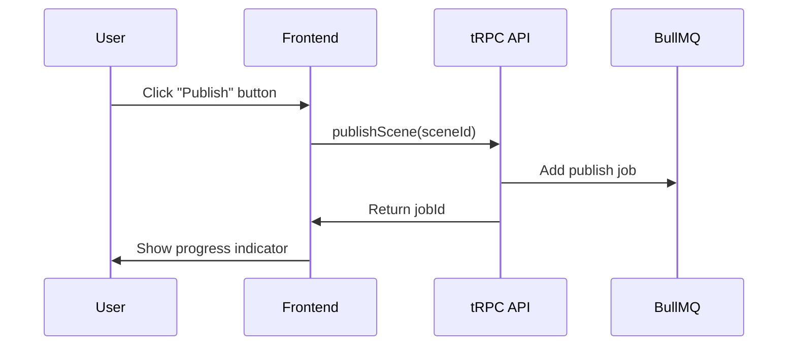
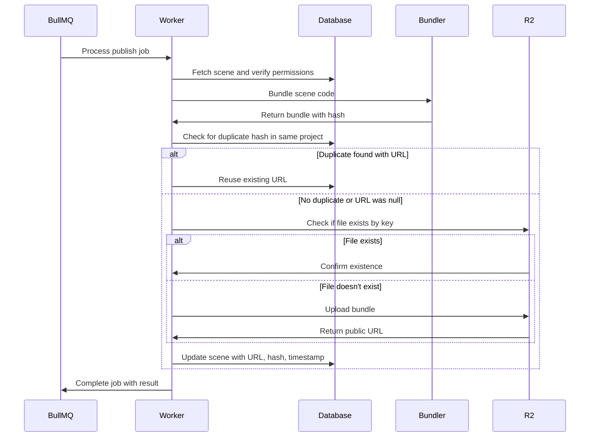
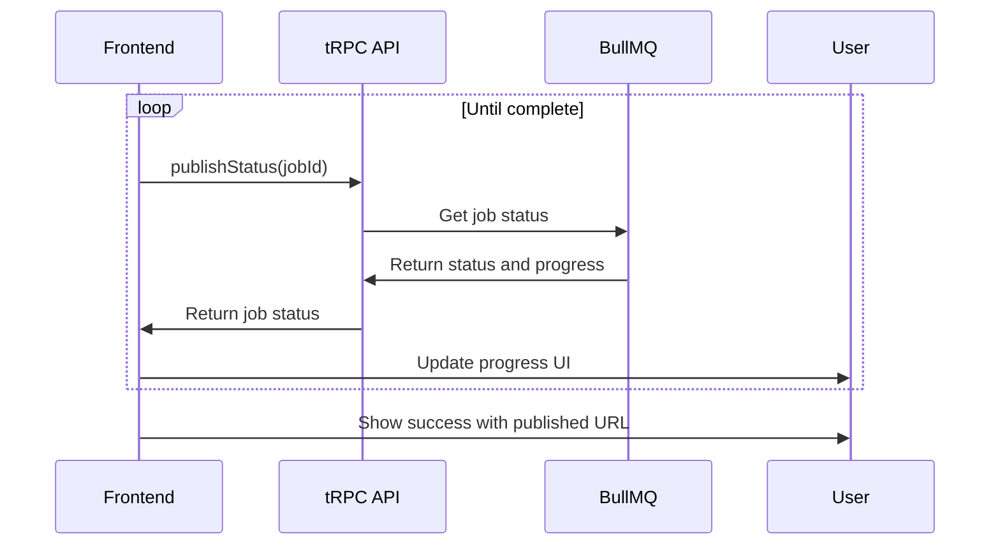

<!-- docs/publish-flow.md -->

# Scene Publishing Flow

This document outlines the architecture and workflow for publishing scenes in Bazaar-Vid. The publishing pipeline provides a way to bundle and share scenes via public URLs with optimized code for production use.

## Architecture Overview

The publishing system consists of three main components:

1. **Bundler Package** (`packages/bundler/index.ts`)
   - Handles the optimization and bundling of scene code for production
   - Uses esbuild to generate optimized JavaScript bundles
   - Externalizes React, React DOM, and Remotion dependencies
   - Provides deduplication via content hashing

2. **R2 Storage Package** (`packages/r2/index.ts`)
   - Manages interaction with Cloudflare R2 storage (S3-compatible)
   - Handles upload, existence checks, and URL generation
   - Implements deterministic key generation based on project and scene IDs

3. **Publishing Queue** (`src/queues/publish.ts`)
   - Orchestrates the end-to-end publishing workflow
   - Uses BullMQ for reliable job processing
   - Tracks progress and handles errors
   - Ensures proper permissions and data consistency

## Database Schema

The publishing system uses the following fields in the `scenes` table:

| Field | Type | Description |
|-------|------|-------------|
| `publishedUrl` | `string` | Public URL to the published bundle |
| `publishedHash` | `string` | SHA-256 hash of the bundle for deduplication |
| `publishedAt` | `Date` | Timestamp of when the scene was published |

## Publishing Workflow

### 1. User Initiates Publish

The process begins when a user initiates scene publishing via the UI:



### 2. Worker Processes Job

A worker processes the queued job asynchronously:



### 3. Frontend Polls for Status

The frontend polls for job status and updates the UI:



## Security and Permissions

- **Permission Checking**: The worker verifies that the user who initiated the publish owns the project containing the scene.
- **Deduplication Scope**: Deduplication is constrained to the same project to prevent unauthorized access to private scenes.
- **R2 Storage Security**: Files are stored with project-scoped paths to maintain isolation.

## Optimizations

### Bundle Optimization

- **Size Reduction**: Assets ≤10kB are inlined as data URIs.
- **External Dependencies**: React, React DOM, and Remotion libraries are marked as external.
- **ESM Format**: Bundles use ES modules for optimal loading.
- **Minification**: Production bundles are minified by default.

### Deduplication

- **Content-Based Hashing**: SHA-256 hash of the bundle content determines uniqueness.
- **Database Tracking**: Hashes are stored in the database to avoid redundant uploads.
- **Storage Efficiency**: Identical bundles are reused within the same project.

## Configuration

### Environment Variables

```
# R2 Configuration
R2_ENDPOINT=https://your-account.r2.cloudflarestorage.com
R2_ACCESS_KEY_ID=your-access-key
R2_SECRET_ACCESS_KEY=your-secret-key
R2_BUCKET_NAME=your-bucket-name
R2_PUBLIC_URL=https://public.your-domain.com

# Queue Configuration
REDIS_URL=redis://localhost:6379
RUN_WORKER=true  # Set this to run the worker process
```

## API Reference

### tRPC Endpoints

#### `publishScene`

Publishes a scene by creating a job in the queue.

**Input:**
```typescript
{
  sceneId: string;
  scope?: 'scene' | 'storyboard';
}
```

**Output:**
```typescript
{
  jobId: string;
}
```

#### `publishStatus`

Checks the status of a publishing job.

**Input:**
```typescript
{
  jobId: string;
}
```

**Output:**
```typescript
{
  status: string; // 'waiting', 'active', 'completed', 'failed'
  progress: number; // 0-100
  result?: {
    success: boolean;
    sceneId: string;
    publishedUrl?: string;
    hash?: string;
    size?: number;
    error?: string;
  };
}
```

## Future Extensions

- **Storyboard Publishing**: Support for publishing entire storyboards as a single bundle (BAZAAR-305).
- **Version Management**: Track and manage multiple published versions of a scene.
- **Access Control**: More granular permissions for sharing published scenes.
- **Analytics**: Track views and usage of published scenes.

## Troubleshooting

### Common Issues

1. **Redis Connection Failures**
   - Ensure `REDIS_URL` is properly configured
   - Check Redis server is running and accessible

2. **R2 Upload Failures**
   - Verify R2 credentials and endpoint configuration
   - Check bucket permissions and CORS settings

3. **Bundle Size Warnings**
   - Large bundles (>500KB) will generate warnings
   - Consider optimizing large assets or externalize more dependencies

### Debugging

The publishing system uses structured logging throughout the process. Check logs with:

```
npm run logs:publish
```

Or filter logs with the `[PublishWorker]` or `[PublishQueue]` prefixes.
