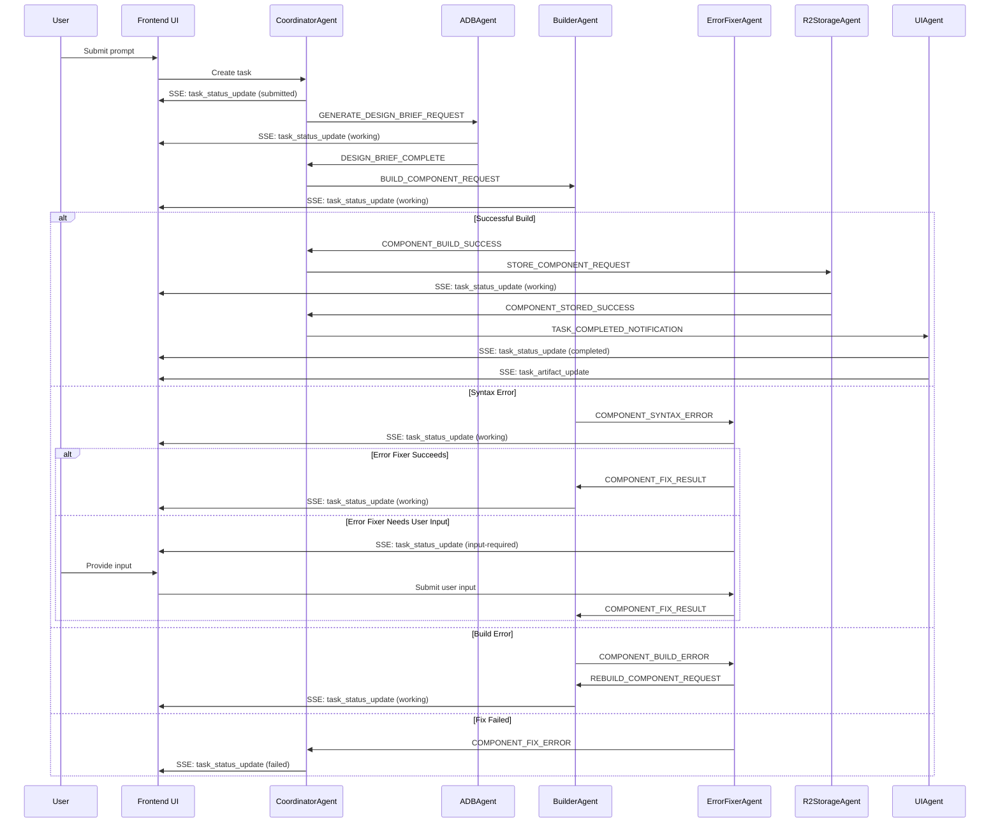

//memory-bank/a2a/end-to-end-workflow.md

# A2A End-to-End Workflow

This document outlines the complete workflow for the A2A-based component generation system in Bazaar-Vid, from user input to final component rendering, including all agent interactions and frontend updates.

## User Interaction Flow

## Detailed Process Flow

### 1. User Interaction & Intent Understanding

1. The user submits a prompt through the UI.
2. The UI creates a task via the `a2a.createTask` tRPC endpoint.
3. The CoordinatorAgent receives the task and begins processing.
4. While processing, an LLM (part of or triggered by the CoordinatorAgent) interacts with the user:
   - Streaming text responses
   - Explaining the process
   - Understanding user intent and context 
   - Providing conversational feedback throughout

### 2. Planning & Design (ADB)

1. The CoordinatorAgent analyzes the user's request and determines the required components.
2. It sends a `GENERATE_DESIGN_BRIEF_REQUEST` message to the ADBAgent.
3. The ADBAgent:
   - Processes this request
   - Generates Animation Design Brief(s) (ADBs) for one or more scenes
   - Creates ADB artifacts
   - Updates task status (via TaskManager → SSE → Frontend hooks)
   - Notifies the CoordinatorAgent with a `DESIGN_BRIEF_COMPLETE` message

### 3. Component Generation & Build

1. The CoordinatorAgent, upon receiving the ADBs:
   - Sends `BUILD_COMPONENT_REQUEST` messages to the BuilderAgent
   - Each request contains an ADB as an artifact or in the payload
   
2. The BuilderAgent for each component:
   - Takes the ADB
   - Generates TSX code (using `generateComponentCode`)
   - Updates task status to "working" (via TaskManager → SSE → Frontend hooks)
   - Attempts to build it (using `buildCustomComponent`)

3. Error handling flow:
   - **Syntax errors**: BuilderAgent sends `COMPONENT_SYNTAX_ERROR` to ErrorFixerAgent
   - **Build errors**: BuilderAgent sends `COMPONENT_BUILD_ERROR` to ErrorFixerAgent
   - ErrorFixerAgent attempts repair (using `repairComponentSyntax`)
   - If successful: sends `REBUILD_COMPONENT_REQUEST` back to BuilderAgent
   - If unsuccessful: sends `COMPONENT_FIX_ERROR` to CoordinatorAgent after retries

4. Input required flow:
   - If the ErrorFixerAgent determines it needs user input:
     - It updates the task status to "input-required"
     - The frontend detects this state and displays appropriate UI
     - The user provides input through the UI
     - The input is sent to the ErrorFixerAgent via `a2a.submitTaskInput`
     - ErrorFixerAgent processes the input and continues the fix attempt

### 4. Storage & Verification

1. When BuilderAgent successfully builds a component:
   - It produces an artifact (the URL to the compiled JS)
   - It sends a `COMPONENT_BUILD_SUCCESS` message to the CoordinatorAgent
   
2. The CoordinatorAgent then:
   - Sends a `STORE_COMPONENT_REQUEST` (with the artifact URL) to the R2StorageAgent
   
3. The R2StorageAgent:
   - Verifies the component in R2
   - Updates the customComponentJobs table (e.g., `r2Verified` flag)
   - If successful: sends `COMPONENT_STORED_SUCCESS` to the CoordinatorAgent
   - If unsuccessful: sends `R2_STORAGE_ERROR` to the CoordinatorAgent

### 5. UI Updates & Completion

1. Throughout this process, agents update the task status via `taskManager.updateTaskStatus()`.
2. These updates emit SSE events, which the frontend hooks consume.
3. When the CoordinatorAgent receives `COMPONENT_STORED_SUCCESS`:
   - It updates the overall task to completed
   - It sends a `TASK_COMPLETED_NOTIFICATION` to the UIAgent
4. The UIAgent:
   - Ensures final SSE events are emitted
   - The component appears in the Remotion player

### 6. Feedback Loop & Iteration

1. The user provides feedback (e.g., "change colors," "add a scene").
2. This initiates a new A2A task flow:
   - Starting with the CoordinatorAgent
   - Understanding the requested changes
   - Generating new or modified ADBs
   - Re-triggering relevant parts of the pipeline
3. The `correlationId` in agent messages links iterative changes back to the original task or project.

## Frontend Integration Points

### SSE Event Flow

1. The TaskManager service emits SSE events when:
   - Task status changes (state transitions)
   - New artifacts are available
   - Error conditions occur
   
2. The frontend hooks (`useSSE`, `useTaskStatus`) connect to the SSE endpoint, subscribe to tasks, and process these events.

3. UI components (`TaskStatus`, `TaskStatusBadge`) render based on the current state from these hooks.

### User Input Handling

When a task enters the "input-required" state:

1. The `useTaskStatus` hook detects this state change.
2. A specialized UI component renders a form or options for the user.
3. User submits input through the UI.
4. The frontend calls `a2a.submitTaskInput` tRPC mutation.
5. TaskManager routes the input to the appropriate agent.
6. The agent processes the input and continues its work.

### Artifact Display

1. When an agent creates artifacts (e.g., ADBs, compiled JS):
   - It attaches these artifacts to the task
   - TaskManager emits SSE events with artifact information
   
2. Frontend components:
   - Detect new artifacts via the `useSSE` hook
   - Render appropriate UI to display/interact with artifacts
   - Provide download links or previews based on artifact type

## Key A2A Principles in Action

1. **Separation of Concerns**: Each agent has a distinct role (ADB generation, building, error fixing, etc.).

2. **Message-Based Communication**: All agent interactions happen through the MessageBus with standardized message types.

3. **Standardized Task Lifecycle**: Tasks follow consistent states (submitted, working, input-required, completed, failed).

4. **Artifacts**: Various outputs (ADBs, source code, compiled JS) are treated as artifacts attached to tasks.

5. **SSE Streaming**: Provides real-time updates from agents to the UI.

## Frontend Implementation Priorities

### 1. Full Pusher to SSE Migration

**Why**: Critical to ensure all real-time updates use the new A2A-compliant streaming infrastructure.

**Implementation Plan**:
- Identify all UI components currently using Pusher
- Systematically refactor them to use `useSSE` and `useTaskStatus` hooks
- Update how components fetch initial data and handle real-time events
- Ensure consistent event handling across the application

### 2. Develop UI for input-required State

**Why**: Enables more sophisticated agent interactions where user input is needed to resolve issues.

**Implementation Plan**:
- Create UI components for displaying agent questions/options
- Integrate with `useTaskStatus` to detect the input-required state
- Implement forms/UI to capture user input
- Add logic to submit input back to agents via `a2a.submitTaskInput`

### 3. Basic Artifact Display

**Why**: Makes agent outputs visible and accessible to users.

**Implementation Plan**:
- Extend TaskStatus component or create a TaskArtifactsViewer
- Display list of available artifacts for tasks
- Implement basic rendering based on artifact type
- Add download capabilities for relevant artifacts

## Backend-Frontend Coordination

### Shared Interfaces
- Continue using `src/types/a2a.ts` as the source of truth
- Add new types for input-required scenarios as needed
- Ensure consistent typing between backend and frontend

### API Contracts
- Frontend will use tRPC endpoints defined in `a2aRouter`
- Key endpoints: `getTaskStatus`, `submitTaskInput`, `subscribeToTaskStatus`
- Message structures must match expected formats in TaskManager service

## Next Steps

1. Complete SSE migration from Pusher
2. Implement input-required handling UI
3. Add artifact display components
4. Update documentation as implementation progresses
5. Conduct end-to-end testing of the complete flow
