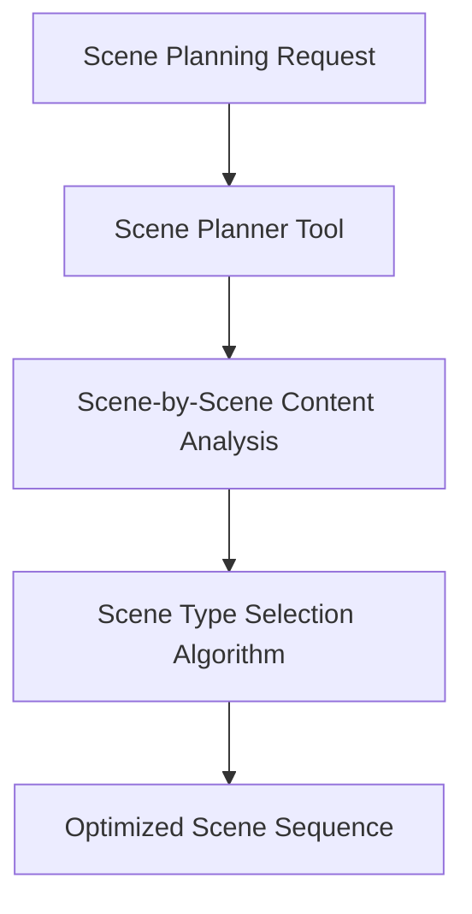
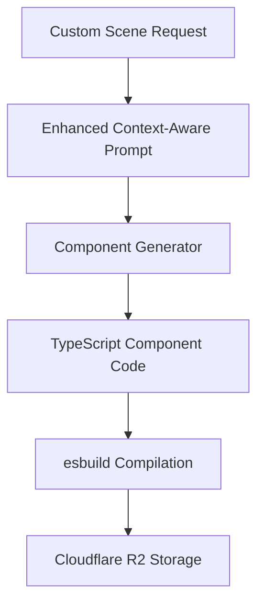
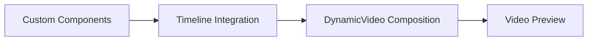

# Intelligent Video Creation Pipeline Documentation

## Overview

The intelligent scene planning and component generation system in Bazaar-Vid creates a seamless flow from a user's natural language prompt to a multi-scene video with custom animations. The system employs a sophisticated multi-stage pipeline that analyzes intent, plans scenes, generates code, and composes the final video.

## Pipeline Stages

### 1. User Prompt Analysis

When a user submits a prompt like "I'm building a dating app for developers based on GitHub profiles, help me make a promo video":


- The LLM first analyzes the high-level intent through the chat router
- Instead of immediately generating a simple text scene, it invokes the `planVideoScenes` tool

### 2. Intelligent Scene Planning

The system breaks down the video into logically sequenced scenes:



**Key Intelligence Features:**
- Analyzes scene descriptions to determine which need custom components vs. simple text
- Evaluates scene content complexity using NLP pattern matching
- Considers scene positioning (intro, body, conclusion) in the overall narrative

**Scene Type Selection Algorithm:**
```javascript
// Content-based heuristic evaluation
const needsVisualComponent = 
    // Visual terminology
    scene.description.match(/animat|visual|graphic|display|present|demonstrat|show|appear/i) ||
    // Elements that benefit from custom components
    scene.description.match(/logo|icon|button|card|slide|image|photo|picture|video/i) ||
    // Motion terminology
    scene.description.match(/move|motion|rotate|spin|flip|bounce|fade|grow|shrink/i);

if (needsVisualComponent || scene.effectType === "custom") {
    // Mark as needing a custom component
    scene.effectType = "custom";
} else {
    // For simpler content, use text components
    scene.effectType = "text";
}
```

### 3. Custom Component Generation

For each scene marked as "custom", the system generates tailored React/Remotion components:



**Enhanced Context Generation:**
- Provides scene positioning info (opening, middle, closing scene)
- Includes previous/next scene descriptions for continuity
- Specifies exact duration requirements
- Includes technical requirements for Remotion compatibility

Example enhanced prompt format:
```
Create a custom Remotion component for scene: "Show users uploading their GitHub profiles"

Scene duration: 15 seconds (450 frames at 30fps)
Scene purpose: This is scene 2 of 4 in the video.

Previous scene: "Introduction to the dating app concept"
Next scene: "Highlight the matching algorithm based on commit history"

Create a visually rich, engaging component that captures the essence of this scene. 
Focus on smooth animations, readability, and visual appeal. The component should be self-contained 
and work well within the overall flow of the video.
```

### 4. Scene Integration & Video Composition

Once components are built, they're integrated into the video timeline:



- Each custom component is inserted at the correct position in the timeline
- The `DynamicVideo.tsx` composition renders the scenes in sequence
- Transitions between scenes are applied as specified
- The final video maintains narrative continuity across all scenes

## Technical Implementation

### Core Files
- `src/server/api/routers/chat.ts`: Main orchestration of the pipeline
- `handleScenePlanInternal()`: Analyzes and upgrades scene types based on content
- `handleComponentGenerationInternal()`: Generates custom components with scene context
- Custom component database schema for tracking generation jobs
- `DynamicVideo.tsx` for rendering the final composition

### Benefits of the Intelligent Approach
1. **Content-Aware Scenes**: Each scene type is chosen based on content requirements
2. **Contextual Component Generation**: Components know their place in the narrative
3. **End-to-End Pipeline**: Seamless flow from text prompt to final video
4. **Progressive Enhancement**: Simple scenes can be upgraded to custom as needed

This intelligent pipeline eliminates the need for users to manually break down their video into scenes or specify which parts need custom animations - the system does this automatically based on natural language understanding.
