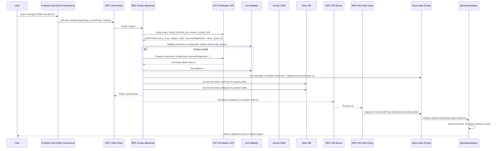

Okay, that's excellent feedback and the `package.json` provides the concrete versions we need. These tweaks will definitely make the context document much more precise and unambiguous for the Cursor agent.

Here is the updated "single source of truth" document incorporating your suggestions and the specific versions from your `package.json`:

---

**Bazaar‑Vid – Full Project Context for AI Development Assistant (Cursor Agent / Codex CLI) - v3 (Airtight)**

> **Read me first:** This document is the **single source of truth** for the Bazaar‑Vid project for every agent or contributor (human or AI). It **must** be kept up-to-date. Any architectural changes or significant implementation decisions **must** be reflected here first. Adhere strictly to the principles and stack defined within.

---

## 1. What we are building

**Bazaar‑Vid** is an AI-powered web application enabling users to create product demonstration videos programmatically using Remotion. Users interact via a **chat interface** (left pane) describing desired video content and edits. A **live preview** (right pane) rendered using **`@remotion/player`** updates in near real-time (<100ms target) based on these instructions. The core interaction relies on a **props-driven architecture**, where the LLM generates configuration data (JSON Patches) rather than executable code for the live preview loop.

**Core Flow Summary:**
> User types instruction → Frontend sends current `inputProps` JSON + message via tRPC → Backend tRPC procedure calls LLM → LLM returns a **JSON Patch (Δ)** → Backend validates patch (Zod), applies patch to update `inputProps`, saves full updated `inputProps` to DB (Neon via Drizzle) → Backend broadcasts **JSON Patch (Δ)** via tRPC WebSocket → Frontend receives patch, applies it to local state → **`@remotion/player`** re-renders → User sees updated preview.

Final video rendering occurs asynchronously via **Remotion Lambda**, triggered by the backend, with assets stored in **Cloudflare R2**.

---

## 2. Chosen Tech Stack & Usage (2025‑04‑26)

| Layer             | Choice                             | Usage in Bazaar-Vid                                                                                                                                                              |
| :---------------- | :--------------------------------- | :------------------------------------------------------------------------------------------------------------------------------------------------------------------------------- |
| **Framework** | **Next.js App Router** | Foundation for UI (React Server & Client Components), API layer (via tRPC hosted in Route Handlers), routing. Use `app/` directory structure.                                       |
| **Styling** | **Tailwind CSS** + 21st.dev Preset | Utility-first styling. Use semantic tokens (`bg-surface`, `text-primary`, etc.) defined by the `@21stst/tailwind-config` preset. Copy structural patterns from 21st.dev as needed. |
| **Auth** | **Auth.js v5** (Drizzle adapter)   | Handles user sign-up, login, session management. Protect tRPC procedures and sensitive Route Handlers using `await auth()` checks. Manages user identity.                     |
| **DB Provider** | **Neon** (Serverless Postgres)     | Hosts the PostgreSQL database storing all persistent application data (users, projects, `inputProps` state, custom component registry, etc.).                                  |
| **ORM** | **Drizzle ORM** + `drizzle-kit`    | Primary interface for all database interactions within backend code (tRPC procedures). Provides compile-time type safety. Use `drizzle-kit` for schema migrations.              |
| **API Layer** | **tRPC v11** | **Exclusive method** for frontend-backend communication. Define type-safe procedures (queries, mutations) on the server. Use tRPC client hooks in the frontend.             |
| **Real-time** | **tRPC WebSockets** | Used *specifically* for the backend to push validated JSON Patches to connected clients for instant preview updates. Do **not** use other real-time services.                |
| **Video Preview** | **`@remotion/player`** | Embedded in a Client Component (`/components/client/PlayerShell.tsx`). Renders the `<DynamicVideo>` composition, driven *only* by the `inputProps` state variable.             |
| **Video Render** | **Remotion Lambda** | Used *only* for final MP4 rendering. Triggered asynchronously by a backend tRPC mutation/Route Handler using `@remotion/lambda` Node.js client API (`renderMediaOnLambda`).       |
| **File Storage** | **Cloudflare R2** | Stores user-uploaded assets (images, audio) and final rendered MP4 videos. Backend generates signed URLs for uploads or handles uploads server-side after download from Lambda S3. |
| **LLM** | **GPT-4o (OpenAI)** / Claude 3     | Called *only* from the backend (tRPC procedures). Roles: 1) Conversational agent, 2) Generate JSON Patches for live edits, 3) Generate component code (offline pipeline).      |
| **Repo/Build** | **Monorepo (npm)** + TS  | Single repo, npm workspaces likely. Strict TypeScript everywhere.                                                                                                               |
| **Deployment** | **Vercel** | Hosts the Next.js app (static assets, server/client components, serverless tRPC Route Handlers). Manages environment variables.                                                |

> **Version Pinning:** Adhere to these primary versions from `package.json` (as of 2025-04-26). Use exact versions where specified or the locked version (`^` implies minimum, use lockfile version). Ensure **all** `@remotion/*` packages use the **same** version (target `4.0.290` based on `@remotion/player`).
> * `next`: `15.2.3`
> * `react`: `19.0.0`
> * `@trpc/*`: `11.0.0`
> * `drizzle-orm`: `0.41.0`
> * `drizzle-kit`: `0.30.5`
> * `next-auth`: `5.0.0-beta.25`
> * `@auth/drizzle-adapter`: `^1.7.2`
> * `@remotion/player`: `^4.0.290` -> **Use `4.0.290` for all `@remotion/*` packages.**
> * `typescript`: `^5.8.2`
> * `zod`: `^3.24.2`
> * `tailwindcss`: `^4.0.15`

---

## 3. Critical Data Shapes (Sync with Zod & Drizzle Schemas)

* The `InputProps` interface/Zod schema is the **central state** for a video project's visual definition.
* Stored in the `projects.props` column (Neon). Manipulated via validated **JSON Patches**.
* A **Zod schema** mirroring `InputProps` **must** validate all data updates.

```typescript
// src/types/input-props.ts
import { z } from 'zod';

export const sceneSchema = z.object({
  id: z.string().uuid(),
  type: z.enum(["text", "image", "custom"]), // Extensible type list
  start: z.number().int().min(0).describe("Start frame"),
  duration: z.number().int().min(1).describe("Duration in frames"),
  data: z.record(z.unknown()).describe("Scene-specific props, structure depends on 'type'"),
  // Example data structure hint within schema or documentation:
  // data for type 'image': { src: z.string().url().or(z.string().startsWith("r2://")), fit: z.enum(['cover', 'contain']).optional(), ... }
  // data for type 'custom': { componentId: z.string(), /* other props based on component */ }
  componentId: z.string().optional().describe("ID of pre-generated custom component if type is 'custom'"),
}).strict();

export const inputPropsSchema = z.object({
  meta: z.object({
    duration: z.number().int().min(1).describe("Total composition duration in frames"),
    title: z.string().min(1),
    // Potentially add global settings like fps, width, height if they can vary per project
  }).strict(),
  scenes: z.array(sceneSchema),
}).strict();

export type Scene = z.infer<typeof sceneSchema>;
export type InputProps = z.infer<typeof inputPropsSchema>;

// src/lib/patch.ts
export type JsonPatch = import('fast-json-patch').Operation[];
```

```typescript
// src/db/schema.ts (Drizzle schema snippet)
// ... imports ...
export const projects = pgTable("projects", {
  id: uuid("id").primaryKey().defaultRandom(),
  userId: varchar("user_id", { length: 255 }).notNull(),
  title: varchar("title", { length: 255 }).notNull(),
  // Store the validated, complete InputProps state
  props: jsonb("props").$type<InputProps>().notNull(),
  createdAt: timestamp("created_at", { withTimezone: true }).defaultNow().notNull(),
  updatedAt: timestamp("updated_at", { withTimezone: true }).defaultNow().notNull(),
  renderStatus: varchar("render_status").default('IDLE'), // e.g., IDLE, RENDERING, COMPLETE, FAILED
  r2Url: varchar("r2_url"), // URL of final MP4 on Cloudflare R2
  currentRenderId: varchar("current_render_id"), // ID from Remotion Lambda
});

export const patches = pgTable("patches", {
  id: uuid("id").primaryKey().defaultRandom(),
  projectId: uuid("project_id").references(() => projects.id, { onDelete: 'cascade' }).notNull(),
  // Store the validated patch that led to the current project state
  patch: jsonb("patch").$type<JsonPatch>().notNull(),
  createdAt: timestamp("created_at", { withTimezone: true }).defaultNow().notNull(),
});

export const customComponents = pgTable("custom_components", {
    id: varchar("id", { length: 50 }).primaryKey(), // Unique ID (e.g., "usr_comp_123")
    userId: varchar("user_id", { length: 255 }).notNull(),
    name: varchar("name", { length: 100 }).notNull(),
    description: varchar("description").notNull(),
    // Store the URL to the *compiled* JS artifact on R2, NOT the raw TSX code
    r2Url: varchar("r2_url").notNull(),
    // Potentially store a Zod schema string for the component's expected props
    // propsSchema: varchar("props_schema"),
    createdAt: timestamp("created_at", { withTimezone: true }).defaultNow().notNull(),
});

// ... other tables (users - potentially managed by Auth.js adapter, etc.) ...
```

---

## 4. Runtime Sequence Diagram (Live Editing Loop)

*This diagram illustrates the real-time update flow using JSON patches.*



---

## 5. Offline Custom Component Pipeline (Phase 3+)

*This asynchronous process creates reusable components.*

1.  **Trigger:** User uploads image/spec -> calls tRPC `components.generate` mutation.
2.  **Backend (tRPC):** Calls GPT-Vision (if needed) -> Calls GPT-4 (with Remotion system prompt) -> Gets self-contained **TSX code string**.
3.  **Validation:** Backend performs basic static analysis/sanitization on TSX string (critical safety step).
4.  **Isolated Build:** Backend triggers a **secure, separate build service** (e.g., dedicated Vercel Function, container) using `esbuild`. **Main app NEVER runs LLM code/build.**
5.  **Storage:** Build service outputs compiled JS artifact (`dist/comp-<hash>.js`) -> Backend uploads **JS artifact** to **Cloudflare R2**.
6.  **Registration:** Backend saves component metadata (`componentId`, R2 `srcUrl`, name, etc.) to `custom_components` table in **Neon DB**.
7.  **CI/CD Pipeline (Essential for Lambda):** Saving to DB triggers CI pipeline (e.g., GitHub Action):
    * Fetches all component code (standard + custom).
    * Rebuilds Remotion project.
    * Runs `npx remotion lambda sites create ...` to deploy **new static Remotion site bundle** (versioned) to S3 for Lambda use.
8.  **Usage in Live Preview:**
    * `inputProps` JSON references `{ type: 'custom', componentId: '...', data: {...} }`.
    * `SceneRenderer.tsx` uses `React.lazy(() => import(/* webpackIgnore: true */ componentR2Url))` fetched via an API call (`/api/components/:id` which gets URL from DB).
    * **Requires `Suspense` boundary.** The component loaded is the **pre-compiled JS from R2**, built by the trusted CI pipeline.

---

## 6. Non-Negotiable Rules (For AI Agent & Humans)

1.  **NEVER Execute LLM-Generated Code Directly at Runtime:** Live previews are updated *only* via validated JSON patches applied to props. Custom components used in preview are loaded from *pre-compiled, trusted artifacts* stored on R2 (built via secure offline pipeline).
2.  **Strict `"use client"` Usage:** Components using hooks or browser APIs require `"use client"`. Keep Client Components focused on interaction; push logic server-side (tRPC/Server Components) where possible.
3.  **Rigorous Validation:** ALL external data (LLM patches, user input, API responses) MUST be validated with Zod schemas before use. Implement LLM JSON auto-repair loop. Sanitize user text for XSS.
4.  **Update This Document:** Any change to architecture, libraries (major versions), core schemas, or fundamental workflows requires updating this file *first*.
5.  **Pass All Checks:** Code MUST pass `npm run typecheck && npm run lint && npm run check && npm run db:generate -- --check` (adapt check commands as needed) before merging. Maintain quality and type integrity.
6.  **Simplicity First:** Write the simplest code possible. Avoid premature optimization. Adhere to T3/Remotion best practices.
7.  **Secure Secrets:** Use Vercel environment variables for all secrets (Neon URL, R2 keys, OpenAI key, Auth secrets, AWS keys for Remotion Lambda). Never commit secrets. Access only on the backend.
8.  **Content Security Policy (CSP):** All relevant Route Handlers serving HTML or API responses consumed directly by browser should set appropriate `Content-Security-Policy` headers (e.g., `script-src 'self' https://<your-vercel-deployment>.vercel.app; object-src 'none'; base-uri 'self';`). Adjust as needed for libraries/assets.

---

## 7. Folder Map & Responsibilities (Conceptual)

```
/app/
  (routes)/.../page.tsx         # UI Pages (Server/Client Components)
  api/trpc/[trpc]/route.ts    # Main tRPC handler (imports appRouter)
  api/auth/[...nextauth]/route.ts # Auth.js dynamic handler
  api/render/route.ts         # Optional: Separate handler for Lambda trigger OR use tRPC
  api/components/generate/route.ts # Handler for triggering custom component generation pipeline
  api/components/[id]/route.ts # Handler to fetch custom component R2 URL/metadata
  layout.tsx                  # Root layout
  globals.css                 # Tailwind directives
/components/
  ui/                         # Basic UI components (buttons, inputs - from 21st.dev/shadcn structure)
  client/                     # Client Components ("use client")
    ChatInterface.tsx         # Left pane chat UI, uses tRPC client hooks
    PlayerShell.tsx           # Hosts @remotion/player, receives/applies patches via tRPC WS
  server/                     # Server Components
/lib/
  db.ts                       # Drizzle client instance export (using postgres.js)
  llm.ts                      # Helpers for OpenAI/Claude 3 API calls, system prompt management
  patch.ts                    # fast-json-patch apply/validate helpers
  remotion-lambda.ts          # Wrapper functions for Remotion Lambda client API calls
  r2.ts                       # Helpers for Cloudflare R2 (e.g., getSignedUrl, upload)
  utils.ts                    # General utility functions
  zodSchemas.ts               # Central Zod schemas (InputProps, Scene, Patch, etc.)
/prisma/                      # --> DELETE if only using Drizzle
/drizzle/                     # Drizzle Kit migration output folder (`drizzle.config.ts` in root)
/public/                      # Static assets for Next.js app (favicon etc.)
/remotion/                    # Remotion specific code (Bundled separately for Lambda)
  index.ts                    # Remotion entry point (registerRoot)
  Root.tsx                    # Defines Remotion <Composition> (reads duration from props)
  components/                 # Core Remotion components used by DynamicVideo
    DynamicVideo.tsx          # Main component interpreting inputProps.scenes
    SceneRenderer.tsx         # Switch logic for rendering different scene types
    standard/                 # Components for "text", "image" types etc.
    custom/                   # Custom components (Code added by CI pipeline)
      registry.ts             # Maps componentId -> lazy import (conceptual)
      ExampleCustom.tsx       # Example custom component structure
  assets/                     # Assets ONLY for Remotion (fonts) - use staticFile()
/server/
  api/
    routers/                  # tRPC router definitions
      _app.ts                 # Root tRPC router (appRouter)
      chat.ts                 # Procedures: sendMessage
      render.ts               # Procedures: triggerRender, getRenderStatus
      components.ts           # Procedures: generateComponentInfo, getComponentInfo
      // ... other routers
    trpc.ts                   # tRPC server setup (initTRPC, createContext, procedure helpers)
/types/
  input-props.ts              # Canonical types+Zod schemas (may live in /lib)
  next-auth.d.ts              # Augment NextAuth types if needed
/auth.ts                      # Auth.js v5 config (providers, adapter)
drizzle.config.ts             # Drizzle Kit config file
next.config.mjs               # Next.js config
postcss.config.js             # PostCSS config (for Tailwind)
tailwind.config.ts            # Tailwind config (extends 21st.dev preset)
tsconfig.json                 # Base TypeScript config (ensure paths align)
.env.example                  # Template for environment variables
```

---

## 8. Styling via 21st.dev Preset

* **Install:** `pnpm add -D @21stst/tailwind-config` (Use correct package manager: `npm install -D ...`)
* **Configure `tailwind.config.ts`:**
    ```typescript
    import type { Config } from 'tailwindcss';

    const config: Config = {
      content: [ // Ensure all paths using Tailwind are included
        './app/**/*.{ts,tsx}',
        './components/**/*.{ts,tsx}',
        './src/**/*.{ts,tsx}', // Adjust if needed
        // Add './remotion/**/*.{ts,tsx}' ONLY if Remotion components use Tailwind directly
      ],
      presets: [require("@21stst/tailwind-config")],
      theme: { extend: {} },
      plugins: [require("tailwindcss-animate")],
    };
    export default config;
    ```
* **Usage:** Strictly use semantic tokens (e.g., `className="bg-background text-foreground border-border"`). Reference 21st.dev for structural patterns but implement using project tokens.

---

## 9. Phase Roadmap (with Estimated Targets)

| Phase | Key Deliverables                                                                                              | Target Date  | Status      |
| :---- | :------------------------------------------------------------------------------------------------------------ | :----------- | :---------- |
| **1** | Base T3 scaffold (done), Drizzle schema (users, projects), Auth.js wired, Player showing static placeholder.    | 2025-05-05   | Initialized |
| **2** | tRPC `chat.sendMessage`, basic LLM call → **full props replacement** saved to Neon, basic Player update.        | 2025-05-19   | TODO        |
| **3** | Implement **JSON Patch** generation (LLM), validation (Zod+repair), application (client), **tRPC WebSocket** push. | 2025-06-02   | TODO        |
| **4** | Remotion Lambda setup (AWS), tRPC trigger (`render.trigger`), basic R2 upload flow for MP4.                     | 2025-06-16   | TODO        |
| **5** | **Offline custom component pipeline** (tRPC, LLM gen, Isolated Build, R2 artifact, Neon registry), **dynamic `React.lazy` loading** in Player. | 2025-07-07   | TODO        |

---

## 10. Asset Upload Flow

* **Client-Side:** Use standard `<input type="file">`. **Reject files > 50 MB** client-side before upload attempt.
* **Backend (tRPC Mutation):**
    1. Generate a **pre-signed POST URL** for **Cloudflare R2** using the R2 SDK/API in a tRPC mutation.
    2. Return the signed URL and necessary fields to the client.
* **Client-Side:** Frontend uploads the file directly to R2 using the signed URL and fields.
* **Backend (Confirmation):** Client notifies backend (another tRPC mutation) upon successful R2 upload, passing the final R2 object key/URL. Backend validates MIME type (`image/*`, `audio/*`, `video/mp4` allowed - configure as needed) by checking R2 metadata or headers, then saves the reference (e.g., `r2://bucket/key` or full URL) in the relevant Neon DB record (e.g., within `inputProps` data for an image scene).

---

## 11. Lambda Cost / Render Budget Strategy

* **Database:** Add a `render_credits_used_today` (integer, default 0) column to the `users` table and potentially a `max_daily_render_seconds` column (default e.g., 120).
* **Trigger Logic (tRPC `render.trigger`):**
    1. Before calling `renderMediaOnLambda`, query the user's `render_credits_used_today` and `max_daily_render_seconds`.
    2. Estimate the duration of the requested video (`inputProps.meta.duration / fps`).
    3. If `credits_used + estimated_duration > max_daily_limit`, reject the request immediately with a "Quota exceeded" error.
    4. If allowed, proceed to call `renderMediaOnLambda`. Store the `renderId` and estimated duration.
* **Completion/Update Logic (Webhook or Polling):** When a render completes successfully (via `getRenderProgress` or webhook):
    * Record the *actual* render duration (if available from Remotion Lambda metadata/logs, otherwise use estimate).
    * Increment the user's `render_credits_used_today` in the Neon DB.
* **Reset:** Have a scheduled job (e.g., Vercel Cron Job, external scheduler calling an API route) reset `render_credits_used_today` to 0 for all users daily (at midnight UTC, for instance).
* **Aborts:** If a render fails or is manually aborted, ensure associated credits are handled appropriately (e.g., not fully debited or partially refunded if possible, though tracking partial usage might be complex).

---

This revised document incorporates all your specific choices and the additional clarifications, providing a very robust and unambiguous guide for development.