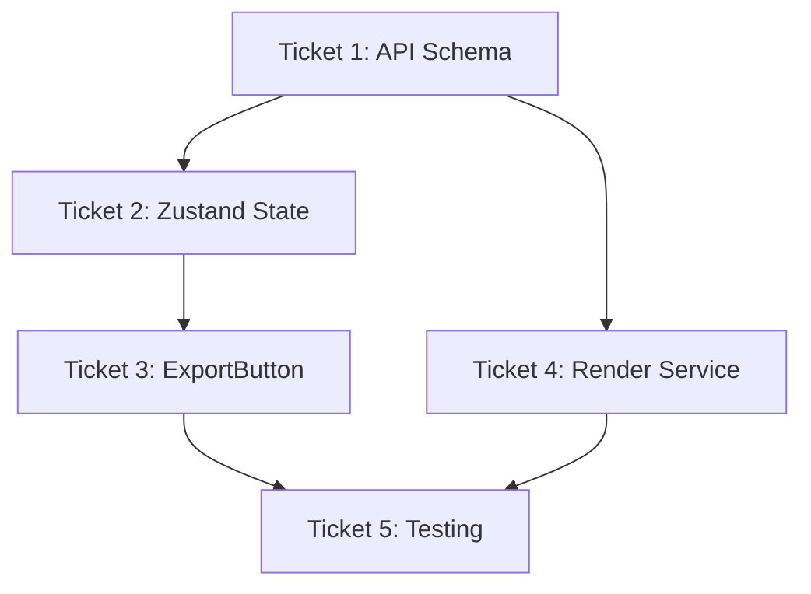

# Playback Speed Export Support - Implementation Tickets

**Epic**: Enable playback speed settings to affect video exports  
**Priority**: P1 - User Expectation  
**Total Effort**: ~1.5 hours  
**Sprint**: 101 - Render Fixes

## Problem Summary

Currently, playback speed (0.25x-4x) only affects Remotion Player preview but not exported videos. Users expect exported MP4s to match their preview speed, creating a significant UX mismatch.

**Current Flow**:
```
User sets speed → UI preview (works) → Export button → Lambda render (ignores speed) → Original speed MP4
```

**Desired Flow**:
```  
User sets speed → UI preview → Export with speed → Lambda render with speed → Speed-adjusted MP4
```

---

## Ticket 1: API Schema Extension
**Priority**: P0 - Blocking  
**Effort**: 5 minutes  
**Component**: Backend API  

### Objective
Add optional `playbackSpeed` parameter to the render API to accept speed settings from frontend.

### Implementation

**File**: `/src/server/api/routers/render.ts`

```typescript
// BEFORE (lines 20-24)
.input(z.object({
  projectId: z.string(),
  format: z.enum(['mp4', 'webm', 'gif']).default('mp4'),
  quality: z.enum(['low', 'medium', 'high']).default('high'),
}))

// AFTER
.input(z.object({
  projectId: z.string(),
  format: z.enum(['mp4', 'webm', 'gif']).default('mp4'),
  quality: z.enum(['low', 'medium', 'high']).default('high'),
  playbackSpeed: z.number().min(0.25).max(4).default(1).optional(),
}))
```

**Pass to render service** (around line 70-80 where prepareRenderConfig is called):
```typescript
const renderConfig = await prepareRenderConfig({
  projectId: input.projectId,
  scenes: dbScenes,
  format: input.format,
  quality: input.quality,
  playbackSpeed: input.playbackSpeed, // NEW LINE
  projectProps
});
```

### Acceptance Criteria
- [ ] API accepts `playbackSpeed` parameter (0.25-4.0 range)
- [ ] Parameter is optional with default value 1.0
- [ ] Validation rejects values outside 0.25-4.0 range
- [ ] Parameter is passed to `prepareRenderConfig`
- [ ] Backward compatibility maintained (existing calls work)

### Testing
```bash
# Test API schema validation
curl -X POST /api/trpc/render.startRender \
  -d '{"projectId": "test", "playbackSpeed": 2.0}' # Should work
curl -X POST /api/trpc/render.startRender \
  -d '{"projectId": "test", "playbackSpeed": 5.0}' # Should fail validation
```

---

## Ticket 2: Zustand State Management Integration  
**Priority**: P0 - Blocking  
**Effort**: 15 minutes  
**Component**: Frontend State Management  

### Objective
Store playback speed in Zustand video state so ExportButton can access it without prop drilling.

### Implementation

**File**: `/src/stores/videoState.ts`

**Add to ProjectState interface** (around line 87):
```typescript
interface ProjectState {
  props: InputProps;
  chatHistory: ChatMessage[];
  dbMessagesLoaded: boolean;
  activeStreamingMessageId?: string | null;
  refreshToken?: string;
  audio?: AudioTrack | null;
  shouldOpenAudioPanel?: boolean;
  draftMessage?: string;
  draftAttachments?: DraftAttachment[];
  playbackSpeed?: number; // NEW LINE
}
```

**Add state management methods** (around line 160):
```typescript
interface VideoState {
  // ... existing methods
  
  // Playback speed management
  setPlaybackSpeed: (projectId: string, speed: number) => void;
  getPlaybackSpeed: (projectId: string) => number;
}
```

**Add implementation** (around line 1300, near other methods):
```typescript
setPlaybackSpeed: (projectId: string, speed: number) =>
  set((state) => {
    if (!state.projects[projectId]) return state;
    
    return {
      ...state,
      projects: {
        ...state.projects,
        [projectId]: {
          ...state.projects[projectId],
          playbackSpeed: speed
        }
      }
    };
  }),

getPlaybackSpeed: (projectId: string) => {
  const { projects } = get();
  return projects[projectId]?.playbackSpeed ?? 1.0;
},
```

**Update persistence** (around line 1310):
```typescript
partialize: (state) => ({
  projects: state.projects,
  currentProjectId: state.currentProjectId,
  selectedScenes: state.selectedScenes,
  // playbackSpeed will be included in projects automatically
}),
```

### Integration Points

**Update WorkspaceContentAreaG** to sync with Zustand:
```typescript
// Replace local state (line 322)
// OLD: const [currentPlaybackSpeed, setCurrentPlaybackSpeed] = useState(1);

// NEW: Use Zustand state
const { setPlaybackSpeed, getPlaybackSpeed } = useVideoState();
const currentPlaybackSpeed = useVideoState(state => state.projects[projectId]?.playbackSpeed ?? 1);

// Update event handler (line 152)
onSpeedChange={(speed) => {
  setPlaybackSpeed(projectId, speed); // Save to Zustand
  // Dispatch event to PreviewPanelG
  const event = new CustomEvent('playback-speed-change', { detail: { speed } });
  window.dispatchEvent(event);
}}
```

### Acceptance Criteria
- [ ] Playback speed persists in Zustand state per project
- [ ] Speed is restored when switching between projects
- [ ] Speed persists across browser sessions (localStorage)
- [ ] UI components sync with state changes
- [ ] No prop drilling required for export components

### Testing
```typescript
// Test state management
const { setPlaybackSpeed, getPlaybackSpeed } = useVideoState.getState();
setPlaybackSpeed('test-project', 2.0);
expect(getPlaybackSpeed('test-project')).toBe(2.0);
```

---

## Ticket 3: ExportButton Integration
**Priority**: P0 - Blocking  
**Effort**: 10 minutes  
**Component**: Frontend Export  

### Objective
Modify ExportButton to read playback speed from Zustand state and pass it to the render API.

### Implementation

**File**: `/src/components/export/ExportButton.tsx`

**Add state hook** (around line 34):
```typescript
// Get audio from Zustand state
const projectAudio = useVideoState(state => state.projects[projectId]?.audio);
// NEW: Get playback speed from Zustand state
const playbackSpeed = useVideoState(state => state.projects[projectId]?.playbackSpeed ?? 1.0);
```

**Update handleExport method** (line 112-124):
```typescript
const handleExport = (format: ExportFormat, quality: ExportQuality) => {
  setShowExportModal(false);
  setCurrentFormat(format);
  setCurrentQuality(quality);
  
  console.log('[ExportButton] Starting render with speed:', playbackSpeed);
  
  startRender.mutate({ 
    projectId,
    format,
    quality,
    playbackSpeed, // NEW LINE - pass speed to API
  });
};
```

**Optional: Add speed indicator in UI** (around line 340):
```typescript
<Button 
  onClick={handleExportClick} 
  disabled={startRender.isPending}
  variant="default"
  size={size}
  className={className}
  title={playbackSpeed !== 1 ? `Export at ${playbackSpeed}x speed` : undefined} // NEW LINE
>
  {startRender.isPending ? (
    <>
      <Loader2 className="mr-2 h-4 w-4 animate-spin" />
      Starting...
    </>
  ) : (
    <>
      <Download className="mr-2 h-4 w-4" />
      Render{playbackSpeed !== 1 ? ` ${playbackSpeed}x` : ''} {/* NEW: Show speed */}
    </>
  )}
</Button>
```

### ExportDropdown Integration

**File**: `/src/components/export/ExportDropdown.tsx`

**Add same pattern** (line 85-90):
```typescript
// Add after line 44
const playbackSpeed = useVideoState(state => state.projects[projectId]?.playbackSpeed ?? 1.0);

// Update startRender.mutate call
startRender.mutate({ 
  projectId,
  format: selectedFormat || format,
  quality: qualityMap[selectedQuality || quality],
  playbackSpeed, // NEW LINE
});
```

### Acceptance Criteria
- [ ] ExportButton reads current playback speed from Zustand state
- [ ] Speed is passed to `startRender` API call
- [ ] UI shows speed indicator when speed ≠ 1x (optional)
- [ ] Both ExportButton and ExportDropdown work consistently
- [ ] No regression in existing export functionality

### Testing
```typescript
// Test export with speed
// 1. Set speed to 2x in UI
// 2. Click export button
// 3. Verify API call includes playbackSpeed: 2.0
```

---

## Ticket 4: Render Service Speed Multiplier Application ⭐
**Priority**: P1 - Core Logic  
**Effort**: 30 minutes  
**Component**: Backend Render Logic  

### Objective
Apply playback speed multiplier to scene durations and frame calculations in the render pipeline.

### Deep Technical Analysis

#### Current Scene Duration Flow
```typescript
// Current: Fixed duration per scene
const scene = {
  id: "scene-1",
  duration: 150, // 5 seconds at 30fps
  order: 0
};

// Total video duration = sum of all scene durations
const totalDuration = scenes.reduce((sum, scene) => sum + scene.duration, 0);
```

#### Speed Multiplier Mathematics

**Key Insight**: Higher playback speed = shorter video duration

```
Speed 2x → Video plays twice as fast → Half the duration
Speed 0.5x → Video plays half as fast → Double the duration

New Duration = Original Duration / Speed Multiplier

Examples:
- Original: 150 frames (5s)
- Speed 2x: 150 / 2 = 75 frames (2.5s)
- Speed 0.5x: 150 / 0.5 = 300 frames (10s)
```

### Implementation

**File**: `/src/server/services/render/render.service.ts`

**Update function signature** (line 325):
```typescript
// BEFORE
export async function prepareRenderConfig({
  projectId,
  scenes,
  format = 'mp4',
  quality = 'high',
  projectProps,
}: {
  projectId: string;
  scenes: SceneEntity[];
  format?: string;
  quality?: string;
  projectProps?: InputProps;
})

// AFTER
export async function prepareRenderConfig({
  projectId,
  scenes,
  format = 'mp4',
  quality = 'high',
  playbackSpeed = 1.0, // NEW
  projectProps,
}: {
  projectId: string;
  scenes: SceneEntity[];
  format?: string;
  quality?: string;
  playbackSpeed?: number; // NEW
  projectProps?: InputProps;
})
```

**Apply speed multiplier to scenes** (insert after line 420):
```typescript
// Calculate total duration
const originalTotalDuration = validScenes.reduce((sum, scene) => {
  return sum + (scene.duration || 150); // Default 5 seconds at 30fps
}, 0);

// NEW: Apply playback speed multiplier to scene durations
const speedAdjustedScenes = validScenes.map(scene => {
  const originalDuration = scene.duration || 150;
  const adjustedDuration = Math.round(originalDuration / playbackSpeed);
  
  console.log(`[prepareRenderConfig] Scene ${scene.id} duration: ${originalDuration} → ${adjustedDuration} frames (${playbackSpeed}x speed)`);
  
  return {
    ...scene,
    duration: adjustedDuration
  };
});

const totalDuration = speedAdjustedScenes.reduce((sum, scene) => {
  return sum + scene.duration;
}, 0);

console.log(`[prepareRenderConfig] Total duration: ${originalTotalDuration} → ${totalDuration} frames (${playbackSpeed}x speed)`);
```

**Update return object** (around line 450):
```typescript
return {
  scenes: speedAdjustedScenes, // Use adjusted scenes instead of validScenes
  totalDuration,
  renderWidth,
  renderHeight,
  fps: 30,
  format,
  settings,
  // NEW: Include speed info for debugging
  playbackSpeed,
  originalDuration: originalTotalDuration,
};
```

### Frame Calculation Edge Cases

**Minimum Duration Protection**:
```typescript
const adjustedDuration = Math.max(
  1, // Minimum 1 frame
  Math.round(originalDuration / playbackSpeed)
);
```

**Frame Rounding Strategy**:
```typescript
// Option 1: Simple rounding (recommended for MVP)
const adjustedDuration = Math.round(originalDuration / playbackSpeed);

// Option 2: Conservative rounding (ensures smooth playback)
const adjustedDuration = Math.ceil(originalDuration / playbackSpeed);

// Option 3: Precise frame timing (complex, for later)
const adjustedDuration = Math.round(originalDuration / playbackSpeed * 1000) / 1000;
```

### Lambda Integration Points

The speed-adjusted scenes flow through the existing pipeline:

```typescript
// 1. prepareRenderConfig applies speed → adjusted scenes
// 2. Scenes passed to Lambda with new durations
// 3. Lambda renders each scene for its adjusted duration
// 4. FFmpeg concatenates scenes (automatically handles timing)
```

**No additional Lambda changes needed** - the duration adjustments are handled at the scene level.

### Testing Strategy

**Unit Tests**:
```typescript
// Test speed multiplier calculations
describe('playback speed multiplier', () => {
  it('doubles speed halves duration', () => {
    const scenes = [{ duration: 150 }];
    const result = prepareRenderConfig({ scenes, playbackSpeed: 2.0 });
    expect(result.scenes[0].duration).toBe(75);
  });
  
  it('half speed doubles duration', () => {
    const scenes = [{ duration: 150 }];
    const result = prepareRenderConfig({ scenes, playbackSpeed: 0.5 });
    expect(result.scenes[0].duration).toBe(300);
  });
  
  it('handles minimum duration', () => {
    const scenes = [{ duration: 1 }];
    const result = prepareRenderConfig({ scenes, playbackSpeed: 4.0 });
    expect(result.scenes[0].duration).toBe(1); // Should not go below 1
  });
});
```

**Integration Tests**:
```typescript
// Test full render pipeline with speed
// 1. Create test project with known duration
// 2. Export at 2x speed
// 3. Verify output video duration is half of original
```

### Performance Considerations

**Lambda Timeout Impact**:
- **Fast speeds (2x-4x)**: Shorter renders, reduced Lambda cost ✅
- **Slow speeds (0.25x-0.5x)**: Longer videos, potential timeout risk ⚠️

**Mitigation**:
```typescript
// Add timeout warning for slow speeds
if (playbackSpeed < 0.5 && totalDuration > 1800) { // > 1 minute at 0.5x
  console.warn(`[prepareRenderConfig] Long render detected: ${totalDuration} frames at ${playbackSpeed}x speed`);
}
```

### Acceptance Criteria
- [ ] Scene durations adjusted by speed multiplier (duration / speed)
- [ ] Total video duration reflects speed changes
- [ ] Minimum duration protection (≥1 frame per scene)  
- [ ] Frame rounding maintains smooth playback
- [ ] Speed multiplier logged for debugging
- [ ] No breaking changes to existing render pipeline
- [ ] Lambda renders complete within timeout limits

### Testing Checklist
- [ ] Export at 2x speed → Half duration video
- [ ] Export at 0.5x speed → Double duration video  
- [ ] Export at 1x speed → No change (regression test)
- [ ] Very short scenes (1-2 frames) don't break
- [ ] Very long scenes handle speed correctly
- [ ] Audio synchronization maintained (if present)

---

## Ticket 5: End-to-End Testing & Validation
**Priority**: P1 - Quality Assurance  
**Effort**: 30 minutes  
**Component**: Full Pipeline Testing  

### Objective
Validate that playback speed settings correctly affect exported video duration and quality across the full user journey.

### Test Scenarios

#### Scenario 1: Speed Validation
```
1. Create test project with known 10-second video
2. Set playback speed to 2x
3. Export video
4. Verify exported video is 5 seconds duration
5. Verify playback appears 2x faster than original
```

#### Scenario 2: Edge Cases
```
1. Test minimum speed (0.25x) → 4x longer video
2. Test maximum speed (4x) → 1/4 duration video
3. Test very short scenes (1-2 frames) at high speed
4. Test very long scenes (10+ seconds) at low speed
```

#### Scenario 3: State Persistence
```
1. Set playback speed to 1.5x
2. Refresh browser
3. Verify speed setting persists
4. Export video
5. Verify exported video uses persisted speed
```

#### Scenario 4: Multi-Scene Projects
```
1. Create project with 3 scenes (5s each = 15s total)
2. Set speed to 2x
3. Export video
4. Verify total duration is 7.5 seconds
5. Verify each scene plays at 2x speed
```

### Validation Tools

**Duration Verification**:
```bash
# Use ffprobe to check video duration
ffprobe -v quiet -show_entries format=duration -of default=noprint_wrappers=1:nokey=1 exported_video.mp4
```

**Frame Count Verification**:
```bash
# Count frames in exported video
ffprobe -v error -select_streams v:0 -count_frames -show_entries stream=nb_frames -csv=p=0 exported_video.mp4
```

### Performance Benchmarks

**Render Time Expectations**:
- **4x speed**: ~25% of normal render time
- **2x speed**: ~50% of normal render time  
- **1x speed**: Normal render time (baseline)
- **0.5x speed**: ~200% of normal render time
- **0.25x speed**: ~400% of normal render time

**Lambda Timeout Monitoring**:
```typescript
// Add metrics logging in render service
console.log(`[RenderMetrics] Speed: ${playbackSpeed}x, EstimatedTime: ${totalDuration/30/playbackSpeed}s`);
```

### Acceptance Criteria
- [ ] All speed settings (0.25x-4x) produce correct duration videos
- [ ] Visual playback speed matches expected speed
- [ ] Audio synchronization maintained across speeds
- [ ] State persistence works across browser sessions
- [ ] Multi-scene projects handle speed correctly
- [ ] Performance within acceptable limits
- [ ] No regression in 1x speed exports
- [ ] Lambda timeouts handled gracefully

### Bug Reporting Template
```
Speed Export Issue:
- Playback Speed Set: 2.0x
- Expected Duration: 5 seconds  
- Actual Duration: 10 seconds
- Project Scenes: 2 scenes, 5s each
- Browser: Chrome 120
- Steps to Reproduce: [...]
```

---

## Implementation Order & Dependencies



1. **Tickets 1 & 2** can be done in parallel (backend/frontend)
2. **Ticket 3** requires Ticket 2 completion
3. **Ticket 4** requires Ticket 1 completion  
4. **Ticket 5** requires all previous tickets

## Risk Mitigation

### Technical Risks
- **Lambda Timeouts**: Monitor render times, add warnings
- **Frame Accuracy**: Use simple rounding, validate with tests
- **State Synchronization**: Ensure UI updates trigger properly

### User Experience Risks
- **Confusion**: Add speed indicator in export UI
- **Performance**: Document expected render time changes
- **Backwards Compatibility**: Default to 1x speed for existing flows

## Success Metrics

### Technical Success
- [ ] API accepts playback speed parameter
- [ ] Zustand state manages speed per project
- [ ] Export components access speed from state
- [ ] Render service applies speed multiplier correctly
- [ ] All tests pass

### User Success  
- [ ] Exported video duration matches preview speed
- [ ] Speed setting persists across sessions
- [ ] UI clearly indicates current speed
- [ ] Performance acceptable across speed range
- [ ] No confusion about speed vs duration

This implementation enables the fundamental user expectation that "preview speed = export speed" while maintaining architectural cleanliness and performance.