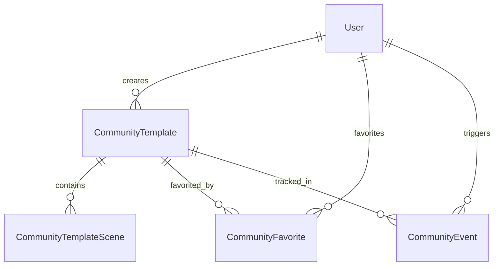

# Database Schema Design - Community Platform (Aligned)

This aligns with the normalized scene structure, event-based analytics, and additive-only migrations.

Note: In code (Drizzle), we use `createTable('community_*')` which prefixes with `bazaar-vid_` automatically. SQL below uses logical names for clarity.

## Core Tables (MVP)

### 1) community_templates
Primary public template metadata (one row per template).

```sql
CREATE TABLE community_templates (
  id uuid PRIMARY KEY DEFAULT gen_random_uuid() NOT NULL,
  slug varchar(255) UNIQUE NOT NULL,
  title varchar(255) NOT NULL,
  description text,
  owner_user_id varchar(255) REFERENCES "bazaar-vid_user"(id),
  source_project_id uuid REFERENCES "bazaar-vid_project"(id),
  thumbnail_url text,
  supported_formats jsonb DEFAULT '["landscape","portrait","square"]'::jsonb,
  tags jsonb DEFAULT '[]'::jsonb,
  category varchar(100),
  visibility varchar(50) DEFAULT 'public', -- 'public' | 'unlisted' (MVP)
  status varchar(50) DEFAULT 'active',     -- 'active' | 'disabled'
  views_count bigint DEFAULT 0 NOT NULL,
  favorites_count bigint DEFAULT 0 NOT NULL,
  uses_count bigint DEFAULT 0 NOT NULL,
  created_at timestamptz DEFAULT now() NOT NULL,
  updated_at timestamptz DEFAULT now() NOT NULL
);

CREATE INDEX community_templates_owner_idx ON community_templates(owner_user_id);
CREATE INDEX community_templates_visibility_idx ON community_templates(visibility, status);
CREATE INDEX community_templates_created_idx ON community_templates(created_at DESC);
```

### 2) community_template_scenes
Normalized scene snapshots per template; preserves TSX per scene with stable ordering.

```sql
CREATE TABLE community_template_scenes (
  id uuid PRIMARY KEY DEFAULT gen_random_uuid() NOT NULL,
  template_id uuid NOT NULL REFERENCES community_templates(id) ON DELETE CASCADE,
  scene_index integer NOT NULL,
  title varchar(255),
  tsx_code text NOT NULL,
  duration integer NOT NULL,
  preview_frame integer DEFAULT 15,
  code_hash text,
  created_at timestamptz DEFAULT now() NOT NULL,
  UNIQUE(template_id, scene_index)
);

CREATE INDEX community_template_scenes_template_idx ON community_template_scenes(template_id);
```

### 3) community_favorites
User ↔ template favorites.

```sql
CREATE TABLE community_favorites (
  user_id varchar(255) NOT NULL REFERENCES "bazaar-vid_user"(id) ON DELETE CASCADE,
  template_id uuid NOT NULL REFERENCES community_templates(id) ON DELETE CASCADE,
  created_at timestamptz DEFAULT now() NOT NULL,
  PRIMARY KEY (user_id, template_id)
);

CREATE INDEX community_favorites_template_idx ON community_favorites(template_id);
```

### 4) community_events (raw)
Event log for analytics; source of truth.

```sql
CREATE TABLE community_events (
  id uuid PRIMARY KEY DEFAULT gen_random_uuid() NOT NULL,
  template_id uuid NOT NULL REFERENCES community_templates(id) ON DELETE CASCADE,
  user_id varchar(255),
  event_type varchar(50) NOT NULL, -- 'view','favorite','unfavorite','use','mix','prompt','click'
  source varchar(50),              -- 'in_app_panel','community_site','direct'
  project_id uuid,
  scene_count integer,
  referrer text,
  user_agent text,
  created_at timestamptz DEFAULT now() NOT NULL
);

CREATE INDEX community_events_template_idx ON community_events(template_id, created_at);
CREATE INDEX community_events_type_idx ON community_events(event_type, created_at);
```

### 5) community_metrics_daily (aggregates)
Pre-aggregated daily metrics for efficient queries.

```sql
CREATE TABLE community_metrics_daily (
  template_id uuid NOT NULL REFERENCES community_templates(id) ON DELETE CASCADE,
  day date NOT NULL,
  event_type varchar(50) NOT NULL, -- 'view','favorite','use'
  count bigint DEFAULT 0 NOT NULL,
  PRIMARY KEY (template_id, day, event_type)
);
```

## Future Enhancements (Not MVP)
- template_ratings (1–5 stars + reviews)
- template_comments (discussion threads)
- creator_profiles (public author profile with rollups)

These can be added later as separate additive migrations.

## Data Relationships (Mermaid)



## Migration Strategy

1) Create tables in order: community_templates → community_template_scenes → community_favorites → community_events → community_metrics_daily
2) No destructive changes; all CREATE TABLE/INDEX only
3) Backfill counters on community_templates from events if needed
4) Validate dev/staging thoroughly before prod (see sprint migration-plan.md)

## Performance & Caching
- Index high-cardinality fields (template_id, created_at)
- Counters on community_templates are cached, but events are the source of truth
- Optional: Redis/CDN for hot paths (Phase 2)

## Security Considerations
- Validate TSX content; sanitize descriptions
- Rate-limit community creation and event writes
- Basic moderation via status = 'disabled'
