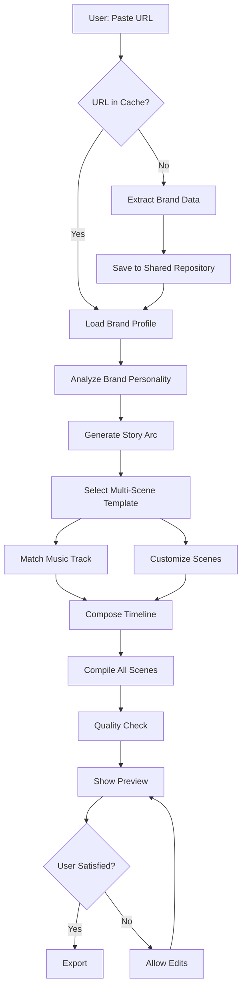

# 🎬 URL to Perfect Video: Complete Master Plan

**Sprint**: 126 - URL to Perfect Video
**Timeline**: 3 weeks to Product Hunt launch
**Goal**: Paste URL → Get complete 20-40s branded video with music via modal-driven UX

---

## 🎯 Executive Vision - UPDATED

```
New Project Modal → User inputs URL + preferences → Video generates automatically
├── Brand extraction (colors, fonts, voice, 8-10 screenshots)
├── AI personality analysis (corporate/playful/bold/minimal scores)
├── Smart template selection (5 multi-scene templates, 8 scenes × 3s each = 24s)
├── Scene customization via LLM edit tool (brand-aware edits)
├── Music integration (auto-selected, user can override)
└── Live progress updates in chat → Perfect export
```

**Success Metric**: 50% of users export without any edits

**Key UX Insight**: Modal → Progress → Result flow guides users through generation

---

## 📊 Current State Analysis - UPDATED

### ✅ What EXISTS Today

#### 1. Brand Extraction (Sprint 99 foundation) - ✅ SHARED REPOSITORY LIVE!
- **Location**: `/src/server/services/website/save-brand-profile.ts`
- **Capabilities**:
  - Color extraction (primary, secondary, accents, gradients)
  - Typography analysis (fonts, weights, scales)
  - Logo detection and extraction
  - Screenshot capture (hero, app, security, mobile views)
  - Copy voice analysis (tone, taglines, headlines)
  - Social proof extraction (testimonials, stats, logos)
  - Product narrative (features, benefits, use cases)
- **Storage**:
  - ✅ `brandRepository` table (shared, URL-keyed)
  - ✅ `projectBrandUsage` join table
  - ✅ `brandExtractionCache` for raw data
  - ✅ URL normalization via `normalizeBrandUrl()`
  - ✅ 30-day TTL for cache freshness
- **Status**: ✅ **IMPLEMENTED** (as of system reminder file changes)

#### 2. Multi-Scene Templates (Sprint 124)
- **Tables**:
  - `templates` (58 active, 1 multi-scene, 169 usages)
  - `template_scenes` (child scenes with order, duration, TSX/JS)
- **Metadata Module**: `src/server/services/templates/multi-scene-metadata.ts` centralises personality targets, beat definitions, and links to real `templateId`s.
- **Selector Service**: `MultiSceneTemplateSelector` (same folder) converts metadata into ordered scene loads + narrative beats.
- **Capabilities**:
  - Admin can create multi-scene templates from projects
  - Templates store ordered scenes with durations
  - Single API call applies all scenes at once
  - Admin-only visibility for experimental templates
- **Status**: 🚧 **Selector live / library sparse (needs ≥5 active templates)**

#### 3. Music System (Exists but basic)
- **Tool**: `addAudio` tool with 4 default tracks
- **Storage**: `projects.audio` JSONB field
- **Tracks**:
  - Cyberpunk Action Intro (high-energy tech)
  - Action Trailer Glitch (intense with effects)
  - Future Design (modern futuristic)
  - Inspiring Ambient Lounge (calm thoughtful)
- **Selection**: Keyword-based (action/calm/tech/future)
- **Status**: ⚠️ **Needs intelligence upgrade**

#### 4. Template Registry
- **Location**: `/src/templates/metadata.ts`
- **50+ single-scene templates** with categories:
  - Intros, CTAs, Features, Metrics, Testimonials
  - Metadata includes duration, customization slots, style
- **Status**: ⚠️ **Needs multi-scene grouping**

### 🚧 Remaining Launch Work *(updated 2025-10-01)*

#### 1. **AI Personality Analysis** ✅ LIVE
- **Status**: GPT-4o-mini + vision adjustments now ship through `BrandPersonalityAnalyzer` and `saveBrandProfile`, storing 6D scores in `brandRepository`.
- **Next**: Add regression evals + alerting if GPT results drift; expose scores/visual analysis in admin dashboard for QA.

- **Status**: Library now ships with seven active templates (`Product Launch`, `Fintech Trust Builder`, `Mobile App Tour`, `Creative Agency Showcase`, `B2B Proof Stack`, `Product Explainer`, `Global Finance Journey`) defined in `src/server/services/templates/multi-scene-metadata.ts` with per-scene requirements and personality targets.
- **Next**: Run selector smoke tests across top 10 shared brand profiles, prepare seed/migration to sync referenced template IDs in prod, and add telemetry dashboards for template win-rate + missing asset warnings.
- **Narrative QA**: New `editPromptHints` explicitly bridge scenes (promise → problem → solution → proof → CTA) and include fallbacks when assets are missing; verify resulting scripts read as cohesive stories during QA.

#### 3. **Intelligent Template Selector** ✅ COMPLETE (FOLLOW-UP: TESTS)
- **Status**: `MultiSceneTemplateSelector.select()` ranks templates using personality (60%) + industry (25%) + content (15%), loads scene code, and generates narrative beats; WebsiteToVideoHandler passes shared brand personality.
- **Next**: Unit tests for keyword extraction/personality scoring + integration test verifying selector fallbacks when templates missing; add telemetry on score breakdown.

#### 4. **LLM Edit Tool Orchestration** ✅ STREAMING, NEEDS PROMPT QA
- **Status**: `TemplateCustomizerAI.customizeTemplatesStreaming()` runs edits scene-by-scene with immediate DB inserts + SSE updates; debug bundle captures prompts/reasoning for admin review.
- **Next**: Harden prompt hints per template (reuse metadata `editPromptHints`), add retries/backoff when Claude fails, and record compilation metrics in analytics.

#### 5. **Modal-Driven UX** 🔴 NOT STARTED
- **Need**: Build the new project modal (URL, duration slider, optional copy, music picker) and wire to auto-launch website pipeline; ensure progress UI matches `UX_FLOW.md`.

#### 6. **Progress Updates via SSE** ⚙️ IN PROGRESS (MODAL LIVE)
- **Status**: Website handler emits `assistant_message_chunk` / `scene_completed` / `all_scenes_complete`; URL modal consumes them for live checklist + auto-close. ChatPanelG now detects URLs and forwards them to SSE pipeline.
- **Next**: Extend chat progress UI beyond modal (persist progress rows in chat history, add toast for background runs) and store SSE status in DB for refresh resilience.

#### NICE TO HAVE (Post-Launch)

7. **Smart Music Matching**
   - Current: 4 tracks, keyword matching
   - Future: 20+ tracks with personality-based scoring
   - Priority: MEDIUM (can expand after launch)

8. **Quality Assurance**
   - Current: None
   - Future: Automated brand alignment scoring
   - Priority: MEDIUM (manual QA sufficient for 5 templates)

---

## 🏗️ Complete System Architecture

### High-Level Flow



### Detailed Component Breakdown

#### Phase 1: Brand Intelligence Layer

```typescript
// New: Brand Intelligence Service
class BrandIntelligenceService {
  async getOrExtractBrand(url: string): Promise<BrandProfile> {
    // 1. Normalize URL
    const normalized = normalizeUrl(url);
    if (!normalized) throw new Error('Invalid URL');

    // 2. Check shared cache
    const cached = await this.getBrandFromCache(normalized);
    if (cached && !this.isStale(cached)) {
      await this.incrementUsageCount(cached.id);
      return cached;
    }

    // 3. Extract brand data
    const extracted = await this.extractBrandData(url);

    // 4. Analyze personality
    const personality = await this.analyzeBrandPersonality(extracted);

    // 5. Save to shared repository
    const saved = await this.saveToBrandRepository({
      normalizedUrl: normalized,
      originalUrl: url,
      brandData: extracted,
      personality,
      confidenceScore: extracted.confidence.overall,
    });

    return saved;
  }

  async analyzeBrandPersonality(brand: ExtractedBrand): Promise<BrandPersonality> {
    // AI analysis of brand personality
    const prompt = `
    Analyze this brand and classify its personality:

    Colors: ${JSON.stringify(brand.colors)}
    Typography: ${JSON.stringify(brand.typography)}
    Voice: ${JSON.stringify(brand.voice)}
    Imagery: ${JSON.stringify(brand.imageryStyle)}

    Score each dimension 0-1:
    - corporate_professional (vs casual)
    - minimalist (vs maximalist)
    - playful (vs serious)
    - technical (vs emotional)
    - bold (vs subtle)
    - modern (vs traditional)
    `;

    const result = await openai.chat.completions.create({
      model: 'gpt-4o-mini',
      messages: [{ role: 'user', content: prompt }],
      response_format: { type: 'json_object' }
    });

    return JSON.parse(result.choices[0].message.content);
  }
}
```

#### Phase 2: Story Arc Generator

```typescript
// New: Story Arc Generator
class StoryArcGenerator {
  async generateArc(
    brand: BrandProfile,
    targetDuration: number // 25-40s
  ): Promise<StoryArc> {

    const productType = this.classifyProduct(brand.productNarrative);
    const audience = this.identifyAudience(brand);

    // Select story structure based on product
    const structure = this.selectStructure(productType, audience);

    // Generate beats with AI
    const beats = await this.generateBeatsWithAI(brand, structure, targetDuration);

    return {
      structure,
      beats,
      totalDuration: beats.reduce((sum, b) => sum + b.duration, 0),
      transitions: this.selectTransitions(beats)
    };
  }

  selectStructure(
    productType: ProductType,
    audience: Audience
  ): StoryStructure {
    // Common structures:
    // 1. Problem → Solution → Proof → CTA (B2B SaaS)
    // 2. Hook → Feature Tour → Benefit → CTA (Consumer app)
    // 3. Before → After → How → CTA (Transformation)
    // 4. Challenge → Innovation → Impact → CTA (Enterprise)

    if (productType === 'saas' && audience === 'business') {
      return {
        name: 'Problem-Solution-Proof',
        beats: [
          { type: 'hook', duration: 3, emotion: 'curiosity' },
          { type: 'problem', duration: 5, emotion: 'pain' },
          { type: 'solution', duration: 8, emotion: 'relief' },
          { type: 'proof', duration: 6, emotion: 'trust' },
          { type: 'cta', duration: 3, emotion: 'action' }
        ]
      };
    }

    // ... more structure templates
  }

  async generateBeatsWithAI(
    brand: BrandProfile,
    structure: StoryStructure,
    targetDuration: number
  ): Promise<EmotionalBeat[]> {

    const prompt = `
    Create a ${targetDuration}s video script for ${brand.productNarrative.value_prop.headline}.

    Brand Voice: ${brand.copyVoice.tone}
    Story Structure: ${structure.name}

    For each beat, provide:
    - headline: short punchy text
    - subtext: supporting copy
    - visuals: what to show
    - duration: seconds

    Beats: ${structure.beats.map(b => b.type).join(' → ')}
    `;

    const result = await openai.chat.completions.create({
      model: 'gpt-4o',
      messages: [{ role: 'user', content: prompt }],
      response_format: { type: 'json_object' }
    });

    return JSON.parse(result.choices[0].message.content).beats;
  }
}
```

#### Phase 3: Intelligent Template Selector

```typescript
// New: Intelligent Template Selector
class IntelligentTemplateSelector {
  async selectTemplateSequence(
    storyArc: StoryArc,
    brand: BrandProfile
  ): Promise<TemplateSequence> {

    const personality = brand.personality;

    // Step 1: Find multi-scene templates that match story structure
    const multiSceneTemplates = await this.getMultiSceneTemplates();
    const structureMatches = this.filterByStructure(multiSceneTemplates, storyArc);

    if (structureMatches.length > 0) {
      // Perfect match: use multi-scene template
      const best = this.rankByPersonality(structureMatches, personality)[0];
      return {
        templateId: best.id,
        scenes: best.scenes,
        customizations: this.generateCustomizations(best, brand)
      };
    }

    // Step 2: Compose from single-scene templates
    const sequence: TemplateScene[] = [];

    for (const beat of storyArc.beats) {
      const candidates = await this.getTemplatesForBeat(beat.type);
      const personalityFiltered = this.filterByPersonality(candidates, personality);
      const styleFiltered = this.filterByStyle(personalityFiltered, brand);
      const flowMatches = this.filterByFlow(styleFiltered, sequence[sequence.length - 1]);

      const best = this.rankByScore(flowMatches, beat, brand)[0];

      sequence.push({
        templateId: best.id,
        beat,
        duration: beat.duration,
        customizations: this.generateSceneCustomizations(best, brand, beat)
      });
    }

    return { scenes: sequence };
  }

  filterByPersonality(
    templates: Template[],
    personality: BrandPersonality
  ): Template[] {
    return templates.filter(t => {
      // Calculate personality match score
      const score = this.calculatePersonalityMatch(t.metadata, personality);
      return score > 0.7; // 70% match threshold
    });
  }

  calculatePersonalityMatch(
    templateMeta: TemplateMetadata,
    brandPersonality: BrandPersonality
  ): number {
    const weights = {
      corporate: templateMeta.style.corporate * brandPersonality.corporate,
      minimalist: templateMeta.style.minimalist * brandPersonality.minimalist,
      playful: templateMeta.style.playful * brandPersonality.playful,
      technical: templateMeta.style.technical * brandPersonality.technical,
      bold: templateMeta.style.bold * brandPersonality.bold,
    };

    return Object.values(weights).reduce((sum, w) => sum + w, 0) / Object.keys(weights).length;
  }

  generateCustomizations(
    template: MultiSceneTemplate,
    brand: BrandProfile
  ): SceneCustomization[] {
    return template.scenes.map((scene, idx) => ({
      sceneId: scene.id,
      order: idx,
      colors: {
        primary: brand.colors.primary,
        secondary: brand.colors.secondary,
        accent: brand.colors.accents[0] || brand.colors.primary,
        gradient: brand.colors.gradients[0]
      },
      typography: {
        heading: brand.typography.fonts[0]?.family || 'Inter',
        body: brand.typography.fonts[1]?.family || brand.typography.fonts[0]?.family || 'Inter'
      },
      text: {
        headline: brand.storyArc?.beats[idx]?.headline || brand.copyVoice.headlines[0],
        subtext: brand.storyArc?.beats[idx]?.subtext
      },
      logos: brand.logos,
      images: this.selectRelevantImages(brand.screenshots, scene.type)
    }));
  }
}
```

#### Phase 4: Smart Music Selector

```typescript
// New: Smart Music Selector
class SmartMusicSelector {

  // Expanded music library (host on R2)
  private readonly musicLibrary: MusicTrack[] = [
    // High Energy
    { id: 1, name: 'Cyberpunk Action', url: '...', mood: 'energetic', tempo: 140, genre: 'electronic', energy: 0.9 },
    { id: 2, name: 'Action Trailer Glitch', url: '...', mood: 'intense', tempo: 150, genre: 'cinematic', energy: 0.95 },

    // Medium Energy
    { id: 3, name: 'Future Design', url: '...', mood: 'modern', tempo: 120, genre: 'tech', energy: 0.7 },
    { id: 4, name: 'Corporate Innovation', url: '...', mood: 'professional', tempo: 110, genre: 'corporate', energy: 0.6 },
    { id: 5, name: 'Startup Energy', url: '...', mood: 'optimistic', tempo: 125, genre: 'indie', energy: 0.75 },

    // Low Energy
    { id: 6, name: 'Inspiring Ambient', url: '...', mood: 'calm', tempo: 85, genre: 'ambient', energy: 0.4 },
    { id: 7, name: 'Thoughtful Piano', url: '...', mood: 'emotional', tempo: 75, genre: 'piano', energy: 0.3 },
    { id: 8, name: 'Minimal Tech', url: '...', mood: 'focused', tempo: 95, genre: 'minimal', energy: 0.5 },

    // Specialized
    { id: 9, name: 'Playful Ukulele', url: '...', mood: 'playful', tempo: 130, genre: 'acoustic', energy: 0.65 },
    { id: 10, name: 'Epic Trailer', url: '...', mood: 'dramatic', tempo: 135, genre: 'orchestral', energy: 0.85 },
  ];

  async selectMusic(
    brand: BrandProfile,
    storyArc: StoryArc,
    duration: number
  ): Promise<MusicTrack> {

    // Calculate desired music characteristics
    const desiredMood = this.inferMood(brand, storyArc);
    const desiredEnergy = this.calculateEnergyLevel(brand.personality, storyArc);
    const desiredGenre = this.inferGenre(brand.personality);

    // Filter and rank tracks
    const candidates = this.musicLibrary.filter(track =>
      this.isDurationCompatible(track, duration)
    );

    const scored = candidates.map(track => ({
      track,
      score: this.calculateMusicScore(track, {
        mood: desiredMood,
        energy: desiredEnergy,
        genre: desiredGenre,
        personality: brand.personality
      })
    }));

    // Sort by score and return best
    scored.sort((a, b) => b.score - a.score);

    return scored[0].track;
  }

  inferMood(brand: BrandProfile, arc: StoryArc): string {
    // Analyze overall emotional tone
    const emotionCounts = arc.beats.reduce((acc, beat) => {
      acc[beat.emotion] = (acc[beat.emotion] || 0) + 1;
      return acc;
    }, {} as Record<string, number>);

    const dominantEmotion = Object.entries(emotionCounts)
      .sort((a, b) => b[1] - a[1])[0][0];

    // Map emotions to moods
    const moodMap: Record<string, string> = {
      'curiosity': 'modern',
      'pain': 'intense',
      'relief': 'optimistic',
      'trust': 'professional',
      'action': 'energetic',
      'joy': 'playful',
      'inspiration': 'calm'
    };

    return moodMap[dominantEmotion] || 'modern';
  }

  calculateEnergyLevel(personality: BrandPersonality, arc: StoryArc): number {
    // Combine brand personality with story pacing
    const personalityEnergy =
      personality.bold * 0.3 +
      personality.playful * 0.2 +
      (1 - personality.minimalist) * 0.2 +
      (1 - personality.corporate) * 0.3;

    const arcEnergy = arc.beats.reduce((sum, beat) =>
      sum + (beat.emotion === 'action' || beat.emotion === 'excitement' ? 1 : 0.5)
    , 0) / arc.beats.length;

    return (personalityEnergy * 0.6 + arcEnergy * 0.4);
  }

  inferGenre(personality: BrandPersonality): string {
    if (personality.technical > 0.7) return 'tech';
    if (personality.corporate > 0.7) return 'corporate';
    if (personality.playful > 0.7) return 'acoustic';
    if (personality.bold > 0.7) return 'electronic';
    return 'ambient';
  }

  calculateMusicScore(
    track: MusicTrack,
    desired: {
      mood: string;
      energy: number;
      genre: string;
      personality: BrandPersonality;
    }
  ): number {
    // Weighted scoring
    const moodMatch = track.mood === desired.mood ? 1 : 0.5;
    const energyMatch = 1 - Math.abs(track.energy - desired.energy);
    const genreMatch = track.genre === desired.genre ? 1 : 0.7;

    return (
      moodMatch * 0.4 +
      energyMatch * 0.35 +
      genreMatch * 0.25
    );
  }
}
```

#### Phase 5: Complete Pipeline Orchestrator

```typescript
// New: URL to Video Orchestrator
class UrlToVideoOrchestrator {

  private brandService: BrandIntelligenceService;
  private storyGenerator: StoryArcGenerator;
  private templateSelector: IntelligentTemplateSelector;
  private musicSelector: SmartMusicSelector;

  async generateVideo(
    url: string,
    userId: string,
    options: {
      targetDuration?: number; // 25-40s
      style?: 'auto' | 'minimal' | 'dynamic' | 'bold';
      includeMusic?: boolean;
    } = {}
  ): Promise<GeneratedVideo> {

    console.log('🎬 [URL TO VIDEO] Starting pipeline for:', url);

    // STEP 1: Get or extract brand
    const brand = await this.brandService.getOrExtractBrand(url);
    console.log('✅ Brand profile loaded:', brand.normalizedUrl);

    // STEP 2: Generate story arc
    const targetDuration = options.targetDuration || 30;
    const storyArc = await this.storyGenerator.generateArc(brand, targetDuration);
    console.log('✅ Story arc generated:', storyArc.beats.length, 'beats');

    // STEP 3: Select template sequence
    const templateSequence = await this.templateSelector.selectTemplateSequence(
      storyArc,
      brand
    );
    console.log('✅ Templates selected:', templateSequence.scenes.length, 'scenes');

    // STEP 4: Select music
    let musicTrack = null;
    if (options.includeMusic !== false) {
      musicTrack = await this.musicSelector.selectMusic(
        brand,
        storyArc,
        storyArc.totalDuration
      );
      console.log('✅ Music selected:', musicTrack.name);
    }

    // STEP 5: Create project
    const project = await this.createProject(userId, {
      title: `${brand.productNarrative.value_prop.headline || 'Video'} - Auto Generated`,
      brand,
      storyArc,
      templateSequence,
      musicTrack
    });
    console.log('✅ Project created:', project.id);

    // STEP 6: Apply templates and customize
    const scenes = await this.applyTemplateSequence(
      project.id,
      templateSequence,
      brand
    );
    console.log('✅ Scenes created:', scenes.length);

    // STEP 7: Add music
    if (musicTrack) {
      await this.addMusicToProject(project.id, musicTrack, storyArc.totalDuration);
      console.log('✅ Music added');
    }

    // STEP 8: Quality check
    const qualityReport = await this.performQualityCheck(project.id, brand);
    console.log('✅ Quality check:', qualityReport.score, '/100');

    if (qualityReport.score < 70) {
      console.warn('⚠️ Quality below threshold, may need manual review');
    }

    return {
      projectId: project.id,
      scenes,
      musicTrack,
      qualityReport,
      brand,
      storyArc
    };
  }

  async performQualityCheck(
    projectId: string,
    brand: BrandProfile
  ): Promise<QualityReport> {

    const project = await db.query.projects.findFirst({
      where: eq(projects.id, projectId),
      with: { scenes: true }
    });

    const checks = {
      brandAlignment: await this.checkBrandAlignment(project, brand),
      visualFlow: await this.checkVisualFlow(project.scenes),
      readability: await this.checkReadability(project.scenes),
      renderPerformance: await this.checkRenderPerformance(project.scenes),
      musicSync: await this.checkMusicSync(project)
    };

    const overallScore = Object.values(checks).reduce((sum, score) => sum + score, 0) / Object.keys(checks).length;

    return {
      score: overallScore,
      checks,
      issues: this.identifyIssues(checks),
      recommendations: this.generateRecommendations(checks)
    };
  }
}
```

---

## 📋 Implementation Roadmap (3 Weeks) - UPDATED FOR MVP

### Week 1: Templates + Customization Engine

#### Day 1-2: ✅ Sprint 125 Complete (Skip This)
- ✅ `brand_repository` table with `normalized_url` exists
- ✅ `project_brand_usage` join table exists
- ✅ `extraction_cache` with unique URL exists
- ✅ `normalizeBrandUrl()` function implemented
- ✅ `saveBrandProfile()` uses shared repository

**Status**: ALREADY DONE per file changes

#### Day 1-2: Create 5 Multi-Scene Templates (8 scenes × 3s = 24s)
Manual creation using existing Sprint 124 admin UI. Each template has **8 scenes at exactly 3 seconds each**:

**Template 1: Product Launch** (8 scenes, 24s)
- [ ] Scene 1: Logo Reveal (3s) - Brand logo with subtle animation
- [ ] Scene 2: Tagline (3s) - Main value proposition text
- [ ] Scene 3: Problem Setup (3s) - Pain point visualization
- [ ] Scene 4: Problem Impact (3s) - Show consequences
- [ ] Scene 5: Solution Intro (3s) - Introduce your product
- [ ] Scene 6: Key Feature (3s) - Main feature highlight
- [ ] Scene 7: Social Proof (3s) - Stats or testimonial
- [ ] Scene 8: CTA (3s) - Clear call to action

**Template 2: App Demo** (8 scenes, 24s)
- [ ] Scene 1: App Icon Reveal (3s)
- [ ] Scene 2: Value Proposition (3s)
- [ ] Scene 3: UI Screen 1 (3s)
- [ ] Scene 4: UI Screen 2 (3s)
- [ ] Scene 5: UI Screen 3 (3s)
- [ ] Scene 6: Key Benefit (3s)
- [ ] Scene 7: User Testimonial (3s)
- [ ] Scene 8: Download CTA (3s)

**Template 3: B2B Pitch** (8 scenes, 24s)
- [ ] Scene 1: Company Logo (3s)
- [ ] Scene 2: Industry Challenge (3s)
- [ ] Scene 3: Current Pain (3s)
- [ ] Scene 4: Innovation (3s)
- [ ] Scene 5: How It Works (3s)
- [ ] Scene 6: Proof Point (3s)
- [ ] Scene 7: ROI Visual (3s)
- [ ] Scene 8: Book Demo CTA (3s)

**Template 4: Feature Tour** (8 scenes, 24s)
- [ ] Scene 1: Brand Intro (3s)
- [ ] Scene 2: Feature 1 (3s)
- [ ] Scene 3: Feature 2 (3s)
- [ ] Scene 4: Feature 3 (3s)
- [ ] Scene 5: Feature 4 (3s)
- [ ] Scene 6: Feature 5 (3s)
- [ ] Scene 7: All Together (3s)
- [ ] Scene 8: Get Started CTA (3s)

**Template 5: Transformation Story** (8 scenes, 24s)
- [ ] Scene 1: Before State 1 (3s) - Problem visualization
- [ ] Scene 2: Before State 2 (3s) - More pain points
- [ ] Scene 3: Discovery (3s) - Found solution
- [ ] Scene 4: First Step (3s) - Using product
- [ ] Scene 5: Progress (3s) - Things improving
- [ ] Scene 6: After State 1 (3s) - Success
- [ ] Scene 7: After State 2 (3s) - More wins
- [ ] Scene 8: CTA (3s) - Join transformation

**LLM Edit Tool will customize:**
- Colors (brand palette)
- Fonts (brand typography)
- Text content (brand copy)
- Logo placement
- Screenshots (brand assets)

**Deliverable**: 5 admin-only multi-scene templates (8 scenes each) in production database

#### Day 3-4: AI Personality Analysis
- [ ] Create `BrandPersonalityAnalyzer` class
- [ ] Implement GPT-4o-mini analysis:
  ```typescript
  interface BrandPersonality {
    corporate: number;      // 0-1 (corporate vs casual)
    minimalist: number;     // 0-1 (minimal vs maximalist)
    playful: number;        // 0-1 (playful vs serious)
    technical: number;      // 0-1 (technical vs emotional)
    bold: number;           // 0-1 (bold vs subtle)
    modern: number;         // 0-1 (modern vs traditional)
  }
  ```
- [ ] Prompt includes: colors, fonts, copy voice, imagery style
- [ ] Add `personality` field to `brandRepository` table
- [ ] Test with 10 diverse brands, validate scores make sense

**Deliverable**: Every brand has AI-analyzed personality scores

#### Day 5: AI-Powered Template Selector
- [ ] Create `IntelligentTemplateSelector` class
- [ ] Add personality scores to each template metadata:
  ```typescript
  // Example: Product Launch template
  {
    personality: {
      corporate: 0.6,
      minimalist: 0.7,
      playful: 0.3,
      technical: 0.5,
      bold: 0.5,
      modern: 0.8
    }
  }
  ```
- [ ] Implement scoring algorithm:
  ```typescript
  function calculateMatch(brand: BrandPersonality, template: TemplatePersonality) {
    return Object.keys(brand).reduce((score, key) => {
      const diff = Math.abs(brand[key] - template[key]);
      return score + (1 - diff);
    }, 0) / 6; // Average across 6 dimensions
  }
  ```
- [ ] Select template with highest personality match
- [ ] Add industry/keyword boosting (mobile app → +0.2 to App Demo)
- [ ] Test selection with 10 diverse brands

**Deliverable**: AI selects best-matching template for any brand

### Week 2: Backend Integration + API

#### Day 6-7: LLM Edit Tool Orchestration
- [ ] Create `BatchEditOrchestrator` class
- [ ] For each of 8 scenes in selected template:
  - [ ] Build edit prompt with brand context:
    ```typescript
    const editPrompt = `
    Edit this scene to match the brand:

    Brand Colors: ${brand.colors.primary}, ${brand.colors.secondary}
    Brand Fonts: ${brand.typography.fonts[0].family}
    Brand Voice: ${brand.copyVoice.tone}
    Tagline: ${brand.copyVoice.taglines[0]}

    Scene Type: ${scene.beatType}
    Current Code: ${scene.tsxCode}

    Make the following changes:
    - Replace colors with brand colors
    - Use brand fonts
    - Update text to match brand voice
    - Add brand logo if relevant
    `;
    ```
  - [ ] Call existing edit tool with prompt
  - [ ] Store edited TSX/JS
  - [ ] Emit SSE progress: "Scene N/8 edited"
- [ ] Handle edit failures gracefully (skip scene or retry)
- [ ] Test with all 5 templates + 3 diverse brands

**Deliverable**: Can batch-edit all 8 scenes with brand context

#### Day 8-9: URL to Video API Endpoint
- [ ] Create new tRPC endpoint: `generation.fromUrl`
- [ ] Input schema:
  ```typescript
  {
    url: string;
    musicStyle?: 'energetic' | 'calm' | 'professional';
    userInputs?: {
      problemStatement?: string;
      differentiators?: string;
    }
  }
  ```
- [ ] Implement complete flow:
  1. Get or extract brand profile (cached)
  2. Analyze personality if not cached
  3. Select best template using personality match
  4. Batch edit all 8 scenes with LLM
  5. Compile scenes sequentially
  6. Add music to project
  7. Return project ID + scene data
- [ ] Add SSE progress events at each step
- [ ] Error handling + fallbacks (use generic if edit fails)

**Deliverable**: Working API endpoint that generates 24s videos

#### Day 10: Music System with Personality Matching
- [ ] Expand music library to 15-20 tracks:
  - 5 energetic (tech, action, upbeat) - for bold/playful brands
  - 5 calm (ambient, thoughtful, minimal) - for minimalist brands
  - 5 professional (corporate, confident, modern) - for corporate brands
  - 5 diverse (indie, funk, retro) - for unique brands
- [ ] Add personality scores to each track:
  ```typescript
  {
    name: "Cyberpunk Action",
    url: "...",
    personality: {
      corporate: 0.3,
      minimalist: 0.4,
      playful: 0.7,
      technical: 0.8,
      bold: 0.9,
      modern: 0.95
    }
  }
  ```
- [ ] Upload tracks to R2 with metadata
- [ ] Create personality-based music selector:
  ```typescript
  function selectMusic(brandPersonality: BrandPersonality) {
    return musicLibrary
      .map(track => ({
        track,
        score: calculatePersonalityMatch(brandPersonality, track.personality)
      }))
      .sort((a, b) => b.score - a.score)[0].track;
  }
  ```
- [ ] Add music to project via existing `addAudio` tool
- [ ] User can override in modal if they want

**Deliverable**: 15-20 tracks with AI-powered selection


### Week 3: Frontend UX + Launch Prep

#### Day 11-12: Create Project Modal (Simple Flow)
- [ ] Create `CreateProjectModal.tsx` component
- [ ] Single-screen modal with fields:
  - URL input with validation
  - Optional: "What problem do you solve?" textarea
  - Optional: "What makes you different?" textarea
  - Music style selector (3 options: Energetic, Calm, Professional)
    - Auto-select based on personality if user doesn't choose
  - Generate button
- [ ] When URL pasted:
  - Show "🔄 Analyzing..." indicator
  - Start brand extraction + personality analysis in background
  - Show "✓ Ready" when extraction complete
- [ ] When "Generate" clicked:
  - Close modal immediately
  - Navigate to workspace
  - Show progress in chat (next step)

**Deliverable**: Simple modal → progress → result flow

#### Day 13-14: Progress Display (8 Scene Updates)
- [ ] Update ChatPanelG to show progress messages:
  ```
  🎬 Generating your 24-second video...

  ✅ Brand extracted
     Colors, fonts, and style captured

  ✅ AI personality analyzed
     Corporate: 0.7, Minimalist: 0.6, Bold: 0.5

  ✅ Template selected: Product Launch
     8 scenes, 24 seconds total

  🔄 Editing scene 1/8: Logo Reveal
  ✅ Scene 1/8 complete

  🔄 Editing scene 2/8: Tagline
  ✅ Scene 2/8 complete

  ... (continues for all 8 scenes)

  ✅ All 8 scenes edited!

  🔄 Compiling scenes...
  ✅ All scenes compiled

  🎵 Adding music: Cyberpunk Action
     (matched to your brand personality)

  ✅ Video complete! (24 seconds)
     View your video in the preview panel →
  ```
- [ ] Style progress messages differently from chat
- [ ] Show real-time: which scene being edited (1/8, 2/8, etc.)
- [ ] Add "Regenerate" and "Change music" buttons after complete
- [ ] Test entire flow: modal → progress → result

**Deliverable**: Live progress for all 8 scenes

#### Day 15: Testing + Bug Fixes
- [ ] Test with 10 diverse URLs:
  - [ ] SaaS dashboard (e.g., Stripe, Notion)
  - [ ] Mobile app (e.g., Instagram clone)
  - [ ] E-commerce (e.g., Shopify store)
  - [ ] B2B service (e.g., consulting firm)
  - [ ] Startup landing page (e.g., YC company)
  - [ ] Agency site (e.g., design agency)
  - [ ] Product marketing (e.g., physical product)
  - [ ] Non-profit (e.g., charity)
  - [ ] Personal brand (e.g., creator)
  - [ ] Technical product (e.g., developer tool)
- [ ] Document which template was selected for each
- [ ] Verify brand colors accurately applied
- [ ] Check music matches style
- [ ] Measure generation time (target <90s)
- [ ] Fix any compilation errors
- [ ] Fix any UI bugs

**Deliverable**: 10/10 URLs generate successfully

#### Day 16-17: Production Readiness
- [ ] Database migration to prod:
  - [ ] Verify `brandRepository`, `projectBrandUsage`, `brandExtractionCache` tables exist
  - [ ] Verify indexes on `normalized_url`
  - [ ] Backfill any existing brand profiles (if needed)
- [ ] Upload 5 multi-scene templates to prod database
- [ ] Upload 8-10 music tracks to prod R2
- [ ] Set up error monitoring:
  - [ ] Sentry for backend errors
  - [ ] Track generation failure rate
  - [ ] Alert if >5% failure rate
- [ ] Performance testing:
  - [ ] Test 5 concurrent generations
  - [ ] Verify compilation times <3s per scene
  - [ ] Check total generation time <90s
- [ ] Add analytics:
  - [ ] Track which templates most popular
  - [ ] Track which music styles selected
  - [ ] Track user inputs (problem/differentiators)
  - [ ] Track export rate without edits

**Deliverable**: Production infrastructure ready

#### Day 18: Product Hunt Launch Prep
- [ ] Create demo video (30-60s):
  - Show modal UX
  - Paste real company URL
  - Show live progress
  - Show final video
  - Export and share
- [ ] Write Product Hunt description
- [ ] Prepare launch screenshots (5-10)
- [ ] Test with 5 beta users
- [ ] Create rollback plan if critical bugs
- [ ] Schedule launch for Tuesday 10am PST
- [ ] Prepare support documentation
- [ ] Set up user feedback collection

**Deliverable**: Ready for Product Hunt launch 🚀

---

## 🎨 Multi-Scene Template Specifications

### Template Structure

```typescript
interface MultiSceneTemplate {
  id: string;
  name: string;
  description: string;
  sceneCount: number;
  totalDuration: number; // frames
  adminOnly: boolean;

  // Story structure this template fits
  storyStructure: {
    name: string;
    beats: BeatType[]; // ['hook', 'problem', 'solution', 'cta']
  };

  // Brand personality compatibility
  personality: {
    corporate: number;      // 0-1
    minimalist: number;
    playful: number;
    technical: number;
    bold: number;
  };

  // Scenes
  scenes: TemplateScene[];
}

interface TemplateScene {
  id: string;
  name: string;
  order: number;
  duration: number; // frames
  beatType: BeatType;

  // Customization requirements
  requires: {
    colors: ('primary' | 'secondary' | 'accent' | 'gradient')[];
    text: ('headline' | 'subtext' | 'cta' | 'metric')[];
    images?: ('logo' | 'hero' | 'screenshot' | 'icon')[];
    metrics?: ('value' | 'label')[];
  };

  // TSX code with placeholders
  tsxCode: string;
  jsCode: string;
}
```

### Example: Product Launch Template

```typescript
{
  name: "Product Launch",
  description: "Perfect for announcing new products or features",
  sceneCount: 4,
  totalDuration: 900, // 30s at 30fps
  storyStructure: {
    name: "Hook-Problem-Solution-CTA",
    beats: ['hook', 'problem', 'solution', 'cta']
  },
  personality: {
    corporate: 0.6,
    minimalist: 0.7,
    playful: 0.4,
    technical: 0.5,
    bold: 0.6
  },
  scenes: [
    {
      name: "Attention Grabber",
      order: 0,
      duration: 180, // 6s
      beatType: 'hook',
      requires: {
        colors: ['primary', 'gradient'],
        text: ['headline'],
        images: ['logo']
      },
      // TSX with {{placeholders}}
      tsxCode: `
        export default function Hook() {
          return (
            <AbsoluteFill style={{
              background: '{{colors.gradient}}',
              display: 'flex',
              alignItems: 'center',
              justifyContent: 'center'
            }}>
              
              <h1 style={{
                fontSize: 72,
                color: '{{colors.primary}}',
                fontFamily: '{{typography.heading}}'
              }}>
                {{text.headline}}
              </h1>
            </AbsoluteFill>
          );
        }
      `
    },
    // ... 3 more scenes
  ]
}
```

---

## 🎵 Music Library Specification

### Expanded Library (20 Tracks)

| ID | Name | Mood | Tempo | Genre | Energy | Duration | Use Case |
|----|------|------|-------|-------|--------|----------|----------|
| 1 | Cyberpunk Action | energetic | 140 | electronic | 0.9 | 2:30 | Tech startups, gaming |
| 2 | Action Trailer Glitch | intense | 150 | cinematic | 0.95 | 2:15 | Product launches, bold brands |
| 3 | Future Design | modern | 120 | tech | 0.7 | 3:00 | SaaS, modern companies |
| 4 | Corporate Innovation | professional | 110 | corporate | 0.6 | 2:45 | B2B, enterprise |
| 5 | Startup Energy | optimistic | 125 | indie | 0.75 | 2:30 | Startups, growth stories |
| 6 | Inspiring Ambient | calm | 85 | ambient | 0.4 | 3:30 | Healthcare, wellness |
| 7 | Thoughtful Piano | emotional | 75 | piano | 0.3 | 2:50 | Non-profits, stories |
| 8 | Minimal Tech | focused | 95 | minimal | 0.5 | 3:00 | Productivity tools |
| 9 | Playful Ukulele | playful | 130 | acoustic | 0.65 | 2:20 | Consumer apps, fun brands |
| 10 | Epic Trailer | dramatic | 135 | orchestral | 0.85 | 2:40 | Big announcements |
| 11 | Upbeat Pop | happy | 128 | pop | 0.8 | 2:35 | E-commerce, lifestyle |
| 12 | Chill Lo-Fi | relaxed | 90 | lofi | 0.45 | 3:15 | Design tools, creative |
| 13 | Tech House | modern | 122 | house | 0.75 | 2:55 | Fintech, crypto |
| 14 | Motivational Guitar | inspiring | 115 | rock | 0.7 | 2:40 | Fitness, self-improvement |
| 15 | Elegant Classical | sophisticated | 100 | classical | 0.5 | 3:20 | Luxury, premium brands |
| 16 | Funky Groove | fun | 118 | funk | 0.72 | 2:25 | Food, entertainment |
| 17 | Aggressive Dubstep | aggressive | 145 | dubstep | 0.92 | 2:10 | Gaming, extreme sports |
| 18 | Ambient Drone | atmospheric | 80 | ambient | 0.35 | 3:45 | Meditation, minimalism |
| 19 | Corporate Uplifting | confident | 112 | corporate | 0.68 | 2:50 | Business services |
| 20 | Synthwave Retro | nostalgic | 126 | synthwave | 0.73 | 2:45 | Retro brands, 80s aesthetic |

### Music Selection Algorithm

```typescript
function selectMusic(brand, storyArc, duration) {
  // 1. Filter by duration compatibility
  const durationMatches = musicLibrary.filter(track =>
    Math.abs(track.duration - duration) < 30 // Within 30s
  );

  // 2. Calculate scores
  const scored = durationMatches.map(track => {
    const moodScore = calculateMoodMatch(track.mood, brand, storyArc);
    const energyScore = 1 - Math.abs(track.energy - brand.personality.energy);
    const genreScore = calculateGenreMatch(track.genre, brand.personality);

    return {
      track,
      score: (moodScore * 0.4) + (energyScore * 0.35) + (genreScore * 0.25)
    };
  });

  // 3. Return top match
  return scored.sort((a, b) => b.score - a.score)[0].track;
}
```

---

## 🔍 Quality Assurance Framework

### Quality Checks

```typescript
interface QualityReport {
  score: number; // 0-100
  checks: {
    brandAlignment: number;      // Color/font match
    visualFlow: number;          // Scene transitions
    readability: number;         // Text legibility
    renderPerformance: number;   // Compilation speed
    musicSync: number;           // Audio/visual harmony
  };
  issues: QualityIssue[];
  recommendations: string[];
}

interface QualityIssue {
  severity: 'critical' | 'warning' | 'suggestion';
  type: string;
  message: string;
  sceneId?: string;
  autoFixAvailable: boolean;
}
```

### Automated Checks

1. **Brand Alignment** (target: 95%)
   - Colors match extracted palette (±10% tolerance)
   - Fonts from brand typography or close fallbacks
   - Logo placement consistent across scenes
   - Voice/tone matches brand personality

2. **Visual Flow** (target: 90%)
   - Scene transitions are smooth
   - No jarring color jumps (max ΔE < 30)
   - Consistent animation styles
   - Proper duration pacing (no too-short/long scenes)

3. **Readability** (target: 95%)
   - Text contrast ratio ≥ 4.5:1 (WCAG AA)
   - Font sizes appropriate for video format
   - Text animation readable (not too fast)
   - No text overlapping

4. **Render Performance** (target: <3s per scene)
   - TSX → JS compilation successful
   - No infinite loops or errors
   - Bundle size reasonable (<500KB per scene)
   - Iconify icons resolve correctly

5. **Music Sync** (target: 100%)
   - Music duration matches video duration (±2s)
   - Volume appropriate (not too loud/quiet)
   - Fade in/out applied correctly
   - No audio artifacts

---

## 🎯 Success Metrics - UPDATED

### Launch Goals (Week 3) - Realistic Targets

| Metric | Target | Measurement |
|--------|--------|-------------|
| Generation Success Rate | 90% | % of URLs that generate without errors |
| Time to First Preview | <120s | 8 LLM edit calls take time, but worth it for quality |
| Export Without Edits | 50% | % of generated videos exported as-is |
| Brand Color Accuracy | 95% | LLM edit tool ensures colors match perfectly |
| Template Selection Accuracy | 85% | AI personality matching is more accurate |
| User Completes Modal | 80% | % who fill out modal and click Generate |
| Cache Hit Rate | 30%+ | % of URLs served from shared repository |
| AI Personality Accuracy | 80% | Manual review of personality scores |

### Post-Launch Metrics (Month 1) - Product Hunt Goals

| Metric | Target | Why This Matters |
|--------|--------|------------------|
| Product Hunt Upvotes | 200+ | Validation & visibility |
| Daily Generations | 50+ | Realistic for new launch |
| Unique URLs Processed | 200+ | Build brand repository |
| Videos Exported | 30% of generations | Conversion metric |
| Average Generation Time | <90s | Performance KPI |
| User Retention (D7) | 40%+ | Come back to make more videos |
| Social Shares | 50+ | Organic growth |

---

## 🚧 Risks & Mitigations - UPDATED

### Technical Risks (Prioritized)

1. **LLM Edit Tool Failures** 🔴 HIGH
   - **Risk**: Edit tool produces invalid TSX, scenes don't compile
   - **Mitigation**:
     - Edit tool already battle-tested with 1000s of user edits
     - Add retry logic (up to 3 attempts per scene)
     - Fallback to original template code if all edits fail
     - Progressive degradation (keep working scenes, skip failed ones)
   - **Action**: Test batch editing with 10 diverse brands before launch

2. **Brand Extraction Fails** 🔴 HIGH
   - **Risk**: Website blocks scraping, returns empty data
   - **Mitigation**:
     - Fallback to generic palette (black/white/blue)
     - Use placeholder logo if none found
     - Show error message: "Couldn't extract brand fully, using defaults"
   - **Action**: Test with 5 challenging sites (SPAs, auth-required, paywalls)

3. **Generation Takes Too Long** 🟡 MEDIUM
   - **Risk**: 8 LLM edit calls = longer generation time (~120s)
   - **Mitigation**:
     - Show detailed progress so user knows what's happening (Scene 1/8, 2/8...)
     - Worth the wait for higher quality (AI-customized vs placeholders)
     - Parallel edit calls where possible (batch 2-3 at once)
     - Show "This usually takes 60-90 seconds..." message
   - **Action**: Profile generation time, optimize LLM call batching

4. **Template Selection Wrong** 🟡 MEDIUM
   - **Risk**: B2B site gets consumer template, looks mismatched
   - **Mitigation**:
     - Make rule-based selector conservative (prefer Product Launch as safe default)
     - Add "Regenerate with different template" button
     - Log mismatches for post-launch improvement
   - **Action**: Manual QA with 10 diverse sites

5. **Music Doesn't Match** 🟢 LOW
   - **Risk**: Energetic music on calm brand, feels off
   - **Mitigation**:
     - User explicitly chooses music style in modal
     - Add "Change music" button after generation
     - Curate safe, professional tracks for MVP
   - **Action**: Beta test with 5 users, get music feedback

### Product Risks (User-Facing)

1. **Modal Feels Like Too Much Work** 🟡 MEDIUM
   - **Risk**: Users abandon modal before clicking Generate
   - **Mitigation**:
     - Make only URL required, everything else optional
     - Show brand color preview immediately after URL paste
     - Add "Skip and use defaults" option
     - Progress bar in modal (Step 1/3)
   - **Action**: A/B test modal steps vs single screen

2. **Generated Videos Look Generic** 🟡 MEDIUM
   - **Risk**: All videos from same template look similar
   - **Mitigation**:
     - Ensure brand colors strongly differentiate videos
     - Use actual brand screenshots in scenes (not just colors)
     - Vary text positioning based on brand style
     - Post-launch: add more templates monthly
   - **Action**: Generate 5 videos from different brands, compare visually

3. **Users Expected More Control** 🟢 LOW
   - **Risk**: "I wanted to change the text in scene 3"
   - **Mitigation**:
     - They can still use chat to edit after generation
     - Add "Edit" button next to each scene in timeline
     - Market as "Quick Start" not "Final Product"
   - **Action**: Set expectations in modal ("You can edit after generation")

---

## 📚 Documentation Deliverables

### Technical Docs
1. **Brand Intelligence API** - How to use brand repository
2. **Template Creation Guide** - Building multi-scene templates
3. **Music Integration Spec** - Adding new tracks
4. **Quality Check System** - Understanding scores

### User Docs
1. **URL to Video Tutorial** - Step-by-step guide
2. **Editing Generated Videos** - Customization tips
3. **Brand Matching FAQ** - Why certain choices were made
4. **Troubleshooting** - Common issues and fixes

---

## 🎬 Launch Checklist

### Pre-Launch (Day 18)
- [ ] All tests passing (unit + integration + e2e)
- [ ] Performance benchmarks met (<90s generation)
- [ ] Quality scores averaging >85/100
- [ ] 20 test websites successfully processed
- [ ] Music library uploaded and tested
- [ ] Error monitoring configured
- [ ] Database migrations applied to prod
- [ ] Brand repository seeded with curated brands
- [ ] Multi-scene templates published
- [ ] Documentation complete
- [ ] Demo video ready
- [ ] Rollback plan documented

### Launch Day
- [ ] Deploy to production
- [ ] Monitor error rates
- [ ] Test with 5 diverse URLs
- [ ] Announce to users
- [ ] Track first 100 generations
- [ ] Collect user feedback
- [ ] Hot-fix any critical issues

### Post-Launch (Week 4)
- [ ] Analyze usage patterns
- [ ] Identify most popular templates
- [ ] Expand music library based on feedback
- [ ] Create more multi-scene templates
- [ ] Improve AI prompts based on results
- [ ] Optimize for speed/cost
- [ ] Plan next iteration

---

## 🔮 Future Enhancements (Post-Launch)

### Phase 2 Ideas
1. **Voice-Over Integration** - AI-generated narration
2. **Stock Footage** - Insert relevant B-roll
3. **Custom Branding Kits** - User-defined brand overrides
4. **A/B Testing** - Generate multiple variants
5. **Social Media Optimization** - Format-specific templates
6. **Analytics Integration** - Pull metrics from website
7. **Competitor Analysis** - "Make it better than [URL]"
8. **Industry-Specific Templates** - Vertical specialization

### Monetization
- **Free Tier**: 5 URL generations/month
- **Pro Tier**: Unlimited generations + custom music
- **Enterprise**: White-label + API access

---

## 📞 Key Contacts & Resources

### Internal
- **Brand Extraction**: `/src/server/services/website/`
- **Templates**: `/src/templates/` + database
- **Music**: `/src/tools/addAudio/`
- **Orchestrator**: `/src/brain/orchestratorNEW.ts`

### External Resources
- **Music**: Pixabay Audio, Freesound.org, Epidemic Sound
- **Fonts**: Google Fonts
- **Icons**: Iconify
- **Stock**: Unsplash, Pexels

---

**Last Updated**: 2025-10-01
**Status**: Backend foundations live, UX work pending
**Timeline**: 3 weeks to launch
