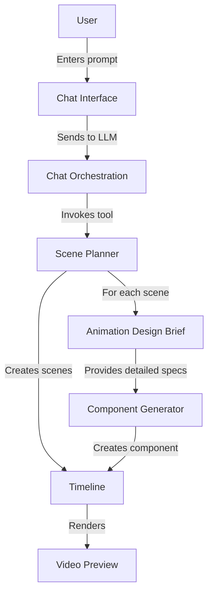

# Animation Design Brief Pipeline Architecture

This document explains how the Animation Design Brief (ADB) system integrates with the larger Bazaar-Vid architecture and the flow of data from user prompt to final video output.

## System Components Overview



## 1. Animation Design Brief in the Video Generation Pipeline

The Animation Design Brief (ADB) sits at a critical junction in the video generation process:

- **Input:** Scene descriptions from the Scene Planner
- **Output:** Detailed animation specifications for the Component Generator
- **Purpose:** Bridge the gap between high-level scene planning and low-level component implementation

By introducing this intermediate layer, we significantly improve component quality by providing richer, more structured animation details that the Component Generator can directly translate into code.

## 2. Data Flow Through the Pipeline

### 2.1 User Prompt → Scene Planning

1. User enters a prompt in ChatPanel.tsx
2. The chatOrchestration.service.ts processes the message
3. OpenAI GPT invokes the `planVideoScenes` tool
4. scenePlanner.service.ts analyzes the prompt and generates:
   - Scene counts, types, and durations
   - Scene descriptions and IDs
   - Overall video structure and timing

```typescript
// Example Scene Plan Output
{
  "intent": "Create ad for GallerySwipe app",
  "reasoning": "...",
  "scenes": [
    {
      "id": "scene_intro",
      "description": "Opening with GallerySwipe logo",
      "durationInSeconds": 3,
      "effectType": "custom"
    },
    {
      "id": "scene_swipe_demo",
      "description": "Show phone with swipe interaction",
      "durationInSeconds": 5,
      "effectType": "custom"
    }
    // ...more scenes
  ],
  "sceneCount": 5,
  "totalDuration": 25,
  "fps": 30
}
```

### 2.2 Scene Planning → Animation Design Brief

For each scene with `effectType: "custom"`, the Scene Planner triggers the Animation Design Brief generation:

1. handleScenePlan() in scenePlanner.service.ts calls generateAnimationDesignBrief()
2. animationDesigner.service.ts generates a detailed ADB for each scene
3. The ADB is stored in the database and linked to the scene
4. Status is updated in the UI via ScenePlanningHistoryPanel.tsx

```typescript
// Example Animation Design Brief Output
{
  "briefVersion": "1.0.0",
  "sceneId": "scene_swipe_demo",
  "sceneName": "Phone Swiping Demonstration",
  "scenePurpose": "Show the app's swiping interface in action",
  "overallStyle": "Modern, clean, app demonstration",
  "durationInFrames": 150,
  "dimensions": { "width": 1920, "height": 1080 },
  "colorPalette": {
    "background": "#121212",
    "primary": "#FF5C5C",
    "secondary": "#35D073",
    "accent": "#3B82F6",
    "textPrimary": "#FFFFFF"
  },
  "elements": [
    {
      "elementId": "phone_device",
      "elementType": "image",
      "name": "Phone Frame",
      "initialLayout": {
        "x": 960,
        "y": 540,
        "width": 300,
        "height": 600,
        "opacity": 1,
        "scale": 1
      },
      "animations": [
        {
          "animationId": "phone_entrance",
          "animationType": "fadeIn",
          "startAtFrame": 0,
          "durationInFrames": 30,
          "easing": "easeOutCubic"
        }
      ]
    },
    {
      "elementId": "swipe_gesture",
      "elementType": "shape",
      "name": "Swipe Animation",
      "initialLayout": {
        "x": 960,
        "y": 540,
        "opacity": 0
      },
      "animations": [
        {
          "animationId": "swipe_appear",
          "animationType": "fadeIn",
          "startAtFrame": 40,
          "durationInFrames": 20
        },
        {
          "animationId": "swipe_motion",
          "animationType": "moveHorizontal",
          "startAtFrame": 60,
          "durationInFrames": 30,
          "propertiesAnimated": [
            {
              "property": "x",
              "from": 800,
              "to": 1100
            }
          ]
        }
      ]
    }
    // ...more elements
  ]
}
```

### 2.3 Animation Design Brief → Component Generation

The ADB provides structured input to the Component Generator:

1. The generateComponent() function receives the ADB
2. componentGenerator.service.ts uses the ADB to prompt OpenAI
3. The LLM generates Remotion component code based on the detailed brief
4. The code is compiled and stored for rendering
5. The component appears in the Timeline once ready

```typescript
// Example of how componentGenerator.service.ts uses the ADB
export async function generateComponent(
  projectId: string,
  animationDesignBrief: AnimationDesignBrief,
  // ...other parameters
) {
  // Extract key details from the ADB
  const {
    sceneName,
    elements,
    colorPalette,
    durationInFrames,
    typography
  } = animationDesignBrief;
  
  // Use these details to enhance the prompt for the LLM
  const fullPrompt = `
    Create a Remotion component for scene "${sceneName}" with the following elements:
    ${elements.map(e => `- ${e.name}: ${e.elementType} with ${e.animations.length} animations`).join('\n')}
    
    Color scheme: ${Object.entries(colorPalette).map(([k, v]) => `${k}: ${v}`).join(', ')}
    
    Typography: ${typography?.defaultFontFamily || 'Inter'}
    
    Total duration: ${durationInFrames} frames
  `;
  
  // Generate the component...
}
```

## 3. UI Integration Points

The Animation Design Brief system integrates with the UI in these key places:

### 3.1 ScenePlanningHistoryPanel.tsx

This panel shows the scene plans and their associated ADBs:
- Displays ADBs for each scene
- Shows ADB status (pending/complete/error)
- Provides buttons to generate/regenerate ADBs
- Shows formatted ADB content when expanded

```typescript
// Key ADB-related parts of ScenePlanningHistoryPanel.tsx

// Fetch ADBs from the server
const { 
  data: designBriefs 
} = api.animation.listDesignBriefs.useQuery(
  { projectId },
  { 
    enabled: !!projectId,
    refetchInterval: 5000 // Poll for updates
  }
);

// Organize by scene
const briefsBySceneId = useMemo(() => {
  if (!designBriefs) return {};
  
  return designBriefs.reduce((acc, brief) => {
    if (!acc[brief.sceneId]) {
      acc[brief.sceneId] = [];
    }
    acc[brief.sceneId].push(brief);
    return acc;
  }, {} as Record<string, AnimationDesignBrief[]>);
}, [designBriefs]);

// Generate/regenerate a brief
const handleRegenerateBrief = (sceneId: string) => {
  regenerateBriefMutation.mutate({
    projectId,
    sceneId,
    // ...other parameters
  });
};
```

### 3.2 ChatPanel.tsx

The chat interface doesn't directly show ADBs but:
- Initiates the pipeline with the user prompt
- Shows progress updates during generation
- Reports completion or errors in the pipeline

### 3.3 TimelinePanel.tsx

The timeline shows scene status:
- Displays generation status for scenes
- Indicates timing issues or errors
- Allows selection of scenes for detailed view

## 4. Database Schema

The Animation Design Brief system relies on these database tables:

1. **animationDesignBriefs**
   - Stores the ADB data, status, and relationships
   - Links to projects, scenes, and component jobs

2. **scenePlans**
   - Stores the higher-level scene planning data
   - References the message that triggered the planning

3. **customComponentJobs**
   - Stores information about component generation jobs
   - Can be linked to ADBs to track the full pipeline

## 5. Key APIs

The system exposes these main API endpoints via tRPC routers:

1. **animation.generateDesignBrief**
   - Generates a new ADB for a given scene
   - Parameters: projectId, sceneId, scenePurpose, dimensions, etc.
   - Returns: brief ID and brief object

2. **animation.listDesignBriefs**
   - Lists all ADBs for a project
   - Parameters: projectId
   - Returns: array of ADBs with metadata

3. **animation.getDesignBrief**
   - Gets a specific ADB by ID
   - Parameters: briefId
   - Returns: complete ADB with status

## 6. Error Handling & Recovery

The ADB system includes these error handling mechanisms:

1. **Validation**: ADB structure is validated against the Zod schema before storage
2. **Fallbacks**: If validation fails, a limited ADB is created with available data
3. **Retry Logic**: Component generation can be retried if it fails
4. **Status Tracking**: ADB status updates in real-time (pending/complete/error)
5. **UI Recovery**: "Regenerate" buttons allow users to fix problematic briefs

## 7. Future Enhancements

Planned improvements to the ADB system:

1. **Template Library**: Pre-designed ADB templates for common scene types
2. **ADB Editor**: Direct editing of briefs in the UI
3. **AI Suggestions**: AI-powered suggestions for improving briefs
4. **Performance Metrics**: Track ADB generation quality and performance
5. **Version History**: Track changes to briefs over time

## Conclusion

The Animation Design Brief system provides a crucial bridge between high-level scene planning and low-level component implementation. By generating structured, detailed animation specifications, it enables the LLM to create higher quality components with more consistent results. The UI integration points provide visibility and control over the process, allowing users to monitor and fix issues as needed. 