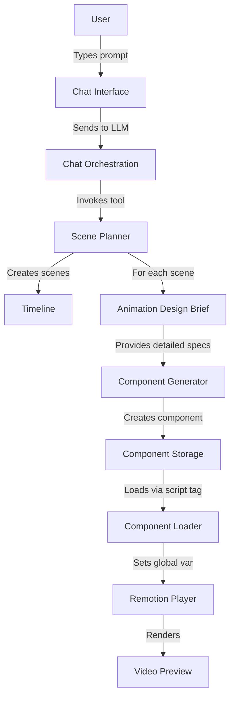

//memory-bank/sprints/sprint25/complete-pipeline-integration-plan.md
# Animation Pipeline Integration: Current State and Required Changes

This document analyzes the current animation generation pipeline from user prompt to final video rendering and outlines the necessary changes to integrate our new ESM component loading approach.

## Current Pipeline Architecture



### Key Components in the Current Flow

1. **User Prompt → Scene Planning**
   - `scenePlanner.service.ts` processes user requests via the LLM
   - Creates scene plans with durations, descriptions, and effect types
   - Initiates animation design brief generation for each scene

2. **Animation Design Brief Generation**
   - `animationDesigner.service.ts` creates detailed specifications
   - Defines elements, animations, colors, typography, etc.
   - Structures output in a standardized schema for component generation

3. **Component Generation**
   - Takes animation design brief as input
   - Generates React/Remotion components to implement the animations
   - Currently outputs components that use global registration pattern

4. **Component Storage and Loading**
   - Components are stored in Cloudflare R2 or similar storage
   - Retrieved via script tag injection in the browser
   - Components register themselves via `window.__REMOTION_COMPONENT`

5. **Rendering in Remotion Player**
   - Player receives component from global variable
   - Renders frames based on scene configuration
   - Manages playback, controls, and timing

## Required Changes for ESM Integration

### 1. Component Generator Updates

#### Current Implementation
```typescript
// Current component generation (simplified)
async function generateComponent(designBrief: AnimationDesignBrief) {
  const prompt = `Create a Remotion component based on this brief: ${JSON.stringify(designBrief)}`;
  const componentCode = await llm.generateCode(prompt);
  return componentCode; // Contains global registration pattern
}
```

#### Required Changes
```typescript
// Updated ESM component generation
async function generateComponent(designBrief: AnimationDesignBrief) {
  // 1. Update system prompt to generate ESM components WITHOUT React imports
  const systemPrompt = `Create a Remotion component for the browser Player:
  - Import {AbsoluteFill, useCurrentFrame, etc.} from 'remotion' ONLY
  - If needed, import from remotion sub-paths (e.g., {interpolateColors} from 'remotion/color')
  - Do NOT import React - it will be available globally
  - Use default export for the main component
  - Do NOT use window.__REMOTION_COMPONENT`;
  
  // 2. Generate the component with updated instruction
  const componentCode = await llm.generateCode(prompt, {systemPrompt});
  
  // 3. Build with esbuild to handle externals
  const builtComponent = await buildWithExternals(componentCode);
  
  // 4. Return ESM-compatible code
  return builtComponent;
}
```

### 2. Component Storage Pipeline

#### Current Implementation
```typescript
// Current storage approach
async function storeComponent(code: string) {
  const blob = new Blob([code], {type: 'application/javascript'});
  const url = await uploadToStorage(blob);
  return url;
}
```

#### Required Changes
```typescript
// Updated storage for ESM modules
async function storeComponent(code: string) {
  // 1. Use correct MIME type for ES modules
  const blob = new Blob([code], {type: 'text/javascript;charset=utf-8'});
  
  // 2. Add metadata for ESM module type
  const metadata = {
    contentType: 'text/javascript;charset=utf-8',
    customMetadata: {
      'X-Module-Type': 'esm',
      'X-React-Version': RUNTIME_DEPENDENCIES.react,
      'X-Remotion-Version': RUNTIME_DEPENDENCIES.remotion
    }
  };
  
  // 3. Upload with proper headers
  const url = await uploadToStorage(blob, metadata);
  return url;
}
```

### 3. Component Loading Mechanism

#### Current Implementation
```typescript
// Current loading approach using script injection
function loadComponent(url: string) {
  return new Promise((resolve, reject) => {
    const script = document.createElement('script');
    script.src = url;
    script.onload = () => resolve(window.__REMOTION_COMPONENT);
    script.onerror = reject;
    document.head.appendChild(script);
  });
}
```

#### Required Changes
```typescript
// Updated ESM loading approach with esbuild-built modules
function loadComponent(url: string) {
  // Simply use dynamic import with webpackIgnore - much cleaner!
  return import(/* webpackIgnore: true */ url);
}
```

### 4. Player Integration

#### Current Implementation
```tsx
// Current Player usage
function VideoPreview({componentUrl, config}) {
  const [component, setComponent] = useState(null);
  
  useEffect(() => {
    loadComponent(componentUrl).then(setComponent);
  }, [componentUrl]);
  
  return (
    <Player
      component={component}
      durationInFrames={config.duration}
      fps={config.fps}
      compositionWidth={config.width}
      compositionHeight={config.height}
    />
  );
}
```

#### Required Changes
```tsx
// Updated Player with lazyComponent
function VideoPreview({componentUrl, config}) {
  // 1. Create lazy component loader function
  const lazyComponent = useCallback(
    () => import(/* webpackIgnore: true */ componentUrl), 
    [componentUrl]
  );
  
  return (
    <ErrorBoundary FallbackComponent={ErrorFallback}>
      <Suspense fallback={<div>Loading component...</div>}>
        <Player
          lazyComponent={lazyComponent}
          durationInFrames={config.duration}
          fps={config.fps}
          compositionWidth={config.width}
          compositionHeight={config.height}
          inputProps={config.props}
          controls
        />
      </Suspense>
    </ErrorBoundary>
  );
}
```

### 5. Global Dependency Exposure

```tsx
// Add to application root component
useEffect(() => {
  // Expose dependencies to window for ESM components
  window.React = React;
  window.ReactDOM = ReactDOM;
  
  // Use dynamic import for JSX runtime (future-proof for React 19+)
  import('react/jsx-runtime').then(jsx => {
    window.ReactJSX = jsx;
  });
  
  window.Remotion = RemotionLib;
  window.sharedModuleRegistry = sharedModuleRegistry;
}, []);
```

## Major Decision Points

### 1. Code Generator System Prompt

We need to decide the specific instructions for the code generator:

**Option A: Standard Remotion Components without React imports**
- Pros: Clean code, standard patterns, proper official approach
- Cons: Requires esbuild step, more build configuration

**Option B: Pre-Transformed Components with window globals**
- Pros: No build step needed, potentially faster
- Cons: Non-standard code, harder to maintain, LLM may be less effective

**Recommendation:** Option A is clearly superior - it produces cleaner code that follows Remotion's official guidance, and the esbuild step is deterministic and reliable.

### 2. Build System Strategy

Two main approaches to handling externals:

**Option A: esbuild with external-global plugin**
- Pros: Robust AST-based transformation, industry standard, preserves source maps, handles Remotion sub-paths
- Cons: Requires build step, additional dependency

**Option B: Runtime transformation with regex**
- Pros: Simpler implementation, no build step
- Cons: Brittle with complex imports, prone to errors, hard to debug

**Recommendation:** Option A (esbuild) is the clear winner - it's the approach recommended by Remotion, guaranteed to handle all import patterns correctly, and preserves source maps for debugging.

### 3. Shared Module Access

How components access shared utilities:

**Option A: Global Registry**
- Pros: Simple implementation, consistent access pattern
- Cons: Global pollution, potential conflicts

**Option B: Import-time Injection**
- Pros: Cleaner component code, no globals
- Cons: More complex transformation, harder to debug

**Option C: Props-based Passing**
- Pros: Cleanest separation, explicit dependencies
- Cons: Verbose props, might not scale well

**Recommendation:** Global Registry provides the best balance of simplicity and functionality, with namespacing to minimize conflicts.

### 4. Error Handling Strategy

How to handle component loading failures:

**Option A: Component-level Fallbacks**
- Pros: Granular recovery, better UX
- Cons: More complex implementation

**Option B: Scene-level Fallbacks**
- Pros: Simpler implementation, consistent behavior
- Cons: Less granular, might discard valid scenes

**Recommendation:** Implement Component-level Fallbacks for best user experience, with scene-level fallbacks as a secondary measure. The improved source maps from esbuild will also help diagnose issues more effectively.

## Implementation Roadmap

1. **Add esbuild Integration**
   - Install esbuild and external-global plugin
   - Set up build pipeline for components
   - Configure external globals for React/React DOM/JSX runtime
   - Map all Remotion sub-paths (color, audio, etc.) to window.Remotion

2. **Update Component Generator System Prompt**
   - Modify prompt to generate components that import from Remotion but NOT React
   - Add examples of proper component structure

3. **Update Storage System**
   - Add proper MIME types and metadata for ESM modules
   - Implement versioning for dependency tracking

4. **Simplify Component Loading**
   - Update all component loading code to use clean dynamic import
   - Add error boundaries and Suspense fallbacks

5. **Update Remotion Player Integration**
   - Switch to `lazyComponent` prop throughout the application
   - Ensure proper controls and interaction

6. **Global Dependency Exposure**
   - Add code to expose React and ReactDOM globals directly
   - Use dynamic import for exposing React JSX runtime (future-proof for React 19+)
   - Expose Remotion and all its sub-namespaces
   - Set up early in application lifecycle

7. **Testing & Validation**
   - Create test suite for end-to-end pipeline
   - Validate with complex animation briefs
   - Check bundle sizes to confirm no duplicate React/Remotion

8. **Source Map Integration**
   - Ensure source maps work correctly for debugging
   - Add monitoring for component load times

## Conclusion

Integrating the esbuild-based ESM component loading approach with the existing animation pipeline requires changes across multiple systems, but the benefits are substantial:

1. **Better Component Integrity**: Single React/Remotion context guaranteed by proper externalization
2. **Improved Animation Experience**: Proper frame-based animations with controls
3. **Enhanced Reliability**: AST-based transformation eliminates edge cases
4. **Maintainable Architecture**: Clean, standard component code following official patterns
5. **Better Debugging**: Preserved source maps for easier troubleshooting

The esbuild approach with external-global plugin is clearly superior to regex-based transformations, providing a robust, maintainable solution that aligns with Remotion's official guidance. This approach ensures clean component code, reliable transformation, and proper dependency handling throughout the pipeline.
