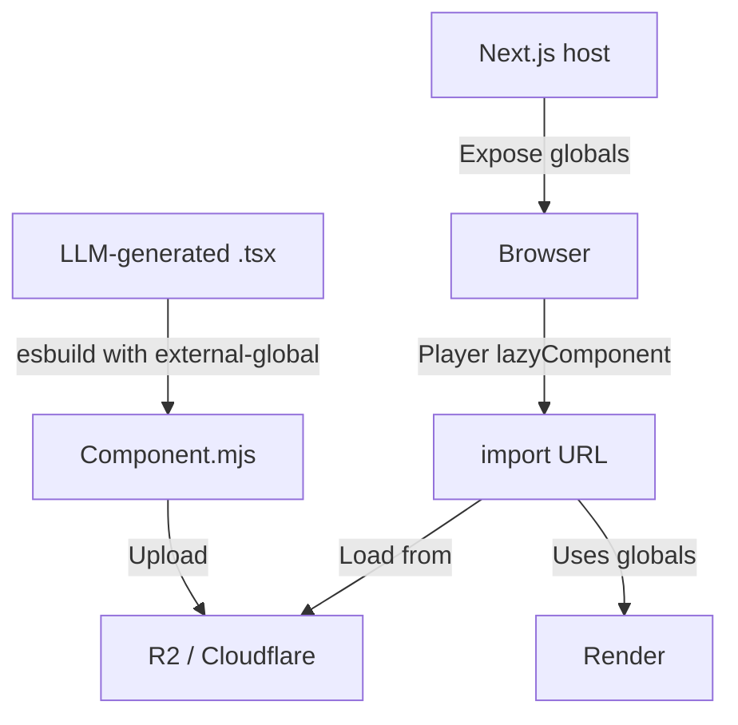

//memory-bank/sprints/sprint25/esbuild-integration-approach.md
# esbuild-based ESM Component Integration

This document outlines a more robust approach to ESM component loading using esbuild's external-global plugin instead of runtime regex transformations, based on Remotion's official recommendations.

## Core Principles

| Goal | Implementation |
|------|----------------|
| Single React & Remotion instance | Use esbuild to externalize React/Remotion at build time |
| Clean ES modules for dynamic import | Keep default exports, use proper ESM format |
| Simple LLM templates | Ask LLM to write standard code, handle externals during build |
| Reliable transformation | Use AST-based transformation instead of regex |

## Build Pipeline Architecture



## Build Step Implementation

```typescript
import { build } from 'esbuild';
import { externalGlobalPlugin } from 'esbuild-plugin-external-global';

// Component build process
export async function buildComponent(componentCode: string): Promise<string> {
  // Write component to temp file
  const tempFilePath = `/tmp/component-${Date.now()}.tsx`;
  fs.writeFileSync(tempFilePath, componentCode);
  
  // Build with esbuild
  const result = await build({
    entryPoints: [tempFilePath],
    write: false, // Keep in memory
    format: 'esm',
    bundle: true,
    platform: 'browser',
    sourcemap: true,
    plugins: [
      externalGlobalPlugin({
        // Core React externals
        react: 'window.React',
        'react-dom': 'window.ReactDOM',
        'react/jsx-runtime': 'window.ReactJSX',
        
        // Remotion and all sub-paths
        remotion: 'window.Remotion',
        'remotion/color': 'window.Remotion',  // Handle sub-paths
        'remotion/audio': 'window.Remotion',
        'remotion/noise': 'window.Remotion',
        'remotion/paths': 'window.Remotion',
      }),
    ],
  });
  
  // Clean up temp file
  fs.unlinkSync(tempFilePath);
  
  // Return built code
  return result.outputFiles[0].text;
}
```

## Runtime Integration

### 1. Host Application Setup

```typescript
// In _app.tsx or main application component
import React from 'react';
import ReactDOM from 'react-dom';
import * as Remotion from 'remotion';

useEffect(() => {
  // Expose globals for component access
  window.React = React;
  window.ReactDOM = ReactDOM;
  // Use dynamic import for JSX runtime (future-proof for React 19+)
  import('react/jsx-runtime').then(jsx => {
    window.ReactJSX = jsx;
  });
  window.Remotion = Remotion;
  
  // Optional: expose shared module registry
  window.sharedModuleRegistry = sharedModuleRegistry;
}, []);
```

### 2. Import Map Configuration

```html
<!-- Only needed for other dependencies, not React or Remotion -->
<script type="importmap">
{
  "imports": {
    "date-fns": "https://esm.sh/date-fns@3",
    "lodash": "https://esm.sh/lodash-es@4",
    "framer-motion": "https://esm.sh/framer-motion@10"
  }
}
</script>
```

### 3. Dynamic Component Loading

```typescript
// Simple and clean component loading
function VideoPreview({ componentUrl, config }) {
  const lazyComponent = useCallback(
    () => import(/* webpackIgnore: true */ componentUrl),
    [componentUrl]
  );
  
  return (
    <ErrorBoundary FallbackComponent={ErrorFallback}>
      <Suspense fallback={<div>Loading component...</div>}>
        <Player
          lazyComponent={lazyComponent}
          durationInFrames={config.duration}
          fps={config.fps}
          compositionWidth={config.width}
          compositionHeight={config.height}
          inputProps={config.props}
          controls
        />
      </Suspense>
    </ErrorBoundary>
  );
}
```

## LLM Instructions

The system prompt for the component generator should be updated to:

```
Write a Remotion component for the browser Player. You may import {AbsoluteFill, useCurrentFrame, ...} from "remotion" and you must export default YourComponent. Do not import React - assume it's globally available.

# If you need features from Remotion sub-paths
You may import features from remotion sub-paths. For example:
- Import {interpolateColors} from "remotion/color"
- Import {noise2D} from "remotion/noise"

All imports will be properly externalized to use the host's Remotion instance.

The component should implement the following animation:
[Animation description from design brief]

You can use any of these shared utilities available via window.sharedModuleRegistry:
- animation-utils: provides easeInOut, spring, etc.
- color-utils: provides color manipulation functions
```

## Advantages Over Runtime Regex Approach

| Current Regex Approach | esbuild Approach |
|------------------------|------------------|
| Runtime regex can fail on edge cases | esbuild plugin uses the AST – zero false positives |
| Need to inject import-map and globals | Only import-map for other deps needed |
| Double declarations | esbuild guarantees single reference |
| Hard to maintain source-maps | esbuild preserves maps automatically |
| Wrapper component / context confusion | `<Player lazyComponent>` uses the module directly |

## Integration with Component Generation

The componentGenerator service should be updated to:

```typescript
async function generateComponent(designBrief: AnimationDesignBrief) {
  // 1. Generate component with updated system prompt
  const componentCode = await llm.generateCode(designBrief, {
    systemPrompt: 'Write a Remotion component for the browser Player. Import specifically from "remotion" (e.g., {AbsoluteFill, useCurrentFrame}) ONLY. DO NOT import React - it will be available globally. Export your component as default.'
  });
  
  // 2. Build with esbuild instead of regex transformation
  const builtComponent = await buildComponent(componentCode);
  
  // 3. Store the built component
  const componentUrl = await storeComponent(builtComponent);
  
  return { componentUrl, status: "ready" };
}
```

## Verification Checklist

- [ ] Bundle size < 120 KB (confirming React isn't bundled twice) - verify in CI pipeline
- [ ] No 'import React' statements in generated code
- [ ] Only one window.Remotion instance
- [ ] External imports from Remotion sub-paths properly handled
- [ ] module.default is a function
- [ ] Player renders without "Invalid hook call" or "useContext is null" errors
- [ ] Source maps work correctly with breakpoints
- [ ] CORS headers correctly set on storage backend

## Implementation Steps

1. Add esbuild and external-global plugin to dependencies
2. Create component build utility with proper externalization
3. Update host application to expose globals
4. Modify component generator system prompt
5. Update component loading to use simpler dynamic import
6. Add verification tests for single React/Remotion instances

## Conclusion

The esbuild external-global approach provides a much more robust solution than our current regex-based approach. It aligns perfectly with Remotion's official guidance, eliminates fragile string manipulation, and guarantees a single React/Remotion context. This approach should be adopted as the primary implementation strategy for the ESM component pipeline.
