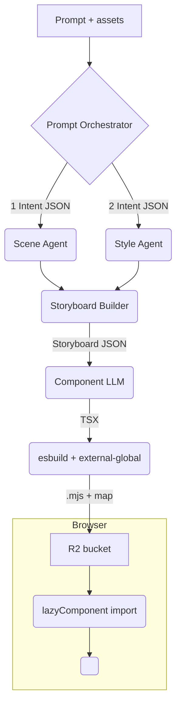

<!-- path: memory-bank/sprint26/overview.md -->

# Modern Remotion-based Video System: Lean Architecture

Modern Remotion-based video systems can stay modular without turning into a “Rube Goldberg editor.”  
Below is a lean architecture that keeps your original ideas—scene planning, design briefs, code-gen—yet removes duplicated logic, clarifies agent responsibilities, and guarantees every clip renders in one React + Remotion context.

---

## 1. Executive Outline

- **Single Orchestrator:** Owns the user prompt, delegates to specialists (scene, style, assets), and stitches results.
- **Storyboard JSON:** Replaces the ScenePlan → ADB chain; contains all scenes’ timing, style tokens, asset refs, and component templates.
- **LLM Component Generation:** Components generated by an LLM that imports only Remotion. Esbuild’s external-global plugin rewires React/Remotion to the host window—no duplicate contexts.
- **Cloud Storage:** R2 stores the built `.mjs` file with proper CORS headers; Player loads via `lazyComponent`—the Remotion-recommended pattern.
- **Theming Consistency:** Style mined from the user’s GitHub repo (or screenshots); design tokens surfaced as a reusable palette for LLM.
- **Design-System Transitions:** Scene transitions follow a small design-system spec (e.g. Salesforce “design-transitions”), not invented ad-hoc.

---

## 2. High-Level Modules

| Module               | Role                                                                                          | Tech / Doc Links                    |
|----------------------|-----------------------------------------------------------------------------------------------|-------------------------------------|
| Prompt Orchestrator  | Parses intent, calls sub-agents (Scene, Style, Asset). Uses OpenAI function calling or “routines & hand-offs”. |
| Scene Agent          | Generates timeline beats & rough duration. Inspired by VideoDirectorGPT multi-scene planning. |
| Style Agent          | Scrapes GitHub repo / images, extracts color & type tokens (see design-token workflow).        | LLM, simple HTML/CSS parser         |
| Storyboard Builder   | Merges Scene + Style + user assets into one JSON schema; feeds that to Component Generator.   |
| Component Generator  | LLM that outputs TSX using only `import {…} from 'remotion'`; no React. Use clear, role-based, few-shot prompts. |
| Builder              | Esbuild + external-global; bundles to ESM, preserves sourcemaps; maps `remotion/**` sub-paths to `window.Remotion`. |
| Storage              | Upload `.mjs` to R2; buckets set public-read CORS so `import()` works.                        |
| Player Host (Next.js)| Exposes window.React, window.ReactDOM, window.ReactJSX, window.Remotion, plus sharedModuleRegistry; uses `<Player lazyComponent={fn}>`. |
| Observability        | Watches bundle size (<120 kB) & React duplication via CI; hooks errors to ErrorBoundary for user feedback. |

---

## 3. Why a Single “Storyboard” Beats ScenePlan → ADB

- **Fewer transformations:** Less chance of drift.
- **Unified context:** Temporal info (duration, fps) alongside visual tokens (colors, fonts).
- **Versionable:** Easy to diff/version; JSON schema validation in CI.

**Example Storyboard JSON:**

```json
{
  "fps": 30,
  "width": 1280,
  "height": 720,
  "palette": { "primary": "#0062ff", "accent": "#e84393" },
  "fontFamily": "Inter",
  "scenes": [
    { "start": 0,  "duration": 90, "template": "HeroTitle", "props": { "title": "Build Fast" } },
    { "start": 90, "duration": 60, "template": "CodeSnippet", "props": { "repo": "github.com/acme/app" } }
  ]
}
```

---

## 4. Component Build & Load Flow (Detailed)

1. **LLM Output:** TSX with Remotion imports.
2. **esbuild Build:**

   ```js
   externalGlobalPlugin({
     react: 'window.React',
     'react-dom': 'window.ReactDOM',
     'react/jsx-runtime': 'window.ReactJSX',
     remotion: 'window.Remotion',
     'remotion/*': 'window.Remotion'
   });
   ```
   > Source-map included automatically.

3. **Upload:** Result to R2; set `Content-Type: text/javascript` and `CORS-allow: *`.

4. **Player Load:**
   ```js
   const lazyComp = useCallback(() => import(/* webpackIgnore: true */ url), [url]);
   <Player lazyComponent={lazyComp} … />
   ```
   > This is the Remotion docs’ pattern.

5. **Clip Mounts:** Hooks resolve against host React; no duplicate context, so no “invalid hook call.”

---

## 5. Style & Asset Ingestion

### 5.1 GitHub Repo Theming

- Parse `tailwind.config.js`, SCSS variables, or Figma tokens in `/tokens/*.json`.
- Convert to design-token set in the Storyboard palette.

### 5.2 User-uploaded Images

- Store raw files in R2; pass URLs into scene props.
- *(Future)* Use CLIP or LLaVA to extract dominant color & mood from images.

### 5.3 Transitions

- Standardise fade, slide, scale durations from motion guidelines (e.g., Lightning Design System) so scenes feel cohesive.

---

## 6. Agent Orchestration Tips

- Use OpenAI “routines & hand-offs”: each agent gets/returns structured JSON; orchestrator stitches.
- Keep agents stateless, except Style Agent (can cache tokens per repo).

---

## 7. Governance & Ethics

- Surface brand AI-protocol choices (transparency, IP) early; see Vogue Business for considerations.
- Provide opt-out for code or imagery that shouldn’t appear in marketing.

---

## 8. Checklist Before Shipping

- **CI fails** if bundle > 120 kB or React appears twice.
- **CORS headers** verified via `curl -I`.
- **Storyboard schema** validated.
- **ErrorBoundary** logs source-mapped stack traces.
- **Prompt quality** iterated (few-shot, role, explicit rules) per Google & Guardian best-practice.

---

## 9. Conclusion

By collapsing several intermediate docs into a single Storyboard, externalising React/Remotion at build-time, and leaning on agent-handoff patterns, you get a pipeline that is:

- **Simpler:** Fewer moving parts, no regex hacks
- **Consistent:** One theme, one context
- **Extensible:** Easy to insert image/GitHub style agents
- **On-spec:** Remotion’s official Player guidelines

> Implement the esbuild-based external-global build once, adopt the JSON storyboard, and your “too smart” system becomes a focused, maintainable video factory.

**In a nutshell:**  
The fastest way to turn the dog-dating launch prompt into a finished, editable video is to run a thin `orchestrator → storyboard → component → build → render` pipeline. A single JSON Storyboard keeps timing, style tokens and asset references in one place, while esbuild’s external-global plugin guarantees every generated clip re-uses the host’s lone React/Remotion instance—avoiding the hook-context crash Remotion warns about.  
From prompt-to-first-preview the path involves seven async jobs (≈30–40s on commodity cloud); all later edits re-render only the affected scene, so a colour tweak feels instant (<2s). Each step can call the LLM best suited for the job—e.g. GPT-4o for planning, Claude-3 for code—because the orchestrator just swaps API wrappers.

---

# Architecture Overview: Prompt-to-Remotion Video Factory

---

## 1. Timeline from User Click to First Playable Video

| Step | Owner | Latency | Output |
|------|-------|---------|--------|
| 1. Prompt → Intent JSON | Prompt-Orchestrator (GPT-4o, 4–6 s) | {goal:"teaser", target:["X","YT","TT"], tone:"fast-paced", refImg:"…/homepage.png"} |
| 2. Scene Planning | Scene Agent (Turbo, 2 s) | 5 scenes with durations (e.g. 0-3 s intro, 3-8 s USP 1…) |
| 3. Style Mining | Style Agent (Claude-3 + Git parser, 5 s) | palette #0062ff/#e84393, “SF Pro” font, dog icons |
| 4. Storyboard Build | Code (no LLM, <0.5 s) | Single JSON combining 2 + 3 |
| 5. Component Generation | Component LLM (Claude/CodeLlama, 6-8 s) | TSX per scene, imports only 'remotion' |
| 6. esbuild + external-global | Build worker (2 s, incremental) | .mjs bundle ≈ 60 kB, source-map, uploaded to R2 (CORS) |
| 7. <Player lazyComponent> import | Browser (3-5 s on 4G) | First frame appears; playback at 30 fps. |

**Total:** ≈ 30–40 s to usable preview; none of it blocks the UI thanks to Suspense + ErrorBoundary fallbacks.

---

## 2. Actors & Their Context Needs

### 2.1 Prompt Orchestrator
- Knows user profile, past chats, available agents.
- Chooses models per task (config file): e.g. `"planner": "gpt-4o"`, `"coder": "claude-3"`.
- Uses OpenAI “routines & hand-offs” pattern for chaining JSON outputs.
- Optionally negotiates agent cooperation via Google’s A2A protocol.

### 2.2 Scene Agent
- Only sees intent JSON; returns timeline array.
- Fast model OK (GPT-3.5-Turbo) because logic is simple.

### 2.3 Style Agent
- Fetches GitHub repo → extracts Tailwind config / CSS vars → converts to design-tokens (use an OSS transformer).
- Pulls dominant colours from uploaded images via tiny Vision model.

### 2.4 Storyboard Builder
- Pure code: merges scenes + tokens into canonical JSON schema (validated via AJV).
- Produces Mermaid visual for debugging (GitHub tool exists).

### 2.5 Component Generator
- Large-context LLM (Claude-3 Haiku if cheap, Sonnet if larger).
- Prompt contains storyboard snippet + shared registry API docs.
- Must not import React—esbuild maps React/Remotion to globals later.

### 2.6 Builder Service
- Runs esbuild with externalGlobalPlugin so bundle references window.React, window.Remotion.
- Maps every remotion/* sub-path (color, audio, noise).
- Outputs .mjs + source-map; uploads to R2 with permissive CORS.

### 2.7 Player Host
- Next.js app exposes globals once in _app.tsx.
- Loads clips via `lazyComponent={() => import(url)}` (docs requirement).
- Shows progress bar during build/upload; swaps scenes live when new .mjs arrives (hot-swap).

---

## 3. Post-Preview Editing Loop

1. User clicks text or types “letters slide from right”.
2. Chat Orchestrator finds affected scene in Storyboard, patches its transition field.
3. Component Generator only re-writes that scene’s TSX; Build + Upload repeat (2 s).
4. Player auto-refreshes the one scene; timeline stays intact.

---

## 4. Model-Flexible Architecture

```mermaid
graph LR
  subgraph LLM Layer
    planner["Scene LLM (cfg.planner)"]
    coder["Code LLM (cfg.coder)"]
    style["Style LLM (cfg.style)"]
  end
  orchestrator --> planner & style --> storyboard --> coder
```

- `cfg.*` read from a YAML file, so ops can switch providers (OpenAI, Anthropic, Mistral) per task without code changes.
- Each agent wrapper implements the same `callLLM(prompt, config)` signature; orchestrator plugs them in.

---

## 5. Evaluation Hooks

| Stage           | Eval Metric                                 | Tooling                                  |
|-----------------|---------------------------------------------|------------------------------------------|
| Scene plan      | “Covers all user goals?”                    | simple rubric + GPT-4 judge              |
| Component build | Bundle size < 120 kB                        | CI shell check, fail if larger           |
| Render output   | No duplicate React, no hook errors          | Jest + Puppeteer open Player, assert console clean |
| Overall         | User rating loop                            | OpenAI Evals framework for automated regression tests |

---

## 6. Why This Stays Simple

- One JSON doc (Storyboard) holds every decision → fewer transforms, easier debugging.
- One build tool (esbuild) handles externals; no runtime regex.
- One Player API (lazyComponent) → no global registry juggling.
- Modular agents run in parallel; swapping models is just a config tweak.

---

## 7. Rough SLA Numbers

| Path               | Cold runtime                                     |
|--------------------|--------------------------------------------------|
| First full build   | ~35 s                                            |
| Scene tweak        | 2–3 s (re-generate 1 file, incremental esbuild)  |
| Prop edit (colour) | <1 s (no rebuild)                                |
| Final 1080p render | 1 × video length (1× realtime) on AWS c7g.medium |

*(Numbers from Remotion benchmarks and esbuild tests on Vercel Edge)*

---

## 8. What to Implement Next

1. Create Storyboard schema + AJV validation.
2. Refactor componentGenerator to the esbuild flow in `esbuild-integration-approach.md`.
3. Add global exposure snippet once in _app.tsx.
4. Wire OpenAI Evals to the CI table above.
5. Ship beta & time real user flows.

_Follow this path and you’ll go from “dog-dating fast-paced teaser” to a polished, editable Remotion video without drowning in micro-services or duplicate contexts._

---

## Overview – From User Prompt to Polished, Editable Remotion Video

We’ll keep the pipeline lean by routing every request through one Prompt Orchestrator, storing all creative decisions in a single Storyboard JSON, and letting an esbuild + external-global build step guarantee that every clip shares the host’s one React / Remotion context. The storyboard feeds a Component-Generator LLM that imports only from remotion (never react), after which the bundle is uploaded to R2 and streamed into Remotion’s `<Player lazyComponent>`; first preview lands in ≈ 35 s, later edits refresh in < 3 s. The diagram below is the high-level architecture we’ll stick to during development, independent of filenames or vendors.

---

## 1. Core Goals

- **Fast first frame** – < 40 s from prompt to playable video on average hardware.
- **One source of truth** – a validated Storyboard JSON containing timing, style tokens and asset refs for every scene.
- **Zero duplicate React / Remotion** – esbuild rewires those imports to window.\*, avoiding the “invalid hook call” crash.
- **LLM-agnostic agents** – any step can swap models via YAML config.
- **Scene-level hot rebuilds** – only the edited scene is regenerated.

---

## 2. Module Map (50 000-ft View)

| Module                | Responsibility                                           | Key tech / doc                                |
|-----------------------|---------------------------------------------------------|-----------------------------------------------|
| Prompt Orchestrator   | Turns free-text + uploads into structured intent JSON and dispatches agents. | OpenAI “routines & handoffs”                  |
| Scene Agent           | Creates timeline beats and durations.                   | Fast LLM                                      |
| Style Agent           | Mines palette / fonts from GitHub repo or images; outputs design tokens. | Tailwind token extraction                     |
| Storyboard Builder    | Merges scene & style into one JSON; validates with AJV. | Pure TS                                       |
| Component Generator   | One TSX per scene; imports only remotion.               | Remotion Player docs require default export & no <Composition> |
| Builder               | esbuild + external-global bundles to ESM, maps react*/remotion* to globals, emits source-map. | Plugin pattern                                |
| Storage               | Uploads .mjs to R2 with permissive CORS.                | Cloudflare CORS guide                         |
| Player Host           | Exposes window.React, window.Remotion, registry; loads scenes via lazyComponent={() => import(url)}. | Remotion Player lazy import pattern           |
| Observability         | CI checks bundle < 120 kB, single React, runs OpenAI Evals on each stage. | Evals framework                               |
| (Optional) A2A layer  | Future-proof multi-agent security & traceability.        | Google A2A analysis                           |

---

## 3. Storyboard JSON – The Single Contract

```json
{
  "fps": 30,
  "width": 1280,
  "height": 720,
  "palette": { "primary": "#0062ff", "accent": "#e84393" },
  "fontFamily": "SF Pro",
  "scenes": [
    { "id": "intro",  "start": 0,  "duration": 90, "template": "LogoReveal",   "props": { "logo": "DogHeart" } },
    { "id": "usp1",   "start": 90, "duration": 60, "template": "SplitScreen",  "props": { "headline": "Swipe to sniff" } },
    { "id": "cta",    "start": 150,"duration": 30, "template": "BigCTA",       "props": { "url": "dogdates.app" } }
  ]
}
```

_All agents read / write this file—so colour, timing and shared components stay consistent across the video._

---

## 4. Data & Control Flow



- All heavy LLM calls (scene, style, code) run asynchronously and in parallel; only the orchestrator’s intent extraction is synchronous (< 150 ms).
- esbuild bundling (< 2 s) and R2 upload stream while the user sees a progress bar.
- `<Player>` pulls the first scene as soon as its module arrives—no need to wait for the full video.

---

## 5. Quality Guard-Rails (Smooth Motion)

1. Build worker renders 2 × fps off-thread frames; rejects if < 75% frames move or if velocity spikes.
2. Optional: Vision-LLM rubric (“rate squash-and-stretch 1-5”) only on final publish, not first preview, to keep latency low.
3. Visual-diff on three keyframes per scene to ensure palette / type don’t drift.

_These checks take < 1 s per scene and don’t block other scenes._

---

## 6. Latency Budget (Cold Run)

| Phase                    | Time (s) | Blocking? |
|--------------------------|----------|-----------|
| Intent extraction        | 0.1      | sync      |
| Scene & Style agents     | ≈ 7      | async     |
| Storyboard merge         | 0.05     | async     |
| Component LLMs (×5)      | ≈ 8      | async     |
| esbuild bundles (×5)     | ≈ 2      | async     |
| R2 uploads               | ≈ 1      | async     |
| Browser import first scene | 3      | async     |
| First frame visible      | ≈ 35     | –         |

_Every later edit rebuilds one scene (incremental esbuild ~300 ms) and the Player hot-swaps it._

---

## 7. Next Actions

1. Scaffold Storyboard schema + AJV validator.
2. Wrap esbuild logic shown in `esbuild-integration-approach.md`.
3. Add _app.tsx snippet to expose globals once.
4. Create YAML model-matrix so any agent’s LLM is a config change.
5. Wire OpenAI Evals + bundle-size guard into CI.

_Stick to this architecture and you’ll keep the codebase small, the animations smooth, and iteration time delightfully short._

---

## Repo-Ready Architecture Outline

This “architecture‐overview.md”-style outline is ready to paste straight into your repo or a code-gen prompt. It keeps the storyboard + esbuild pipeline, adds a first-class streaming-chat lane, and notes exactly where each concern lives. All timings assume today’s cloud instances and OpenAI Turbo-class models.

---

### 1. What We Are Building

A prompt-to-video factory that turns a single natural-language brief (+ optional images / GitHub repo) into a Remotion MP4, then lets the user iterate via chat or timeline clicks.

**Two real-time surfaces run in parallel:**

| Surface         | UX goal                                | Implementation                                                     |
|-----------------|----------------------------------------|--------------------------------------------------------------------|
| Video preview   | First playable frame ≤ 40 s; sub-scene edits < 3 s | Remotion <Player lazyComponent> + ESM components built with esbuild + external-global |
| Chat stream     | Token-level assistant typing + live tool-status events | tRPC v11 HTTP streaming (“experimental_stream” → SSE)              |

_Both channels share one JSON Storyboard (single source of truth) and the same window-scoped React / Remotion instances, eliminating the classic “invalid hook call” bug._

---

### 2. Top-Level Services & Data Flow

```
User ──▶ ChatRouter (tRPC)
          │
          │ ① store user msg
          ▼
Prompt-Orchestrator (LLM) ─┐
    │ splits work           │
    ├──► SceneAgent   (Turbo) ─┐
    ├──► StyleAgent   (Claude) │
    └──► AssetInspector        │
                               ▼
 storyboard.json  ◀──────── Storyboard-Builder (code, no LLM)
                               │
                               ▼
 ComponentGen (Code LLM) ───► esbuild-Worker ─► R2 (.mjs + map + CORS)
                               │
                               └── posts tool events back to Chat stream
Browser
  ├─ SSE stream (chat) ──▶ React UI
  └─ <Player lazyComponent> ─▶ import(componentURL) ─▶ playback
```

---

### 3. Streaming-Chat Lane (`chat.ts`)

| Phase        | What happens                                                                                             | Emitted SSE events                                      |
|--------------|---------------------------------------------------------------------------------------------------------|---------------------------------------------------------|
| 1. Init      | initiateChat writes user row + “pending” assistant row in DB.                                           | {type:"status",status:"thinking"}                       |
| 2. LLM stream| streamResponse opens a single OpenAI streaming request; deltas arrive as they are typed                 | {type:"delta", content:"…"}                             |
| 3. Tool call | When the assistant picks planVideoScenes or generateRemotionComponent, chat router: <br>– pushes {type:"tool_start"} <br>– delegates to SceneAgent / ComponentGen| {tool_start}                                            |
| 4. Long job updates | Build worker & R2 upload report progress via an eventBufferService; retransmitted as {type:"tool_result"} or {type:"sceneStatus"} | Keeps tab alive during 30 s build                       |
| 5. Completion| On success or error the router patches the assistant DB row once, then sends {type:"finalized"} and closes. | final delta                                             |

_Re-connections use clientId + lastEventId to replay buffered events (handled in eventBufferService.markDisconnected). SSE chosen over WebSockets: simpler infra, works with Vercel/Cloudflare edge, matches OpenAI’s token cadence._

---

### 4. Storyboard Schema (Single Source of Truth)

```json
{
  "fps": 30,
  "width": 1280,
  "height": 720,
  "palette": { "primary": "#0062ff" },
  "scenes": [
    { "id": "hero", "start": 0, "duration": 90, "template": "HeroTitle", "props": { "title": "Dog-Date" } },
    { "id": "feature1", "start": 90, "duration": 60, "template": "ScreenshotPan", "asset": "upload://homepage.png" }
  ]
}
```

- Lives in `projects.props` in your DB.
- Validated by AJV on every patch (keeps chat edits safe).

---

### 5. Build & Load Details (Video Lane)

1. esbuild bundles each TSX scene with externalGlobalPlugin so `import {AbsoluteFill} from 'remotion'` becomes `window.Remotion.AbsoluteFill` in the output bundle.
2. Upload .mjs to Cloudflare R2 with Content-Type: text/javascript and permissive CORS headers (Workers example).
3. Player side:

    ```js
    const lazyComp = useCallback(
      () => import(/* webpackIgnore:true */ componentUrl),
      [componentUrl]
    );
    <Player lazyComponent={lazyComp} … />
    