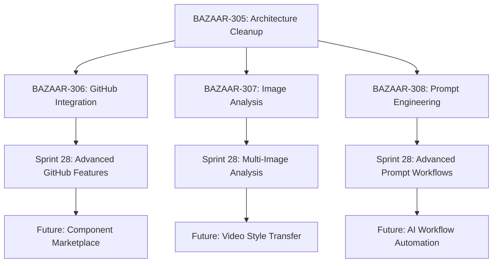

# Sprint 27 Ticket Overview - Foundation & Next-Gen Features

**Date**: May 25, 2025  
**Sprint Duration**: 3-4 weeks  
**Total Estimated Hours**: 54-70 hours  
**Philosophy**: Clean foundations first, then build next-generation features  

## 🎯 Sprint Objectives

1. **Clean up Sprint 26 foundations** to ensure solid, idiot-proof architecture
2. **Establish MVP implementations** of next-generation features
3. **Focus on `/projects/[id]/generate/page.tsx`** workspace as the main interface
4. **Ship fast, iterate based on user feedback**

## 📋 Ticket Breakdown

### 🏗️ BAZAAR-305: Architecture & State Management Cleanup
**Priority**: P0 - Critical Foundation  
**Estimate**: 12-16 hours  
**Status**: Planning  

**Objective**: Clean up Sprint 26 foundations to ensure solid, idiot-proof architecture before implementing new features.

**Key Focus Areas**:
- Fix project listing inconsistency (`/projects/page.tsx` → proper dashboard)
- Consolidate state management (Zustand, React Context, local state)
- Establish clear component boundaries and data flow
- Implement proper error boundaries and user session management

**Success Criteria**:
- Users can see all projects in grid layout
- Single source of truth for project data
- No console errors during normal usage
- Clear documentation of state management patterns

---

### 🔗 BAZAAR-306: GitHub Integration Foundation
**Priority**: P1 - Core Feature  
**Estimate**: 16-20 hours  
**Status**: Planning  
**Depends On**: BAZAAR-305  

**Objective**: Build foundational infrastructure for GitHub integration to extract visual DNA from deployed applications.

**Key Focus Areas**:
- GitHub OAuth integration and repository selection
- Style extraction engine (colors, typography, layout)
- Style-aware prompt generation and workspace integration
- MVP targeting no-code developers (Lovable, Bolt, Replit users)

**Success Criteria**:
- GitHub connection success rate > 95%
- Style extraction success rate > 80%
- Generated videos reflect extracted styling
- Time from connection to first styled video < 5 minutes

---

### 🖼️ BAZAAR-307: Image Analysis Foundation
**Priority**: P1 - Core Feature  
**Estimate**: 14-18 hours  
**Status**: Planning  
**Depends On**: BAZAAR-305  

**Objective**: Build foundational image analysis capabilities to allow users to upload images and generate matching video scenes.

**Key Focus Areas**:
- Image upload & storage system (R2 integration)
- AI Vision analysis engine (OpenAI GPT-4V)
- Style-aware scene generation from analysis
- Workspace integration with drag/drop upload

**Success Criteria**:
- Image upload success rate > 98%
- Analysis completion rate > 90%
- Generated scenes reflect image style
- Feature adoption rate > 40% of active users

---

### ⚙️ BAZAAR-308: Prompt Engineering System Foundation
**Priority**: P1 - Core Feature  
**Estimate**: 12-16 hours  
**Status**: Planning  
**Depends On**: BAZAAR-305  

**Objective**: Build a flexible prompt engineering system that makes it easy to change models, improve animation focus, and iterate on generation quality.

**Key Focus Areas**:
- Model management system (easy switching between OpenAI models)
- Prompt template system with versioning
- Animation-focused prompt improvements
- A/B testing and quality metrics framework

**Success Criteria**:
- Animation quality score improvement > 25%
- Generation success rate > 95%
- Model switching adoption > 60% of developers
- Cost per successful generation reduction > 15%

## 🚀 Implementation Strategy

### Week 1: Foundation Cleanup (BAZAAR-305)
**Focus**: Make the system idiot-proof and establish solid foundations

**Tasks**:
- Fix project management and listing
- Consolidate state management patterns
- Establish clear component boundaries
- Implement error boundaries and session management

**Deliverables**:
- Proper "My Projects" dashboard
- Unified state management documentation
- Clean component architecture
- Reliable user session handling

### Week 2-3: Parallel Feature Development
**Focus**: Build MVP implementations of next-gen features

**BAZAAR-306 (GitHub Integration)**:
- Week 2: OAuth integration and repository selection
- Week 3: Style extraction and workspace integration

**BAZAAR-307 (Image Analysis)**:
- Week 2: Upload system and AI vision integration
- Week 3: Scene generation and workspace integration

**BAZAAR-308 (Prompt Engineering)**:
- Week 2: Model management and template system
- Week 3: A/B testing and analytics integration

### Week 4: Integration & Polish
**Focus**: Ensure all features work together seamlessly

**Tasks**:
- Cross-feature integration testing
- Performance optimization
- User experience polish
- Documentation and deployment

## 🎯 Success Metrics

### Technical Metrics
- **System Reliability**: 99%+ uptime, no critical errors
- **Feature Adoption**: >40% of users try new features within 2 weeks
- **Performance**: No degradation in existing workspace performance
- **Quality**: Generation success rates improve across all features

### User Experience Metrics
- **Project Management**: Users can find and switch between projects easily
- **GitHub Integration**: No-code developers can connect repos and extract styles
- **Image Analysis**: Users can upload images and get matching video styles
- **Prompt Engineering**: Developers can experiment with models and prompts

### Business Metrics
- **User Retention**: Improved retention after using new features
- **Feature Stickiness**: Users return to use features multiple times
- **Cost Efficiency**: Reduced generation costs through better prompting
- **User Satisfaction**: Positive feedback on new capabilities

## 🚨 Risk Mitigation

### Technical Risks
- **Breaking Changes**: Implement incrementally with feature flags
- **State Migration**: Ensure backward compatibility during cleanup
- **API Limits**: Implement proper rate limiting and fallbacks
- **Performance**: Monitor and optimize resource usage

### Product Risks
- **Feature Complexity**: Keep MVP scope minimal and focused
- **User Confusion**: Provide clear onboarding and documentation
- **Integration Issues**: Test cross-feature interactions thoroughly
- **Scope Creep**: Stick to MVP definitions and iterate later

## 📝 Notes

### Startup Approach
- **Ship Fast**: Focus on MVP implementations that can be iterated
- **User Feedback**: Gather feedback early and often
- **Technical Debt**: Clean up foundations before building new features
- **Resource Efficiency**: Parallel development where dependencies allow

### Focus on `/projects/[id]/generate/page.tsx`
- This is the main workspace where users spend their time
- All new features should integrate seamlessly into this interface
- Maintain the existing 4-panel layout (Chat, Preview, Storyboard, Code)
- Add new capabilities without disrupting existing workflows

### Future Considerations
- These foundations will support more advanced features in future sprints
- GitHub integration can expand to component-level analysis
- Image analysis can support video-to-video style transfer
- Prompt engineering can enable advanced AI workflows

## 🔗 Dependencies

## 📊 Resource Allocation

- **Architecture Cleanup**: 25% of sprint capacity (critical foundation)
- **GitHub Integration**: 30% of sprint capacity (highest user value)
- **Image Analysis**: 25% of sprint capacity (high user value)
- **Prompt Engineering**: 20% of sprint capacity (developer experience)

This allocation ensures we have solid foundations while delivering high-value user features that differentiate Bazaar-Vid in the market. 