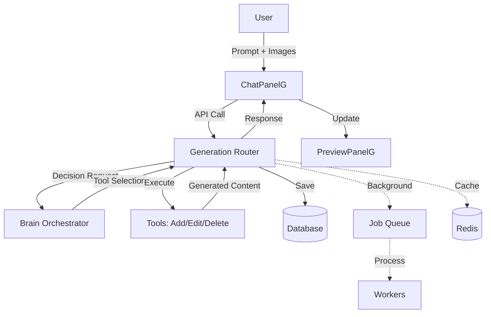
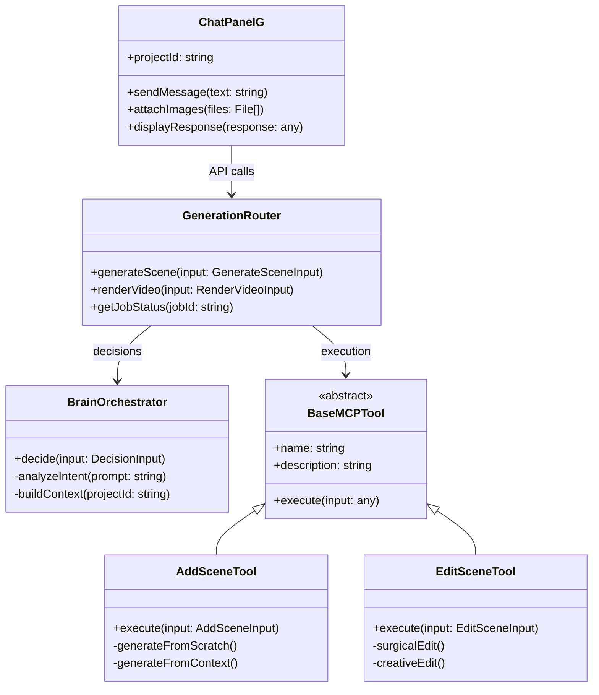
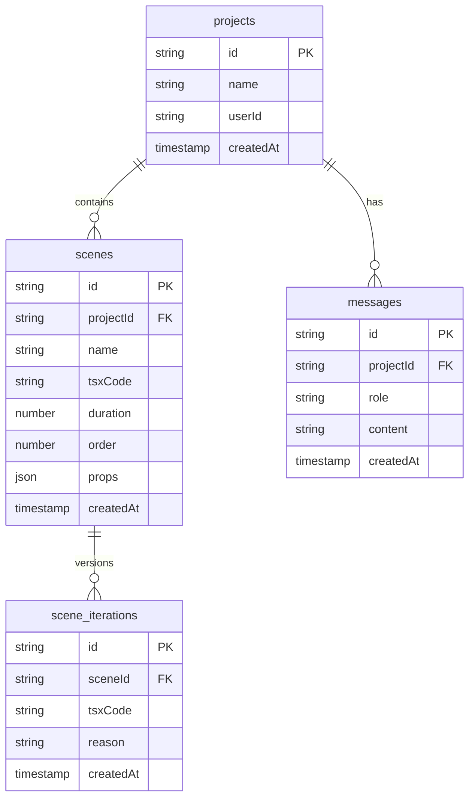

# TICKET-013: Developer Documentation

## Overview
Document the architecture comprehensively so future developers can understand and extend the system easily.

## Current State

### Problem Areas
1. **No architecture diagrams** - Hard to understand system flow
2. **Limited inline docs** - Code purpose unclear
3. **No troubleshooting guide** - Common issues undocumented
4. **Missing examples** - How to add features unclear

## Implementation Plan

### Step 1: Architecture Overview

Create `/docs/ARCHITECTURE.md`:
```markdown
# Bazaar-Vid Architecture

## System Overview

Bazaar-Vid is a motion graphics video generator that uses AI to create scenes from natural language and images.



## Core Principles

### 1. Zero Transformation
- Database field names are used everywhere
- No mappers or transformers
- `tsxCode` never becomes `code` or `existingCode`

### 2. Pure Function Tools
- Tools only generate/transform content
- No database access in tools
- Same input = same output

### 3. Router as Orchestrator
- Only the router touches the database
- Handles all I/O operations
- Manages transactions

### 4. Universal Response Format
Every API response follows this structure:
```typescript
{
  success: boolean;
  data?: T;
  error?: {
    code: string;
    message: string;
    details?: any;
  };
  meta: {
    requestId: string;
    timestamp: Date;
    operation: string;
  };
}
```

## Request Flow

### Scene Creation Flow

1. **User Input** → ChatPanelG
   - User types: "Create a blue intro"
   - Optional: Uploads reference images

2. **API Call** → Generation Router
   ```typescript
   api.generation.generateScene.mutate({
     projectId: "proj-123",
     userMessage: "Create a blue intro",
     userContext: { imageUrls: ["..."] }
   })
   ```

3. **Brain Decision** → Orchestrator
   - Analyzes user intent
   - Builds context from project history
   - Selects appropriate tool

4. **Tool Execution** → Add/Edit/Delete
   - Receives plain objects (no entities)
   - Generates TSX code
   - Returns generated content

5. **Database Save** → Router
   - Creates scene entity
   - Calculates order
   - Saves to database

6. **Response** → Client
   - UniversalResponse format
   - Includes created scene
   - Chat response from brain

7. **UI Update** → Preview
   - Real-time update via SSE
   - Preview renders new scene
   - No page reload

## Key Components

### Brain Orchestrator
- **Purpose**: Understand user intent and select tools
- **Location**: `/src/brain/orchestratorNEW.ts`
- **Responsibilities**:
  - Analyze prompts and images
  - Build context from project
  - Select appropriate tool
  - Generate intelligent responses

### Generation Router
- **Purpose**: Orchestrate the entire flow
- **Location**: `/src/server/api/routers/generation.ts`
- **Responsibilities**:
  - Receive API requests
  - Call brain for decisions
  - Execute tools
  - Save to database
  - Return responses

### Tools (Add/Edit/Delete)
- **Purpose**: Generate and transform content
- **Location**: `/src/tools/`
- **Responsibilities**:
  - Generate TSX code
  - Transform existing scenes
  - Pure functions only
  - No side effects

### Database Schema
- **Scenes Table**: Core content storage
  - `id`: UUID
  - `projectId`: Reference to project
  - `tsxCode`: Component code (NEVER `code`)
  - `duration`: Frame count
  - `order`: Scene position
```

### Step 2: Data Flow Documentation

Create `/docs/DATA_FLOW.md`:
```markdown
# Data Flow Examples

## Example 1: Creating First Scene

### User Input
```
"Create a welcome scene with our logo"
```

### 1. Chat Panel Processing
```typescript
// ChatPanelG.tsx
const result = await generateSceneMutation.mutateAsync({
  projectId: "proj-123",
  userMessage: "Create a welcome scene with our logo",
});
```

### 2. Router Receives Request
```typescript
// generation.ts
{
  projectId: "proj-123",
  userMessage: "Create a welcome scene with our logo",
  userContext: undefined
}
```

### 3. Brain Makes Decision
```typescript
// Brain analyzes and returns:
{
  toolName: "addScene",
  confidence: 0.95,
  reasoning: "User wants to create a new welcome scene",
  chatResponse: "I'll create a welcome scene with your logo",
  toolContext: {
    userPrompt: "Create a welcome scene with our logo",
    styleHints: {
      elements: ["logo", "welcome text"],
      mood: "professional"
    }
  }
}
```

### 4. Tool Generates Content
```typescript
// AddSceneTool returns:
{
  success: true,
  tsxCode: `
    import { Logo } from './Logo';
    
    export default function WelcomeScene() {
      return (
        <div style={{
          display: 'flex',
          flexDirection: 'column',
          alignItems: 'center',
          justifyContent: 'center',
          height: '100%',
          background: 'linear-gradient(to bottom, #1a1a1a, #2d2d2d)'
        }}>
          <Logo size={200} />
          <h1 style={{
            fontSize: 48,
            color: 'white',
            marginTop: 40,
            fontWeight: 'bold'
          }}>
            Welcome
          </h1>
        </div>
      );
    }
  `,
  name: "Welcome Scene",
  duration: 150,
  reasoning: "Created welcome scene with logo and text"
}
```

### 5. Router Saves to Database
```typescript
// Router creates entity:
{
  id: "scene-uuid-123",
  projectId: "proj-123",
  name: "Welcome Scene",
  tsxCode: "...", // The generated code
  duration: 150,
  order: 0,
  props: {},
  createdAt: new Date(),
  updatedAt: new Date()
}
```

### 6. Response to Client
```typescript
{
  success: true,
  data: {
    operation: "scene.create",
    scene: { /* scene entity */ },
    message: "I'll create a welcome scene with your logo"
  },
  meta: {
    requestId: "req-123",
    timestamp: new Date(),
    operation: "scene.create"
  }
}
```

## Example 2: Editing with Image

### User Input
```
"Make it look like this" + [screenshot.png]
```

### Complete Flow
1. Image uploaded to storage
2. Brain detects image-based edit intent
3. Edit tool receives current code + image URL
4. Multimodal AI transforms scene
5. Database updated with new code
6. Preview updates instantly
```

### Step 3: Troubleshooting Guide

Create `/docs/TROUBLESHOOTING.md`:
```markdown
# Troubleshooting Guide

## Common Issues

### 1. "tsxCode is undefined" Error

**Symptom**: Error when trying to access scene.tsxCode

**Cause**: Using old field name (code, existingCode, sceneCode)

**Solution**:
1. Run `npm run generate:types` to update types
2. Import from `~/generated/entities`
3. Use `tsxCode` everywhere

### 2. Scene Generation Fails

**Symptom**: "Failed to generate scene" error

**Possible Causes**:
- OpenAI API key invalid
- Rate limit exceeded
- Network timeout

**Debug Steps**:
```bash
# Check API key
echo $OPENAI_API_KEY

# Test API directly
curl https://api.openai.com/v1/models \
  -H "Authorization: Bearer $OPENAI_API_KEY"

# Check logs
tail -f .next/server/logs/error.log
```

### 3. Preview Not Updating

**Symptom**: New scenes don't appear in preview

**Possible Causes**:
- SSE connection dropped
- State sync issue
- Render error in scene

**Debug Steps**:
1. Check browser console for errors
2. Verify SSE connection in Network tab
3. Check if scene saved to database
4. Try manual refresh

### 4. Redis Connection Errors

**Symptom**: Slow performance, cache errors in logs

**Solution**:
```bash
# Check Redis running
redis-cli ping

# Clear cache if corrupted
redis-cli FLUSHDB

# Disable cache temporarily
CACHE_ENABLED=false npm run dev
```

## Performance Issues

### Slow Scene Generation

**Check**:
1. AI response time in traces
2. Database query time
3. Cache hit rates

**Solutions**:
- Enable caching: `CACHE_ENABLED=true`
- Check rate limits
- Use connection pooling

### Memory Leaks

**Symptoms**:
- Increasing memory usage
- Server crashes after time

**Debug**:
```bash
# Monitor memory
node --inspect server.js

# Heap snapshot
kill -USR2 <pid>
```

## Error Codes Reference

| Code | Description | Solution |
|------|-------------|----------|
| `SCENE_NOT_FOUND` | Scene ID doesn't exist | Verify scene ID |
| `AI_TIMEOUT` | AI took too long | Retry or simplify prompt |
| `INVALID_TSX` | Generated code invalid | Check AI prompt |
| `RATE_LIMITED` | Too many requests | Wait and retry |
| `DB_CONNECTION_LOST` | Database unreachable | Check connection string |
```

### Step 4: How-to Guides

Create `/docs/HOW_TO.md`:
```markdown
# How-To Guides

## Adding a New Tool

### 1. Create Tool Class

```typescript
// src/tools/newfeature/newfeature.ts
import { BaseMCPTool } from '../base/BaseMCPTool';

export interface NewFeatureInput {
  userPrompt: string;
  // Add your inputs
}

export interface NewFeatureOutput {
  success: boolean;
  tsxCode?: string;
  reasoning: string;
  error?: string;
}

export class NewFeatureTool extends BaseMCPTool<NewFeatureInput, NewFeatureOutput> {
  name = "NEW_FEATURE";
  description = "Does something new";
  
  protected async execute(input: NewFeatureInput): Promise<NewFeatureOutput> {
    try {
      // Your logic here
      const code = await this.generateCode(input);
      
      return {
        success: true,
        tsxCode: code,
        reasoning: "Generated new feature"
      };
    } catch (error) {
      return {
        success: false,
        reasoning: "Failed to generate",
        error: error.message
      };
    }
  }
}
```

### 2. Update Brain to Recognize Tool

```typescript
// src/brain/config/prompts/BRAIN_ORCHESTRATOR.md
Available tools:
1. addScene - Create new scenes
2. editScene - Modify existing scenes  
3. deleteScene - Remove scenes
4. newFeature - Your new feature description
```

### 3. Add Tool Execution

```typescript
// src/server/api/routers/generation.ts
async function executeToolFromDecision(decision, projectId, userId) {
  switch (decision.toolName) {
    case 'addScene':
      // existing
    case 'newFeature':
      const tool = new NewFeatureTool();
      return await tool.execute({
        userPrompt: decision.toolContext.userPrompt,
        // map other inputs
      });
  }
}
```

## Adding a New API Endpoint

### 1. Define Input/Output Types

```typescript
// src/lib/types/api/newEndpoint.ts
export const newEndpointSchema = z.object({
  projectId: z.string(),
  // your fields
});

export type NewEndpointInput = z.infer<typeof newEndpointSchema>;
```

### 2. Add Router Method

```typescript
// src/server/api/routers/generation.ts
newEndpoint: protectedProcedure
  .input(newEndpointSchema)
  .mutation(async ({ input, ctx }): Promise<UniversalResponse<YourData>> => {
    try {
      // Your logic
      
      return {
        success: true,
        data: result,
        meta: {
          requestId: generateRequestId(),
          timestamp: new Date(),
          operation: 'your.operation'
        }
      };
    } catch (error) {
      return createErrorResponse(error, 'your.operation');
    }
  })
```

## Debugging Production Issues

### 1. Enable Tracing

```bash
ENABLE_TRACING=true
OTLP_ENDPOINT=http://your-tracing-service
```

### 2. Find Specific Request

```typescript
// Look for X-Trace-Id header in response
const traceId = response.headers.get('X-Trace-Id');

// Query traces
SELECT * FROM traces WHERE trace_id = 'xxx';
```

### 3. Analyze Performance

```sql
-- Slow queries
SELECT query, avg_time, calls 
FROM pg_stat_statements 
ORDER BY avg_time DESC 
LIMIT 10;

-- Cache performance
HGETALL cache:stats
```
```

### Step 5: API Reference

Create `/docs/API_REFERENCE.md`:
```markdown
# API Reference

## Generation Endpoints

### `generation.generateScene`

Creates, edits, or deletes scenes based on user input.

**Input:**
```typescript
{
  projectId: string;
  userMessage: string;
  userContext?: {
    imageUrls?: string[];
  };
}
```

**Output:**
```typescript
UniversalResponse<{
  operation: 'scene.create' | 'scene.update' | 'scene.delete';
  scene?: SceneEntity;
  message?: string;
}>
```

**Example:**
```typescript
const result = await api.generation.generateScene.mutate({
  projectId: "proj-123",
  userMessage: "Create a red circle animation",
});
```

### `generation.renderVideo`

Queues video rendering job.

**Input:**
```typescript
{
  projectId: string;
  sceneIds?: string[];
  format?: 'mp4' | 'webm' | 'gif';
  resolution?: '1080p' | '720p' | '480p';
}
```

**Output:**
```typescript
UniversalResponse<{
  jobId: string;
}>
```

## Scene Types

### SceneEntity

Generated from database schema. ALWAYS use these types.

```typescript
interface SceneEntity {
  id: string;
  projectId: string;
  name: string;
  tsxCode: string;  // NEVER 'code' or 'existingCode'
  duration: number;
  order: number;
  props: Record<string, any>;
  createdAt: Date;
  updatedAt: Date;
}
```

## Tool Interfaces

### AddSceneTool

**Input:**
```typescript
{
  userPrompt: string;
  projectContext?: {
    sceneCount: number;
    brandColors?: string[];
  };
  previousScenes?: SceneContext[];
  imageUrls?: string[];
}
```

**Output:**
```typescript
{
  success: boolean;
  tsxCode?: string;
  name?: string;
  duration: number;
  reasoning: string;
  error?: string;
}
```

### EditSceneTool

**Input:**
```typescript
{
  userPrompt: string;
  tsxCode: string;  // Current scene code
  currentDuration: number;
  editType: 'surgical' | 'creative' | 'error-fix';
  imageUrls?: string[];
}
```

**Output:**
```typescript
{
  success: boolean;
  tsxCode?: string;
  duration?: number;
  reasoning: string;
  error?: string;
}
```
```

### Step 6: Architecture Diagrams

Create `/docs/diagrams/` folder with Mermaid diagrams:

```markdown
# System Components



# Database Schema


```

## Success Criteria

- [ ] Architecture clearly documented with diagrams
- [ ] Data flow examples for all operations
- [ ] Troubleshooting covers common issues
- [ ] How-to guides for extending system
- [ ] API fully documented with examples

## Time Estimate

- Architecture overview: 1 hour
- Data flow examples: 1 hour
- Troubleshooting guide: 1 hour
- How-to guides: 0.5 hours
- API reference: 0.5 hours
- **Total: 4 hours**