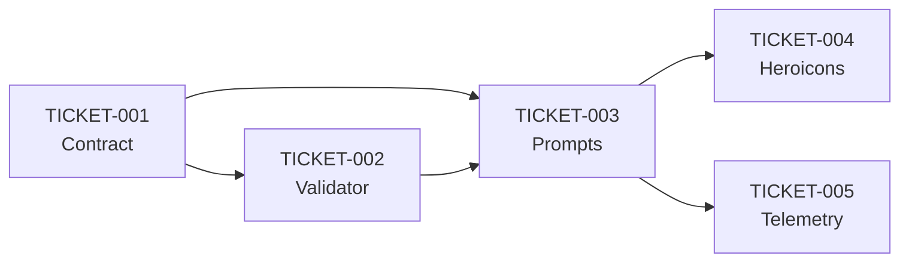

# Sprint 44: Implementation Roadmap

## Overview
Sprint 44 focuses on implementing a robust dependency management and validation system for AI code generation, enabling the addition of professional libraries while maintaining code quality.

## Goal
Transform AI-generated scenes from amateur (emoji-heavy) to professional (using proper libraries) while preventing hallucination and runtime errors.

## Tickets Overview

### Phase 1: Foundation (Day 1-2)
**TICKET-001: Dependency Contract** ⚡ CRITICAL PATH
- Single source of truth for all dependencies
- Machine-readable format for AI
- Version tracking for changes
- **Estimated**: 2 hours

**TICKET-002: Code Validator** ⚡ CRITICAL PATH  
- Validates AI output against contract
- Prevents broken code reaching users
- Clear error messages for retry
- **Estimated**: 3 hours

### Phase 2: Integration (Day 2-3)
**TICKET-003: Prompt Integration** ⚡ CRITICAL PATH
- Inject contract into all prompts
- Implement retry with validation
- Remove hardcoded rules
- **Estimated**: 2 hours

### Phase 3: First Library (Day 3-4)
**TICKET-004: Enable Heroicons** 🎯 QUICK WIN
- Zero bundle cost (already installed)
- Replace 80% of emoji usage
- Template for future libraries
- **Estimated**: 1 hour

### Phase 4: Monitoring (Day 4-5)
**TICKET-005: Telemetry** 📊 OPTIONAL
- Track validation failures
- Measure improvement
- Inform future decisions
- **Estimated**: 2 hours

## Implementation Order

## Day-by-Day Plan

### Day 1
- [ ] Morning: Implement TICKET-001 (Contract)
- [ ] Afternoon: Start TICKET-002 (Validator)

### Day 2  
- [ ] Morning: Finish TICKET-002 (Validator)
- [ ] Afternoon: Implement TICKET-003 (Prompt Integration)

### Day 3
- [ ] Morning: Test integration end-to-end
- [ ] Afternoon: Implement TICKET-004 (Heroicons)

### Day 4
- [ ] Morning: Test Heroicons generation
- [ ] Afternoon: Start TICKET-005 (Telemetry) if time permits

### Day 5
- [ ] Morning: Finish any remaining work
- [ ] Afternoon: Documentation and handoff

## Definition of Done

### Minimum Viable Implementation ✅
- [ ] Contract system working
- [ ] Basic validation preventing imports
- [ ] Prompts using contract
- [ ] One validation-retry cycle
- [ ] Heroicons enabled and working

### Nice to Have 🎯
- [ ] Full telemetry system
- [ ] Admin analytics dashboard
- [ ] Additional libraries enabled
- [ ] AST-based validation

## Risk Mitigation

### Risk 1: Breaking Existing Scenes
- **Mitigation**: Validator only warns initially, doesn't block
- **Rollback**: Disable validation in production if needed

### Risk 2: Increased Generation Time
- **Mitigation**: Single retry maximum
- **Monitoring**: Track generation times in telemetry

### Risk 3: Contract Drift
- **Mitigation**: Version field in contract
- **Process**: PR review for any contract changes

## Success Metrics

1. **Validation Success Rate**: Target 90%+ on first attempt
2. **Emoji Reduction**: 80%+ reduction in emoji usage
3. **Generation Time**: <10% increase with validation
4. **Zero Runtime Errors**: No broken scenes reach users

## Future Sprints

Based on this foundation:
- Sprint 45: Add more libraries (@remotion/shapes, framer-motion)
- Sprint 46: Implement dynamic loading for large libraries
- Sprint 47: Type system cleanup (per TYPE-SYSTEM-CLEANUP-STRATEGY.md)

## Notes

- Start with "lean mode" - we can always add complexity
- Contract is the key - everything else follows
- Heroicons is the perfect test case (zero risk)
- Telemetry will guide future improvements

## Resources

- [Window Dependencies System](./WINDOW-DEPENDENCIES-SYSTEM.md)
- [Adding Libraries Guide](./ADDING-THIRD-PARTY-LIBRARIES-GUIDE.md)
- [Heroicons Example](./HEROICONS-EXAMPLE-IMPLEMENTATION.md)
- [Quick Win Analysis](./QUICK-WIN-LIBRARIES-ANALYSIS.md)