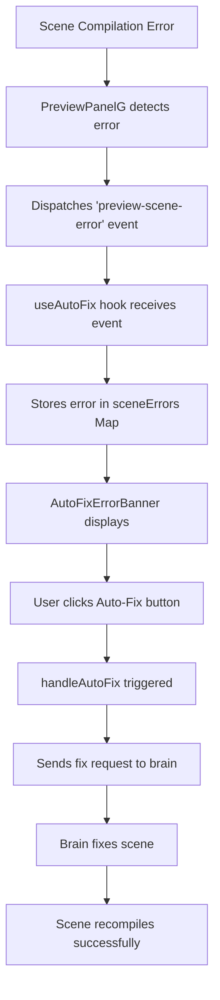

# Sprint 73: Auto-Autofix Analysis - From Manual to Automatic

## Current Auto-Fix Implementation

### The Problem
Currently, when a scene has a compilation error:
1. User sees an error banner
2. User must click "Auto-Fix" button
3. System then fixes the error

This creates unnecessary friction. Why make users click when we could fix automatically?

### Current Flow



### Key Components

#### 1. Error Detection (PreviewPanelG.tsx)
- Detects errors in 3 places:
  - Scene compilation errors (line 235)
  - ESBuild failures (line 730)
  - Component load failures (line 1124, 1139, 1216)
- Dispatches `preview-scene-error` custom event with:
  ```typescript
  {
    sceneId: string,
    sceneName: string,
    error: Error
  }
  ```

#### 2. Error Tracking (use-auto-fix.ts)
- Listens for `preview-scene-error` events
- Stores errors in a Map: `Map<sceneId, ErrorDetails>`
- Tracks "fixing" scenes to avoid duplicate fixes
- Provides `handleAutoFix` function

#### 3. UI Display (AutoFixErrorBanner.tsx)
- Shows error banner with:
  - Scene name
  - Error message (truncated)
  - Auto-Fix button
  - Motivational quote (nice touch!)

#### 4. Fix Process
When auto-fix is triggered:
1. Adds user message: "🔧 FIX BROKEN SCENE..."
2. Clears error banner immediately
3. Calls `generateScene` mutation with fix prompt
4. Updates chat with progress
5. Refreshes scene state after fix

### Current Issues

1. **Manual Intervention Required**: User must click button
2. **Error Persistence**: Errors stay visible until user acts
3. **Repetitive**: Same errors might appear multiple times
4. **User Friction**: Interrupts creative flow

## Proposed Auto-Autofix Architecture

### Design Principles

1. **Zero User Intervention**: Errors fix themselves
2. **Smart Debouncing**: Don't spam fixes for rapid errors
3. **Retry Logic**: Handle transient failures
4. **User Awareness**: Keep user informed without requiring action
5. **Escape Hatch**: Allow disabling for debugging

### Proposed Flow

```mermaid
graph TD
    A[Scene Compilation Error] --> B[PreviewPanelG detects error]
    B --> C[Dispatches 'preview-scene-error' event]
    C --> D[useAutoFix hook receives event]
    D --> E{Is auto-fix enabled?}
    E -->|Yes| F[Add to fix queue with debounce]
    E -->|No| G[Show manual fix banner]
    F --> H{Already fixing this scene?}
    H -->|No| I[Wait debounce period 2s]
    H -->|Yes| J[Skip - already in progress]
    I --> K{Error still exists?}
    K -->|Yes| L[Trigger automatic fix]
    K -->|No| M[Cancel - error resolved]
    L --> N[Add notification: "Fixing scene..."]
    N --> O[Execute fix process]
    O --> P{Fix successful?}
    P -->|Yes| Q[Update notification: "Fixed!"]
    P -->|No| R{Retry attempts < 3?}
    R -->|Yes| S[Wait 5s and retry]
    R -->|No| T[Show manual fix banner]
    S --> L
```

### Implementation Details

#### 1. Auto-Fix Queue System
```typescript
interface AutoFixQueueItem {
  sceneId: string;
  errorDetails: ErrorDetails;
  attempts: number;
  firstErrorTime: number;
  lastAttemptTime: number;
}

const autoFixQueue = new Map<string, AutoFixQueueItem>();
```

#### 2. Debouncing Logic
- Wait 2 seconds after error before attempting fix
- Prevents fixing during rapid edits
- Cancels if error disappears during wait

#### 3. Retry Strategy
- Max 3 attempts per error
- 5 second delay between retries
- Exponential backoff for persistent errors

#### 4. User Notifications
Instead of error banner, show toast notifications:
- "🔧 Fixing scene compilation error..."
- "✅ Scene fixed automatically!"
- "❌ Unable to auto-fix - manual intervention needed"

#### 5. Settings Integration
Add to user preferences:
```typescript
autoFixEnabled: boolean (default: true)
autoFixDebounceMs: number (default: 2000)
autoFixMaxRetries: number (default: 3)
```

### Benefits

1. **Seamless Experience**: Errors vanish without interruption
2. **Maintains Context**: User stays focused on creation
3. **Smart Handling**: Doesn't spam fixes for transient errors
4. **Fallback Available**: Manual fix still possible if auto-fix fails

### Potential Concerns & Mitigations

1. **Infinite Fix Loops**
   - Track fix attempts per error
   - Bail out after max retries
   - Add cooldown period

2. **User Confusion**
   - Clear notifications about what's happening
   - Option to view fix history
   - Setting to disable for power users

3. **Performance Impact**
   - Debounce prevents rapid fixes
   - Queue system manages load
   - Background processing doesn't block UI

4. **Debugging Difficulty**
   - Add debug mode that disables auto-fix
   - Log all fix attempts
   - Show fix history in UI

### Migration Path

1. **Phase 1**: Add auto-fix setting (default off)
2. **Phase 2**: Implement queue and debounce system
3. **Phase 3**: Enable for beta users
4. **Phase 4**: Make default behavior
5. **Phase 5**: Remove manual fix button (keep as fallback)

## Next Steps

1. Implement auto-fix queue system
2. Add debouncing logic to useAutoFix hook
3. Replace error banner with toast notifications
4. Add user settings for auto-fix behavior
5. Test with various error scenarios
6. Monitor for edge cases and infinite loops