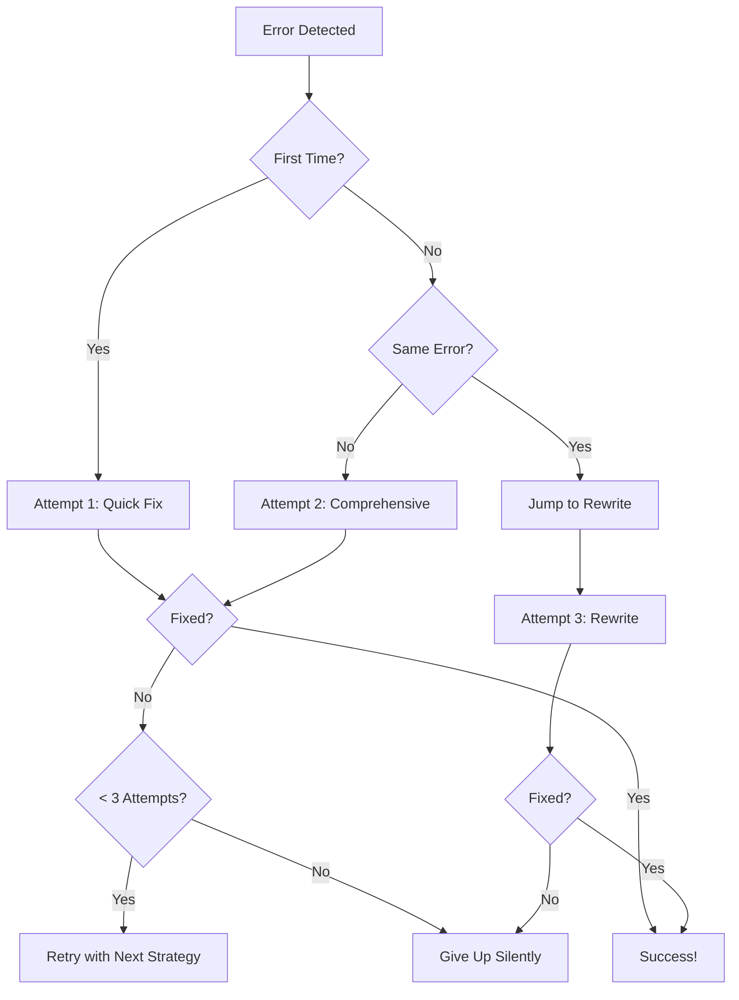

# Sprint 73: Final Smart Auto-Fix Implementation

## What We've Built

### 1. Progressive Fix Strategy
Each attempt gets progressively more aggressive:

**Attempt 1 (Quick Fix)**:
- Focuses on the specific error only
- Makes minimal changes
- Example: "Cannot find 'useState'" → adds import

**Attempt 2 (Comprehensive Fix)**:
- Fixes ALL compilation errors
- Checks imports, variables, syntax
- More thorough approach

**Attempt 3 (Nuclear Rewrite)**:
- Complete component rewrite
- Prioritizes "just make it work"
- Simpler, more reliable code

### 2. Smart Error Detection
```typescript
// Detects repeating errors and skips to rewrite
if (isRepeatingError && queueItem.attempts >= 2) {
  queueItem.attempts = 3; // Jump to rewrite
}
```

### 3. Infinity Loop Prevention
Multiple safeguards:
- ✅ Max 3 attempts (hard limit)
- ✅ Progressive delays (5s, 10s, 20s)
- ✅ Tracks previous errors to detect loops
- ✅ Skips to rewrite if same error repeats
- ✅ Scene existence checks
- ✅ Duplicate fix prevention

### 4. Why It's Smarter

**Before**: 
- Generic prompt: "Fix error X"
- Same approach every time
- No learning from failures

**Now**:
- Attempt 1: "Fix ONLY this specific error"
- Attempt 2: "Previous fix failed, be MORE thorough"
- Attempt 3: "Two fixes failed, REWRITE the component"

### 5. Direct Tool Approach (Future Enhancement)
While currently using generateScene mutation (which goes through brain orchestrator), the ideal approach would be:

```typescript
// Direct EditTool call (not implemented yet)
import { editTool } from "~/tools/edit/edit";

const result = await editTool.execute({
  sceneId,
  tsxCode: scene.data.code,
  userPrompt: progressivePrompt,
  errorDetails: error.message,
  projectId,
  userId: "system-autofix"
});
```

This would skip the brain overhead entirely.

## Key Improvements Made

1. **Progressive Prompts**: Each attempt uses different strategy
2. **Error Tracking**: Detects when stuck on same error
3. **Smart Escalation**: Jumps to rewrite if error repeats
4. **Clear Instructions**: Tells AI to use fixBrokenScene tool
5. **Context Awareness**: Later attempts know previous failed

## How It Works Now



## Testing the Smart Fix

To see it in action:

1. **Create a broken scene**: Missing import
   ```tsx
   function Scene() {
     const [count, setCount] = useState(0); // Missing React import
     return <div>{count}</div>;
   }
   ```
   - Attempt 1 will add: `import React, { useState } from 'react';`

2. **Create a complex error**: Multiple issues
   ```tsx
   function Scene() {
     const data = fetchData(); // undefined function
     return <div>{unknownVar}</div>; // undefined variable
   }
   ```
   - Attempt 1: Might fix one issue
   - Attempt 2: Fixes all issues comprehensively

3. **Create an unfixable error**: Logic problems
   ```tsx
   function Scene() {
     return <div>{recursiveFunc()}</div>; // causes infinite loop
   }
   ```
   - Attempts 1-2: Try to fix
   - Attempt 3: Rewrites entirely with simple working code

## Monitoring

In development, watch console for:
- `[SILENT FIX] Executing fix attempt 1/2/3`
- `[SILENT FIX] Same error repeating, jumping to rewrite`
- `[SILENT FIX] Successfully fixed on attempt X`

## Future Enhancements

1. **Direct Tool Execution**: Skip brain orchestrator
2. **AI Memory**: Pass previous fix attempts to AI
3. **Pattern Learning**: Track common fixes that work
4. **Selective Rewrite**: Only rewrite problematic parts
5. **User Settings**: Let users choose aggressiveness

The system is now much smarter about fixing errors, using different strategies based on what's failing and learning from previous attempts!