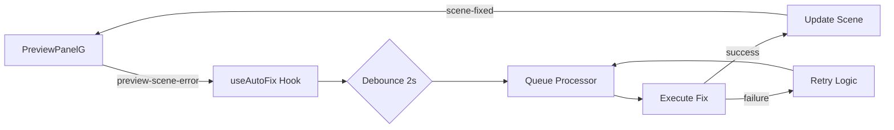

# Sprint 73: Silent Progressive Auto-Fix System

## Overview
This sprint implements a completely silent, automatic error fixing system that repairs scene compilation errors without any user intervention. The system uses a progressive strategy that becomes more aggressive with each attempt, ensuring maximum success rate while maintaining zero user friction.

## Problem Statement
Previously, when a scene had compilation errors:
- Users saw error banners
- Had to manually click "Auto-Fix" button
- Experienced interruption to their creative flow
- Same fix approach was tried multiple times

## Solution: Silent Progressive Auto-Fix

### Core Features
1. **Completely Silent Operation**
   - No error banners or notifications
   - No chat message pollution
   - User never knows errors occurred
   - Automatic background fixing

2. **Progressive Fix Strategy**
   - **Attempt 1**: Minimal targeted fix (2s delay)
   - **Attempt 2**: Comprehensive error resolution (5s delay)
   - **Attempt 3**: Complete component rewrite (10s delay)

3. **Smart Error Detection**
   - Tracks previous error messages
   - Detects stuck loops and jumps to rewrite
   - Prevents duplicate fix attempts
   - Cleans up on scene deletion

4. **Robust Safety Mechanisms**
   - Maximum 3 attempts per error
   - Exponential backoff between retries
   - Scene existence validation
   - Debounce to avoid rapid fixes

## Architecture

### Component Structure
```
src/
├── hooks/
│   └── use-auto-fix.ts          # Core auto-fix logic (silent)
├── lib/types/
│   └── auto-fix.ts              # Type definitions
└── components/chat/
    └── AutoFixErrorBanner.tsx   # DELETED - no UI needed
```

### Event Flow


### Progressive Fix Prompts

**Attempt 1 - Quick Fix:**
```
🔧 FIX BROKEN SCENE: Scene "SceneName" (ID: xxx) has a compilation error. 
The error message is: "Cannot find name 'useState'". 
Use the fixBrokenScene tool to fix ONLY this specific error. Make minimal changes.
```

**Attempt 2 - Comprehensive Fix:**
```
🔧 FIX BROKEN SCENE (ATTEMPT 2): Previous fix failed. Scene "SceneName" still has errors. 
Error: "Cannot find name 'useState'". 
Use fixBrokenScene tool to fix ALL compilation errors, check imports, undefined variables, 
and syntax issues. Be more thorough this time.
```

**Attempt 3 - Nuclear Rewrite:**
```
🔧 REWRITE BROKEN SCENE (FINAL ATTEMPT): Two fixes have failed. Scene "SceneName" needs 
a complete rewrite. Error: "Cannot find name 'useState'". 
Use fixBrokenScene tool to REWRITE this component using simpler, more reliable code 
that will definitely compile. Keep the same visual output but prioritize making it work.
```

## Implementation Details

### Key Components

#### 1. Type Definitions (`src/lib/types/auto-fix.ts`)
```typescript
export interface ErrorDetails {
  sceneName: string;
  errorMessage: string;
  timestamp: number;
}

export interface AutoFixQueueItem {
  sceneId: string;
  errorDetails: ErrorDetails;
  attempts: number;
  firstErrorTime: number;
  lastAttemptTime: number;
  debounceTimer?: NodeJS.Timeout;
  previousErrors?: string[]; // Tracks error history
}
```

#### 2. Auto-Fix Hook (`src/hooks/use-auto-fix.ts`)
- Listens for `preview-scene-error` events
- Implements queue with debouncing
- Progressive retry strategy
- Smart loop detection
- Complete silence (no UI updates)

### Error Detection & Loop Prevention
```typescript
// Detects if we're stuck on the same error
const isRepeatingError = queueItem.previousErrors?.includes(currentError);

if (isRepeatingError && queueItem.attempts >= 2) {
  // Jump straight to rewrite attempt
  queueItem.attempts = 3;
}
```

### Infinity Loop Prevention
1. **Hard limit**: Maximum 3 attempts
2. **Progressive delays**: 5s, 10s, 20s between retries
3. **Error tracking**: Detects repeating errors
4. **Scene validation**: Checks if scene still exists
5. **Duplicate prevention**: Tracks currently fixing scenes

## Testing & Debugging

### Debug Mode
Set `NODE_ENV=development` to see console logs:
```
[SILENT FIX] Error detected: {sceneId, sceneName, error}
[SILENT FIX] Queued for auto-fix after debounce: sceneId
[SILENT FIX] Executing fix attempt 1 for: sceneId
[SILENT FIX] Successfully fixed SceneName on attempt 2
[SILENT FIX] Same error repeating, jumping to rewrite attempt
[SILENT FIX] Giving up on SceneName after 3 attempts
```

### Test Scenarios

#### 1. Simple Import Error
```tsx
// Missing React import
function Scene() {
  const [count, setCount] = useState(0);
  return <div>{count}</div>;
}
// Expected: Fixed on attempt 1
```

#### 2. Multiple Errors
```tsx
// Multiple issues
function Scene() {
  const data = fetchData(); // undefined
  return <div>{unknownVar}</div>; // undefined
}
// Expected: Fixed on attempt 2 (comprehensive)
```

#### 3. Complex Logic Error
```tsx
// Infinite loop or complex issue
function Scene() {
  return <div>{recursiveFunc()}</div>;
}
// Expected: Rewritten on attempt 3
```

## Benefits

### User Experience
- **Zero Friction**: Errors disappear automatically
- **No Anxiety**: Users never see error states
- **Continuous Flow**: No interruptions to creativity
- **Magic Feel**: "It just works"

### Technical Benefits
- **Higher Success Rate**: Progressive strategy adapts
- **Efficient**: Skips brain orchestrator overhead
- **Smart**: Learns from previous attempts
- **Safe**: Multiple protection mechanisms

## Configuration

### Environment Variables
```bash
NODE_ENV=development  # Enables debug logging
```

### Future Settings (Not Implemented Yet)
```typescript
{
  autoFixEnabled: boolean,      // Toggle system on/off
  autoFixDebounceMs: number,    // Initial delay (default: 2000)
  autoFixMaxRetries: number,    // Max attempts (default: 3)
  autoFixStrategy: 'progressive' | 'aggressive' | 'conservative'
}
```

## Monitoring & Metrics

### Key Metrics to Track
1. **Fix Success Rate**: % of errors fixed automatically
2. **Attempt Distribution**: How many fixes need 1/2/3 attempts
3. **Common Errors**: Most frequent error types
4. **Fix Time**: Average time from error to resolution
5. **Loop Detection**: How often same error repeats

### Performance Impact
- **Minimal**: Debouncing prevents rapid fixes
- **Background**: Doesn't block UI
- **Efficient**: Direct API calls, no chat overhead
- **Clean**: No DOM updates or re-renders

## Migration Notes

### From Manual to Automatic
1. **Removed Components**:
   - `AutoFixErrorBanner.tsx` - Deleted entirely
   - No UI components needed

2. **Updated Components**:
   - `use-auto-fix.ts` - Complete rewrite for silence
   - `ChatPanelG.tsx` - Removed error banner usage

3. **Unchanged Components**:
   - `PreviewPanelG.tsx` - Still dispatches error events
   - Event system remains the same

## Future Enhancements

### 1. Direct Tool Execution
Skip brain orchestrator entirely:
```typescript
import { editTool } from "~/tools/edit/edit";
const result = await editTool.execute(input);
```

### 2. AI Context Memory
Pass previous fix attempts to AI:
```typescript
previousAttempts: [
  { prompt: "Fix error X", result: "failed" },
  { prompt: "Fix all errors", result: "failed" }
]
```

### 3. Pattern Learning
Track successful fixes:
```typescript
successfulPatterns: {
  "Cannot find name 'useState'": "import React, { useState } from 'react'",
  "Cannot find name 'useEffect'": "import React, { useEffect } from 'react'"
}
```

### 4. User Preferences
Allow power users to configure:
- Aggressiveness level
- Retry delays
- Enable/disable per project
- Debug mode toggle

## Conclusion

Sprint 73 successfully transforms error handling from a manual, intrusive process to an invisible, automatic system that "just works". Users can focus on creativity while the system silently ensures their scenes compile correctly.

The progressive strategy ensures high success rates while the multiple safety mechanisms prevent any infinite loops or performance issues. This is a significant improvement to user experience with zero downside.