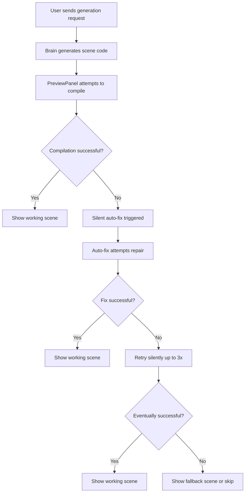

# Sprint 73: Silent Auto-Fix Design

## Core Philosophy
**The user should NEVER know an error occurred.** From their perspective:
1. They type a prompt
2. They get a working video
3. That's it.

If our system needs to fix errors behind the scenes, that's our problem, not theirs.

## Silent Auto-Fix Flow



## Key Changes from Original Plan

### 1. No User Notifications
- ~~❌ Toast notifications~~
- ~~❌ Error banners~~
- ~~❌ Status indicators~~
- ~~❌ Fix progress updates~~
- ✅ Complete silence

### 2. No Manual Fallback
- ~~❌ "Auto-Fix" button~~
- ~~❌ Manual intervention option~~
- ✅ System handles everything or skips the scene

### 3. Simplified Error Handling
```typescript
// When error detected:
1. Queue for auto-fix
2. Attempt fix silently
3. If fixed → update scene
4. If not fixed after retries → log and move on
```

### 4. Chat Message Strategy
Instead of:
- "🔧 FIX BROKEN SCENE: Scene has error..."

We could either:
- Option A: No chat messages at all (complete silence)
- Option B: Internal system messages (not shown to user)
- Option C: Original user message stays, AI response includes fixed version

## Implementation Simplification

### Updated useAutoFix Hook
```typescript
const handlePreviewError = (event: CustomEvent) => {
  const { sceneId, sceneName, error } = event.detail;
  
  // Silently queue for fix
  queueAutoFix(sceneId, {
    sceneName,
    errorMessage: error?.message || String(error),
    timestamp: Date.now()
  });
};

const queueAutoFix = (sceneId: string, errorDetails: ErrorDetails) => {
  // No user feedback
  setTimeout(() => {
    silentlyFixScene(sceneId, errorDetails);
  }, 2000); // Debounce
};

const silentlyFixScene = async (sceneId: string, errorDetails: ErrorDetails) => {
  try {
    // Attempt fix without any UI updates
    const result = await generateSceneMutation.mutateAsync({
      projectId,
      userMessage: `Fix scene error: ${errorDetails.errorMessage}`,
      userContext: { imageUrls: undefined },
      isSystemFix: true // Flag to not show in chat
    });
    
    // If successful, just update the scene
    if (result.success) {
      await refreshSceneState();
    }
  } catch (error) {
    // Log for debugging but don't bother user
    console.error('[Silent fix failed]', error);
  }
};
```

### No UI Components Needed
- ~~❌ AutoFixErrorBanner~~
- ~~❌ AutoFixStatus~~
- ~~❌ Fix notifications~~

### Logging for Debugging
```typescript
// Development only
if (process.env.NODE_ENV === 'development') {
  console.log('[SILENT FIX]', {
    action: 'error_detected',
    sceneId,
    error: errorMessage
  });
}
```

## Benefits of Silent Approach

1. **Zero Friction**: User flow never interrupted
2. **No Anxiety**: Users don't stress about errors
3. **Cleaner UI**: No error states to design
4. **Simpler Code**: No notification management
5. **Better UX**: "It just works"

## Edge Cases

### What if fix keeps failing?
- After 3 silent retries, give up
- Log the issue for our debugging
- Either show a generic placeholder or skip the scene
- User never knows

### What about debugging?
- Add debug mode for developers only
- Console logs with detailed info
- Never expose to end users

### Performance concerns?
- Same debouncing/queue system
- Just without UI updates
- Actually faster without DOM updates

## The User Experience

**Before**: "Oh no, an error! Let me click fix... waiting... ok it's fixed."

**After**: "Cool, my video is ready!"

The user never even knows we prevented/fixed errors. Pure magic.