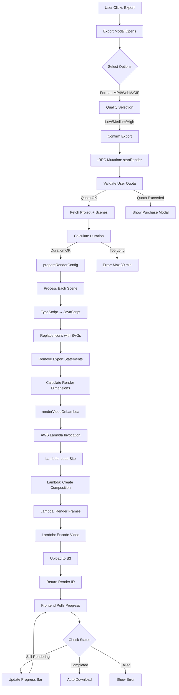

# Video Rendering Flow Diagram

## Complete Render Flow Visualization



## Detailed Component Flow

### 1. Frontend Flow
```
ExportButton (PreviewPanelG)
    ↓
ExportModal
    ├── Format Selector (MP4/WebM/GIF)
    ├── Quality Selector (480p/720p/1080p)
    └── Duration Calculator
    ↓
API Call (tRPC)
    ↓
ExportProgress Modal
    ├── Progress Bar
    ├── Status Updates
    └── Download Handler
```

### 2. Backend Processing Flow
```
render.ts (tRPC Router)
    ↓
Validations
    ├── User Authentication
    ├── Daily Quota Check (10/day)
    ├── Project Ownership
    └── Duration Limit (30 min)
    ↓
prepareRenderConfig (render.service.ts)
    ├── Load Project Metadata
    ├── Calculate Dimensions
    │   ├── Portrait: 1080x1920
    │   ├── Landscape: 1920x1080
    │   └── Square: 1080x1080
    └── Preprocess Scenes
        ├── TypeScript Compilation
        ├── Icon Replacement
        ├── Export Removal
        └── Component Validation
    ↓
renderVideoOnLambda (lambda-render.service.ts)
    ├── Configure Lambda Parameters
    ├── Set Input Props
    └── Invoke Lambda Function
```

### 3. Lambda Execution Flow
```
AWS Lambda Function
    ↓
Load Remotion Site (S3)
    ↓
MainCompositionSimple.tsx
    ├── Receive Scene Data
    ├── Calculate Total Duration
    └── For Each Scene:
        ├── Create Function Constructor
        ├── Inject Preprocessed Code
        ├── Execute Component Factory
        └── Render React Component
    ↓
Remotion Renderer
    ├── Render Each Frame (30fps)
    ├── Apply Animations
    └── Encode Video (H.264/VP8/GIF)
    ↓
Upload to S3 Bucket
    ↓
Return Public URL
```

### 4. Progress Tracking Flow
```
Lambda Render Started
    ↓
Store in Memory (renderState)
    ↓
Store in Database (exportTracking)
    ↓
Frontend Polls Every 500ms
    ├── getRenderStatus (tRPC)
    ├── getLambdaRenderProgress (SDK)
    └── Update UI
    ↓
On Completion
    ├── Update Database
    ├── Track Download
    └── Auto-download File
```

## State Transitions

```
PENDING → RENDERING → COMPLETED
                  ↓
                FAILED
```

### Render States
1. **PENDING**: Job created, not started
2. **RENDERING**: Lambda actively processing
3. **COMPLETED**: Video ready for download
4. **FAILED**: Error occurred, retry available

## Error Handling Flow

```
Error Occurs
    ↓
Categorize Error
    ├── User Error (quota, duration)
    │   └── Show Clear Message
    ├── System Error (Lambda, S3)
    │   └── Log + Generic Message
    └── Code Error (compilation)
        └── Auto-fix Attempt
            ├── Success → Continue
            └── Fail → Placeholder Scene
```

## Key Decision Points

1. **Format Selection**
   - MP4: Best compatibility
   - WebM: Smaller size
   - GIF: No audio, limited colors

2. **Quality Selection**
   - Low: Fast render, small file
   - Medium: Balanced
   - High: Best quality, slow

3. **Dimension Calculation**
   - Project format determines aspect ratio
   - Quality setting determines max resolution
   - Maintains aspect ratio while scaling

4. **Scene Preprocessing**
   - Must compile TypeScript to JavaScript
   - Must replace icons with inline SVGs
   - Must remove ES6 export statements
   - Must validate component structure

---

This flow ensures reliable, scalable video rendering with proper error handling at each step.