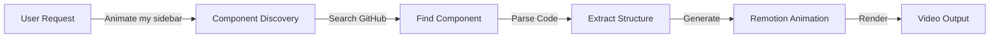

# Sprint 88: GitHub Component Animation System

## Executive Summary

Build a system that allows users to animate their actual GitHub components by connecting their repos and using natural language commands like "animate my sidebar" or "show my navbar with effects".

## Core Concept



## System Architecture

### 1. Component Discovery Pipeline

```typescript
// The complete flow from request to component
interface ComponentDiscoveryPipeline {
  // Step 1: Parse user intent
  parseIntent(prompt: string): ComponentIntent;
  
  // Step 2: Search strategies
  searchStrategies(intent: ComponentIntent): SearchQuery[];
  
  // Step 3: Execute searches
  searchGitHub(queries: SearchQuery[]): SearchResult[];
  
  // Step 4: Rank and select
  selectBestMatch(results: SearchResult[]): ComponentFile;
  
  // Step 5: Parse and extract
  parseComponent(file: ComponentFile): ParsedComponent;
}
```

### 2. Search Strategies

```typescript
// Intelligent search based on common patterns
const searchStrategies = {
  // Direct name match
  exact: (name: string) => [
    `filename:${name}.tsx`,
    `filename:${name}.jsx`,
    `filename:${name}.vue`,
    `filename:${name}.svelte`,
  ],
  
  // Component declaration
  declaration: (name: string) => [
    `"export function ${capitalize(name)}"`,
    `"export const ${capitalize(name)}"`,
    `"export default function ${capitalize(name)}"`,
    `"class ${capitalize(name)} extends"`,
  ],
  
  // Common locations
  paths: (name: string) => [
    `path:components/${name}`,
    `path:src/components/${name}`,
    `path:app/components/${name}`,
    `path:lib/components/${name}`,
    `path:ui/${name}`,
  ],
  
  // Fuzzy matching
  fuzzy: (name: string) => [
    `${name} component`,
    `${name} navigation`,
    `${name} menu`,
    `${name} panel`,
  ],
};
```

### 3. Component Parser Implementation

```typescript
// Detailed parsing using AST
import { parse } from '@babel/parser';
import traverse from '@babel/traverse';
import * as t from '@babel/types';

class ComponentParser {
  private ast: any;
  private code: string;
  
  constructor(code: string) {
    this.code = code;
    this.ast = parse(code, {
      sourceType: 'module',
      plugins: [
        'jsx',
        'typescript',
        'decorators-legacy',
        'classProperties',
      ],
    });
  }
  
  // Extract component structure
  extractStructure(): ComponentStructure {
    const structure = {
      type: 'unknown',
      name: '',
      props: [],
      state: [],
      jsx: null,
      hooks: [],
      effects: [],
    };
    
    traverse(this.ast, {
      // Find function components
      FunctionDeclaration(path) {
        if (path.node.id && isComponentName(path.node.id.name)) {
          structure.type = 'function';
          structure.name = path.node.id.name;
          structure.props = extractProps(path.node.params);
        }
      },
      
      // Find arrow function components
      VariableDeclarator(path) {
        if (t.isArrowFunctionExpression(path.node.init)) {
          const name = path.node.id.name;
          if (isComponentName(name)) {
            structure.type = 'arrow';
            structure.name = name;
            structure.props = extractProps(path.node.init.params);
          }
        }
      },
      
      // Find class components
      ClassDeclaration(path) {
        if (extendsReactComponent(path.node)) {
          structure.type = 'class';
          structure.name = path.node.id.name;
          structure.state = extractClassState(path.node);
        }
      },
      
      // Extract JSX
      JSXElement(path) {
        if (!structure.jsx) {
          structure.jsx = extractJSXTree(path.node);
        }
      },
      
      // Find hooks
      CallExpression(path) {
        if (isReactHook(path.node)) {
          structure.hooks.push(extractHookInfo(path.node));
        }
      },
    });
    
    return structure;
  }
  
  // Extract styles
  extractStyles(): ComponentStyles {
    const styles = {
      inline: [],
      classes: [],
      styled: [],
      modules: [],
      tailwind: [],
    };
    
    traverse(this.ast, {
      // Inline styles
      JSXAttribute(path) {
        if (path.node.name.name === 'style') {
          styles.inline.push(extractInlineStyle(path.node.value));
        }
        
        // Class names
        if (path.node.name.name === 'className') {
          const classes = extractClassNames(path.node.value);
          
          // Detect Tailwind classes
          const tailwindClasses = detectTailwindClasses(classes);
          styles.tailwind.push(...tailwindClasses);
          
          // Regular classes
          styles.classes.push(...classes);
        }
      },
      
      // Styled components
      TaggedTemplateExpression(path) {
        if (isStyledComponent(path.node)) {
          styles.styled.push(extractStyledComponent(path.node));
        }
      },
      
      // CSS modules
      MemberExpression(path) {
        if (isCSSModule(path.node)) {
          styles.modules.push(extractCSSModule(path.node));
        }
      },
    });
    
    return styles;
  }
  
  // Extract content
  extractContent(): ComponentContent {
    const content = {
      text: [],
      images: [],
      icons: [],
      links: [],
      data: [],
    };
    
    traverse(this.ast, {
      // Text content
      JSXText(path) {
        const text = path.node.value.trim();
        if (text) {
          content.text.push(text);
        }
      },
      
      // String literals in JSX expressions
      JSXExpressionContainer(path) {
        if (t.isStringLiteral(path.node.expression)) {
          content.text.push(path.node.expression.value);
        }
      },
      
      // Images
      JSXElement(path) {
        if (path.node.openingElement.name.name === 'img') {
          const src = getAttributeValue(path.node, 'src');
          const alt = getAttributeValue(path.node, 'alt');
          content.images.push({ src, alt });
        }
      },
      
      // Icons (various patterns)
      JSXElement(path) {
        const name = path.node.openingElement.name.name;
        if (isIconComponent(name)) {
          content.icons.push(extractIconInfo(path.node));
        }
      },
      
      // Links
      JSXElement(path) {
        if (['a', 'Link', 'NavLink'].includes(path.node.openingElement.name.name)) {
          const href = getAttributeValue(path.node, 'href') || 
                       getAttributeValue(path.node, 'to');
          const text = extractJSXText(path.node);
          content.links.push({ href, text });
        }
      },
      
      // Map functions (list data)
      CallExpression(path) {
        if (path.node.callee.property?.name === 'map') {
          content.data.push(extractMapData(path.node));
        }
      },
    });
    
    return content;
  }
}
```

### 4. Animation Generation Engine

```typescript
class AnimationGenerator {
  private component: ParsedComponent;
  private animationType: AnimationType;
  private userPreferences: UserPreferences;
  
  constructor(
    component: ParsedComponent,
    animationType: AnimationType,
    preferences?: UserPreferences
  ) {
    this.component = component;
    this.animationType = animationType;
    this.userPreferences = preferences || defaultPreferences;
  }
  
  // Generate Remotion component
  generateAnimation(): string {
    // 1. Analyze component for animation opportunities
    const opportunities = this.analyzeAnimationOpportunities();
    
    // 2. Select animation strategy
    const strategy = this.selectStrategy(opportunities);
    
    // 3. Convert component to Remotion
    const remotionBase = this.convertToRemotion();
    
    // 4. Apply animations
    const animated = this.applyAnimations(remotionBase, strategy);
    
    // 5. Add timing and orchestration
    const final = this.addTimingOrchestration(animated);
    
    return final;
  }
  
  private analyzeAnimationOpportunities(): AnimationOpportunities {
    return {
      // Container animations
      container: {
        canSlide: this.component.structure.type === 'sidebar',
        canFade: true,
        canScale: !this.component.structure.isFullScreen,
        canRotate: this.component.structure.isCard,
      },
      
      // Children animations
      children: {
        count: this.component.structure.childCount,
        canStagger: this.component.structure.childCount > 1,
        canCascade: this.component.structure.hasHierarchy,
        canParallax: this.component.structure.hasLayers,
      },
      
      // Content animations
      content: {
        hasText: this.component.content.text.length > 0,
        hasImages: this.component.content.images.length > 0,
        hasIcons: this.component.content.icons.length > 0,
        canTypewriter: this.component.content.hasLongText,
      },
      
      // Interaction animations
      interactions: {
        hasHover: this.component.interactions.includes('hover'),
        hasClick: this.component.interactions.includes('click'),
        hasDrag: this.component.interactions.includes('drag'),
      },
    };
  }
  
  private selectStrategy(opportunities: AnimationOpportunities): AnimationStrategy {
    // Based on component type and animation type
    const strategies = {
      sidebar: {
        'slide-in': new SlideInStrategy('left', 300),
        'fade': new FadeStrategy(0, 1, 30),
        'expand': new ExpandStrategy('horizontal'),
      },
      navbar: {
        'slide-down': new SlideInStrategy('top', 100),
        'fade': new FadeStrategy(0, 1, 20),
        'scale': new ScaleStrategy(0.8, 1),
      },
      card: {
        'flip': new FlipStrategy('y', 180),
        'scale': new ScaleStrategy(0, 1),
        'bounce': new BounceStrategy(1.2),
      },
      button: {
        'pulse': new PulseStrategy(1.1, 3),
        'shake': new ShakeStrategy(5, 3),
        'glow': new GlowStrategy('#fff', 10),
      },
    };
    
    const componentType = this.detectComponentType();
    return strategies[componentType]?.[this.animationType] || 
           new DefaultStrategy();
  }
  
  private convertToRemotion(): RemotionComponent {
    const { structure, styles, content } = this.component;
    
    // Build Remotion component
    return `
import React from 'react';
import { 
  AbsoluteFill, 
  interpolate, 
  useCurrentFrame, 
  spring,
  Sequence 
} from 'remotion';

export default function Animated${structure.name}() {
  const frame = useCurrentFrame();
  
  // Original component structure
  ${this.preserveOriginalStructure(structure)}
  
  // Original styles
  ${this.preserveOriginalStyles(styles)}
  
  // Original content
  ${this.preserveOriginalContent(content)}
  
  return (
    <AbsoluteFill>
      ${this.generateJSX(structure, styles, content)}
    </AbsoluteFill>
  );
}
    `;
  }
}
```

### 5. Complete API Implementation

```typescript
// API endpoint: /api/github-component/animate
import { NextRequest, NextResponse } from 'next/server';
import { auth } from '~/server/auth';
import { GitHubComponentService } from '~/server/services/github-component';
import { AnimationGenerator } from '~/server/services/animation';

export async function POST(request: NextRequest) {
  const session = await auth();
  if (!session?.user?.id) {
    return NextResponse.json({ error: 'Unauthorized' }, { status: 401 });
  }
  
  const { prompt, animationType, options } = await request.json();
  
  try {
    // 1. Parse user intent
    const intent = await parseComponentIntent(prompt);
    // Example: { component: 'sidebar', action: 'animate', style: 'slide' }
    
    // 2. Get user's GitHub connection
    const connection = await getUserGitHubConnection(session.user.id);
    if (!connection) {
      return NextResponse.json(
        { error: 'Please connect your GitHub account first' },
        { status: 400 }
      );
    }
    
    // 3. Search for component
    const searchService = new GitHubComponentService(connection.accessToken);
    const components = await searchService.findComponents(
      intent.component,
      connection.repos
    );
    
    if (components.length === 0) {
      return NextResponse.json(
        { error: `No ${intent.component} component found in your repos` },
        { status: 404 }
      );
    }
    
    // 4. Parse the component
    const parser = new ComponentParser(components[0].content);
    const parsed = {
      structure: parser.extractStructure(),
      styles: parser.extractStyles(),
      content: parser.extractContent(),
    };
    
    // 5. Generate animation
    const generator = new AnimationGenerator(
      parsed,
      animationType || intent.style || 'slide',
      options
    );
    const animationCode = generator.generateAnimation();
    
    // 6. Create project and scene
    const project = await createProject({
      userId: session.user.id,
      title: `${intent.component} Animation`,
      source: 'github-component',
    });
    
    const scene = await createScene({
      projectId: project.id,
      name: components[0].name,
      tsxCode: animationCode,
      metadata: {
        sourceRepo: components[0].repo,
        sourcePath: components[0].path,
        originalComponent: components[0].name,
      },
    });
    
    // 7. Return success with project URL
    return NextResponse.json({
      success: true,
      projectId: project.id,
      sceneId: scene.id,
      projectUrl: `/projects/${project.id}/generate`,
      component: {
        name: components[0].name,
        repo: components[0].repo,
        path: components[0].path,
      },
      message: `Successfully animated your ${intent.component} component!`,
    });
    
  } catch (error) {
    console.error('Component animation error:', error);
    return NextResponse.json(
      { 
        error: 'Failed to animate component',
        details: error instanceof Error ? error.message : 'Unknown error',
      },
      { status: 500 }
    );
  }
}
```

## Implementation Phases

### Phase 1: Foundation (2 days)
- GitHub OAuth connection
- Basic component search
- Simple JSX extraction
- Proof of concept animation

### Phase 2: Intelligence (3 days)
- AST parser implementation
- Style extraction (Tailwind, CSS-in-JS)
- Content and data extraction
- Component type detection

### Phase 3: Animation (2 days)
- Animation strategy system
- Remotion code generation
- Timing and orchestration
- Effect library

### Phase 4: Polish (2 days)
- Multiple component support
- Error handling and fallbacks
- Caching system
- UI for component selection

### Phase 5: Advanced (3 days)
- Multi-file component support
- Complex state handling
- Data inference
- Custom animation editor

## Total Timeline: 2 weeks for full system