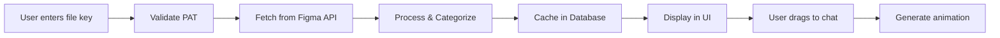

# Figma Integration Developer Guide

## 🚀 Getting Started in 5 Minutes

### Prerequisites
1. **Figma Account**: You need a Figma account with at least one file
2. **PAT Token**: Personal Access Token from Figma settings
3. **Node/npm**: Standard Bazaar-vid dev environment

### Quick Setup
```bash
# 1. Add your Figma PAT to .env.local
FIGMA_PAT="figd_YOUR_TOKEN_HERE"

# 2. Run database migrations (if not done)
npm run db:push

# 3. Start dev server
npm run dev

# 4. Open Figma panel in workspace
Click the palette icon (🎨) in the sidebar
```

### Test Your Setup
```bash
# Run the PAT validation script
npx tsx test-figma-pat.ts

# Should output:
# ✅ PAT is valid!
# 👤 User: your-email@example.com
```

## 📁 File Structure

```
src/
├── app/projects/[id]/generate/workspace/panels/
│   └── FigmaDiscoveryPanel.tsx         # Main UI component
├── server/
│   ├── api/routers/
│   │   └── figma.router.ts            # tRPC endpoints
│   └── services/figma/
│       ├── figma-auth.service.ts      # Authentication logic
│       ├── figma-discovery.service.ts # Component discovery
│       └── figma-converter.service.ts # Figma → Remotion conversion
├── lib/types/
│   └── figma.types.ts                 # TypeScript definitions
└── server/db/
    └── schema.ts                       # Database tables (figma_*)
```

## 🔧 Core Components Explained

### 1. FigmaDiscoveryPanel (`FigmaDiscoveryPanel.tsx`)
**Purpose**: UI for browsing and importing Figma designs

**Key Functions**:
- `handleSearch()`: Validates PAT, fetches file components
- `handleDragStart()`: Prepares component data for chat integration
- `getComponentIcon()`: Maps Figma types to UI icons

**State Management**:
```typescript
const [fileKey, setFileKey] = useState('');      // Current file
const [components, setComponents] = useState([]); // Discovered items
const [loading, setLoading] = useState(false);    // Loading state
```

### 2. Figma Router (`figma.router.ts`)
**Purpose**: API endpoints for Figma operations

**Key Endpoints**:
```typescript
// Check if PAT is valid
checkConnection() 

// Index a Figma file and discover components
indexFile({ fileKey })

// Import component as Remotion code
importComponent({ fileKey, nodeId })
```

### 3. Discovery Service (`figma-discovery.service.ts`)
**Purpose**: Fetches and categorizes Figma components

**Key Methods**:
```typescript
indexFile(fileKey)     // Main entry point
getFile(fileKey)       // Fetches file structure
categorizeComponent()  // Sorts into UI categories
scoreRelevance()       // Ranks by importance
```

**Rate Limiting**: Built-in queue (2 requests/second)

### 4. Converter Service (`figma-converter.service.ts`)
**Purpose**: Transforms Figma designs to Remotion code

**Current Implementation**: Basic (needs enhancement)
```typescript
convertToRemotionComponent(figmaNode) {
  // Extracts: position, size, colors, text
  // Generates: Basic Remotion component
  // TODO: Add animations, effects, responsiveness
}
```

## 🎯 Common Tasks

### Adding a New Figma Feature
1. **Update Types** (`figma.types.ts`):
```typescript
export interface NewFeature {
  // Add your types
}
```

2. **Add Router Endpoint** (`figma.router.ts`):
```typescript
newFeature: protectedProcedure
  .input(z.object({ /* schema */ }))
  .mutation(async ({ input, ctx }) => {
    // Implementation
  })
```

3. **Update UI** (`FigmaDiscoveryPanel.tsx`):
```typescript
const newFeature = api.figma.newFeature.useMutation({
  onSuccess: (data) => { /* handle */ }
});
```

### Testing Figma Integration
```bash
# 1. Test with your own file
- Create a Figma file with components
- Copy the file key
- Paste in the panel

# 2. Test with different file types
- Frames only
- Components only  
- Mixed content
- Large files (100+ items)

# 3. Test error cases
- Invalid file key
- No access file
- Empty file
```

### Debugging Tips
```javascript
// Enable verbose logging in browser console
localStorage.setItem('DEBUG_FIGMA', 'true');

// Check API calls in Network tab
// Filter by: api/trpc/figma

// Common issues:
// - 403: PAT doesn't have access to file
// - 404: Invalid file key
// - 429: Rate limited (wait a bit)
```

## 🔄 Data Flow



## 🗄️ Database Schema

```sql
-- Figma connections (user tokens)
figma_connections {
  userId: varchar(255) PK
  accessToken: text (encrypted)
  figmaUserId: varchar(255)
  figmaUserEmail: varchar(255)
}

-- File cache (discovered components)
figma_file_cache {
  fileKey: varchar(255) PK
  fileName: varchar(255)
  componentCatalog: json
  indexedAt: timestamp
}

-- Import history
figma_imports {
  id: uuid PK
  userId: varchar(255) FK
  fileKey: varchar(255)
  nodeId: varchar(255)
  remotionCode: text
  importedAt: timestamp
}
```

## 🚧 Current Limitations

1. **No Thumbnails**: Figma's image export API not implemented
2. **Basic Conversion**: Doesn't preserve complex styles
3. **No Variants**: Component variants not supported
4. **No Auto-layout**: Figma's auto-layout not translated
5. **Rate Limits**: 2 req/sec can be slow for large files

## 🎨 Extending the Integration

### Want to add thumbnails?
```typescript
// In figma-discovery.service.ts
async getThumbnails(fileKey: string, nodeIds: string[]) {
  const response = await fetch(
    `https://api.figma.com/v1/images/${fileKey}?ids=${nodeIds.join(',')}&format=png`,
    { headers: this.getHeaders() }
  );
  return response.json();
}
```

### Want to improve conversion?
Look at `figma-converter.service.ts`:
- Add animation presets based on component type
- Extract and apply Figma effects (shadows, blurs)
- Generate responsive layouts from Figma constraints
- Map Figma interactions to Remotion animations

### Want to add OAuth?
1. Register app at figma.com/developers
2. Implement OAuth flow in `figma-auth.service.ts`
3. Store refresh tokens in database
4. Add token refresh logic

## 🐛 Troubleshooting

### "Forbidden" Error
- **Cause**: PAT doesn't have access to file
- **Fix**: Use a file you own or have been shared with

### No Components Found
- **Cause**: File might only have shapes/text
- **Fix**: Ensure file has frames or components

### Slow Performance
- **Cause**: Rate limiting (2 req/sec)
- **Fix**: Implement caching, batch requests

### Components Not Animating
- **Cause**: Basic converter doesn't add animations
- **Fix**: Manually add animations in chat after import

## 📚 Resources

- [Figma API Docs](https://www.figma.com/developers/api)
- [Figma File Structure](https://www.figma.com/developers/api#files)
- [Remotion Docs](https://remotion.dev/docs)
- [tRPC Docs](https://trpc.io/docs)

## 💡 Pro Tips

1. **File Keys**: Can be found in any Figma URL after `/file/` or `/design/`
2. **PAT Scope**: Personal tokens can only access your files
3. **Caching**: Files are cached for 24 hours to reduce API calls
4. **Categories**: Components auto-categorized (auth, commerce, content, etc.)
5. **Drag Data**: Check `window.figmaDragData` in console while dragging

## Ready to Code? 🎯

1. Pick a limitation from above
2. Check the relevant service file
3. Make your changes
4. Test with real Figma files
5. Submit PR with description

Need help? Check existing code patterns or ask in team chat!