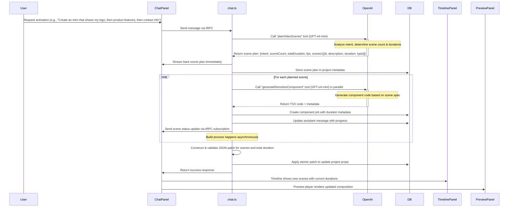
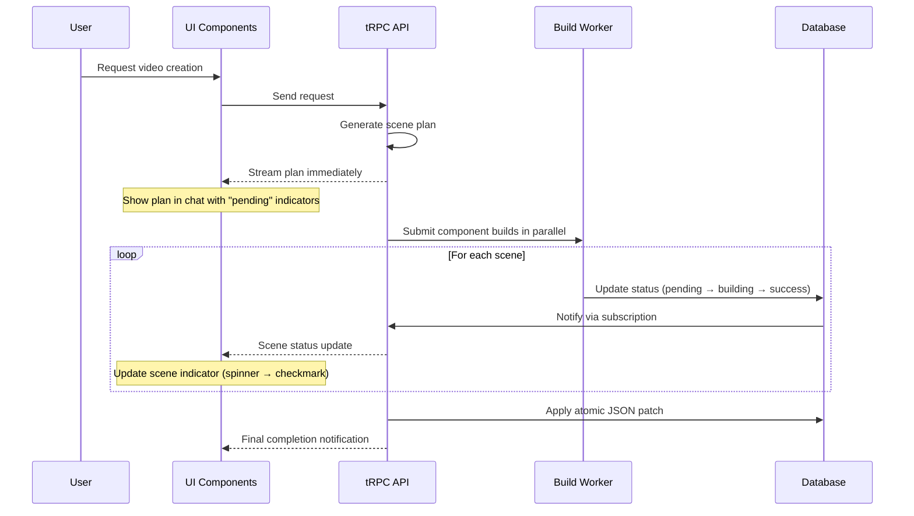

# Sprint 9: Intelligent Scene Planning & Dynamic Duration System

## Technical Specification Document

**Version**: 1.3  
**Author**: Cursor Agent  
**Date**: 2024-05-27  
**Status**: Draft  
**File**: `/memory-bank/sprints/sprint9/intelligent-scene-planning.md`

## Overview

This document outlines the implementation of a two-step LLM approach for intelligent scene planning and dynamic duration handling in Bazaar-Vid. The current system uses hardcoded durations (180 frames/6 seconds) regardless of scene complexity or user intent. This implementation will upgrade our system to dynamically determine appropriate scene counts, types, and durations based on user requests.

## 1. System Architecture

### 1.1 Two-Step LLM Approach



### 1.2 Real-time Feedback Pattern



## 2. Detailed Data Flow & Storage

### 2.1 User Prompt Processing

1. **Entry Point**: User submits prompt in `ChatPanel.tsx`
2. **Transport**: tRPC mutation `chat.sendMessage` or streaming subscription
3. **Backend Processing**: `src/server/api/routers/chat.ts` handles the message

```typescript
// In chat.ts
const streamResponse: protectedProcedure = ({ ctx, input }) => {
  // ... existing setup code
  
  const openaiResponse = await openai.chat.completions.create({
    model: "gpt-o4-mini", // Using o4-mini as per @gpt.mdc standard
    messages: messagesForAPI,
    // Tools for the two-step process
    tools: [scenePlannerTool, generateRemotionComponentTool, applyPatchTool],
    tool_choice: "auto",
    stream: true,
  });
  
  // ... stream processing
};
```

### 2.2 Intent Analysis & Scene Planning

**Tool Definition**:

```typescript
// Already exists in src/server/api/routers/chat.ts
const scenePlannerTool: ChatCompletionTool = {
  type: "function",
  function: {
    name: "planVideoScenes",
    description: "Analyze user intent to plan multiple scenes with appropriate durations",
    parameters: {
      type: "object",
      properties: {
        intent: {
          type: "string",
          description: "Summary of the user's overall video intent"
        },
        sceneCount: {
          type: "integer",
          description: "Number of scenes needed to fulfill the request (minimum 1, maximum 10)"
        },
        totalDuration: {
          type: "integer",
          description: "Total suggested video duration in seconds (maximum 60 seconds)"
        },
        fps: {
          type: "integer",
          description: "Frames per second (normally 30)",
          default: 30
        },
        scenes: {
          type: "array",
          description: "Detailed breakdown of each scene",
          items: {
            type: "object",
            properties: {
              id: {
                type: "string",
                description: "Unique ID for this scene to track across generation steps"
              },
              description: {
                type: "string", 
                description: "Detailed description of this scene's content and purpose"
              },
              durationInSeconds: {
                type: "number",
                description: "Recommended duration for this scene in seconds"
              },
              effectType: {
                type: "string",
                enum: ["text", "image", "custom"],
                description: "Preferred scene type for this content"
              }
            },
            required: ["id", "description", "durationInSeconds", "effectType"]
          }
        }
      },
      required: ["intent", "sceneCount", "totalDuration", "fps", "scenes"]
    }
  }
};
```

**Streaming the Plan Immediately**:
```typescript
// In handleScenePlanInternal
async function handleScenePlanInternal(
  projectId: string,
  userId: string,
  scenesPlan: any,
  assistantMessageId: string,
  db: any,
  emitter: Subject<any> // For streaming updates
): Promise<{ message: string, patches?: Operation[] }> {
  // Immediately stream back the plan
  emitter.next({
    type: "scenePlan",
    plan: scenesPlan,
    status: "planning_complete"
  });
  
  // Store the plan in project metadata
  await db.update(projects)
    .set({ 
      metadata: {
        ...project.metadata,
        lastScenePlan: scenesPlan
      },
      updatedAt: new Date()
    })
    .where(eq(projects.id, projectId));
  
  // Rest of implementation handling patches, etc.
  // ...
}
```

**Storage**:
1. The scene plan is initially processed in memory
2. It is stored as context for subsequent calls
3. The plan is also stored in the project's metadata for future reference

### 2.3 Component Generation

For each scene in the plan, we call `generateRemotionComponent` to create the actual code:

```typescript
// Enhanced implementation in src/server/api/routers/chat.ts
async function handleScenePlanInternal(
  projectId: string,
  userId: string,
  scenesPlan: any,
  assistantMessageId: string,
  db: any,
  emitter: Subject<any>
): Promise<{ message: string, patches?: Operation[] }> {
  // ... existing code
  
  // Process each scene in parallel for faster results
  const sceneProcessingPromises = scenesPlan.scenes.map(async (scene, index) => {
    const durationInFrames = Math.round(scene.durationInSeconds * scenesPlan.fps); // Convert to frames using fps from plan
    const sceneId = scene.id; // Use the ID directly from the planner
    
    // Stream scene status = "pending"
    emitter.next({
      type: "sceneStatus",
      sceneId,
      sceneIndex: index,
      status: "pending"
    });
    
    // Generate custom component if needed
    if (scene.effectType === "custom") {
      try {
      // Generate a custom component with explicit duration
        const { jobId, effect, componentMetadata } = await handleComponentGenerationInternal(
        projectId,
        scene.description,
        assistantMessageId,
          scene.durationInSeconds, // Pass the planned duration
          scenesPlan.fps,          // Pass fps from plan
          sceneId                  // Pass the scene ID from planner
        );
        
        // Update scene status = "building"
        emitter.next({
          type: "sceneStatus",
          sceneId,
          sceneIndex: index,
          status: "building",
          jobId
        });
        
        // Handle component over-run: If component declares a different duration, trust the component
        if (componentMetadata?.durationInFrames && 
            componentMetadata.durationInFrames > durationInFrames) {
          
          console.log(`Scene ${index} (${sceneId}): Component declared ${componentMetadata.durationInFrames} frames, ` +
                      `which exceeds planned ${durationInFrames}. Using component's duration.`);
          
          // Trust the component's duration
          return {
            sceneId,
            type: scene.effectType,
            durationInFrames: componentMetadata.durationInFrames, 
            jobId,
            effect,
            status: "building"
          };
        }
      
      // ... rest of code to add component
        
        return {
          sceneId,
          type: scene.effectType,
          durationInFrames,
          jobId,
          effect,
          status: "building"
        };
      } catch (error) {
        // Handle errors - fall back to a placeholder
        console.error(`Error generating scene ${index}:`, error);
        emitter.next({
          type: "sceneStatus",
          sceneId,
          sceneIndex: index,
          status: "error",
          error: error.message
        });
        
        // Return a fallback scene
        return {
          sceneId,
          type: "text",
          durationInFrames: 5 * scenesPlan.fps, // 5 seconds fallback using plan fps
          data: { text: `Scene ${index + 1}: ${scene.description} (Error: ${error.message})` },
          status: "error"
        };
      }
    }
    
    // ... handle other scene types
  });
  
  // Wait for all scene processing to complete
  const sceneResults = await Promise.all(sceneProcessingPromises);
  
  // ... rest of implementation
}
```

**Component Job Storage**:
Component code and metadata is stored in the `customComponentJobs` table:

```typescript
// In src/server/workers/buildCustomComponent.ts
// The generated component knows its intended duration
await db.insert(customComponentJobs).values({
  id: jobId,
  projectId,
  effect,
  tsxCode,
  status: "pending",
  retryCount: 0,
  errorMessage: null,
  metadata: { 
    durationInFrames: Math.round(durationInSeconds * fps), // Use fps from plan
    durationInSeconds,
    fps,
    scenePlanId: sceneId  // Reference to the specific scene in the plan
  },
  createdAt: new Date(),
  updatedAt: new Date(),
});
```

### 2.4 JSON Patch Construction & Validation

After all components are generated (or in parallel), we create a single atomic JSON patch to update the video state:

```typescript
// In handleScenePlanInternal
// Create operations array
const operations: Operation[] = [];

// Add each scene
for (let i = 0; i < sceneResults.length; i++) {
  const scene = sceneResults[i];
  
  // ... scene creation logic
  operations.push({
    op: "add",
    path: `/scenes/-`,
    value: {
      id: scene.sceneId,
      type: scene.type,
      start: currentPosition,
      duration: scene.durationInFrames,
      data: {
        // Different data based on scene type
        // For custom: componentId, name, etc.
        // For text: text, fontSize, etc.
      }
    }
  });
  
  // Update position for next scene
  currentPosition += scene.durationInFrames;
}

// Update total duration
operations.push({
  op: "replace",
  path: "/meta/duration",
  value: currentPosition
});

// Validate the entire patch against our schema before applying
try {
  // Create a test object to validate final state
  const testProps = applyPatch(
    structuredClone(currentProps), 
    operations
  ).newDocument;
  
  // Validate with Zod schema
  const validationResult = inputPropsSchema.safeParse(testProps);
  
  if (!validationResult.success) {
    throw new Error(`Invalid patch: ${validationResult.error.message}`);
  }
  
  // Additional checks for total duration and scene count
  if (testProps.scenes.length > 10) {
    throw new Error("Too many scenes: maximum allowed is 10");
  }
  
  if (testProps.meta.duration > 60 * scenesPlan.fps) { // 60 seconds @ configured fps
    throw new Error("Total duration exceeds maximum of 60 seconds");
  }
  
  // Check for off-by-one errors in scene positioning
  let expectedPosition = 0;
  for (const scene of testProps.scenes) {
    if (scene.start !== expectedPosition) {
      throw new Error(`Scene positioning error: expected ${expectedPosition}, got ${scene.start}`);
    }
    expectedPosition += scene.duration;
  }
  
  if (expectedPosition !== testProps.meta.duration) {
    throw new Error(`Duration mismatch: scenes sum to ${expectedPosition}, meta.duration is ${testProps.meta.duration}`);
  }
} catch (error) {
  console.error("Patch validation failed:", error);
  // Fall back to simpler patch if validation fails
  // ...
}

// Apply the validated patch atomically
const patchRecord = await db.transaction(async (tx) => {
  // 1. Apply patch to project
  // 2. Record patch in patches table
  // ... existing transaction code
});

// Return patches for application
return {
  message: responseMessage,
  patches: operations
};
```

## 3. Database Schema Updates

We'll need minor updates to our database schema:

```typescript
// src/server/db/schema.ts
export const projects = pgTable("projects", {
  // ... existing fields
  metadata: jsonb("metadata").$type<Record<string, any>>().default({}).notNull(),
  // This stores scene plans, relationships between scenes, etc.
});

// customComponentJobs table already has metadata field for duration
```

## 4. Client-Side Integration

### 4.1 Chat UI Updates

When a scene plan is created, the assistant message shows details about the multi-scene video:

```typescript
// In ChatPanel.tsx - no changes needed
// The assistant message will display the scene plan summary
// "I've created a 3-scene video for you:
// Scene 1: Logo introduction (2 seconds)
// Scene 2: Product showcase (5 seconds)
// Scene 3: Contact information (3 seconds)
// Total duration: 10 seconds"
```

### 4.2 Timeline Panel Integration

The timeline automatically shows all scenes with their correct durations:

```typescript
// In TimelinePanel.tsx - Uses existing code
// No changes needed as it already maps scenes from videoState
// Each scene will now have the dynamic duration from the planning step
```

### 4.3 Real-time Scene Status Updates

```typescript
// In TimelinePanel.tsx - Add progress indicators
// For each scene in the timeline
const SceneItem = ({ scene, index }) => {
  // Subscribe to scene status updates via tRPC
  const { data: sceneStatus } = api.chat.getSceneStatus.useQuery({
    projectId,
    sceneId: scene.id
  }, {
    refetchInterval: 1000, // Poll every second
  });
  
  return (
    <div className="relative">
      {/* Existing scene rendering */}
      <div className="scene-item">{scene.data.name || `Scene ${index + 1}`}</div>
      
      {/* Status indicator */}
      {sceneStatus?.status === "pending" && (
        <div className="absolute top-0 right-0">
          <Spinner size="sm" className="text-blue-500" />
        </div>
      )}
      {sceneStatus?.status === "building" && (
        <div className="absolute top-0 right-0">
          <Spinner size="sm" className="text-amber-500" />
        </div>
      )}
      {sceneStatus?.status === "error" && (
        <div className="absolute top-0 right-0 text-red-500">
          <ExclamationCircleIcon className="h-4 w-4" />
        </div>
      )}
      {sceneStatus?.status === "success" && (
        <div className="absolute top-0 right-0 text-green-500">
          <CheckCircleIcon className="h-4 w-4" />
        </div>
      )}
      
      {/* Regenerate button */}
      {scene.type === "custom" && (
        <button 
          className="absolute bottom-0 right-0 text-xs p-1 bg-blue-500 text-white rounded"
          onClick={() => handleRegenerateScene(scene.id)}
        >
          Regenerate
        </button>
      )}
    </div>
  );
};
```

## 5. Editing Workflow - Scene Context

To handle scene-specific edits:

```typescript
// New field in the chat message schema (when needed)
export interface ChatMessage {
  // ... existing fields
  sceneContext?: {
    sceneId: string;
    sceneIndex: number;
    description: string;
    currentCode?: string; // The current TSX code for the scene
    sceneData?: any; // The scene's JSON representation (start/duration)
  }
}

// When user drags scene from timeline to chat
async function handleScenePrompt(sceneId: string, message: string) {
  // Get the scene from videoState
  const scene = videoState.getCurrentProps()?.scenes.find(s => s.id === sceneId);
  if (!scene) return;
  
  // Get the scene's index
  const sceneIndex = videoState.getCurrentProps()?.scenes.findIndex(s => s.id === sceneId) ?? -1;
  
  // For custom components, get the current code
  let currentCode = undefined;
  if (scene.type === "custom" && scene.data?.componentId) {
    const componentJob = await api.video.getComponentJob.query({
      jobId: scene.data.componentId
    });
    currentCode = componentJob?.tsxCode;
  }
  
  // Send message with scene context
  return api.chat.sendMessage.mutate({
    projectId,
    message,
    sceneContext: {
      sceneId,
      sceneIndex,
      description: scene.data?.description || `Scene ${sceneIndex + 1}`,
      currentCode,
      sceneData: {
        start: scene.start,
        duration: scene.duration,
        ...scene.data
      }
    }
  });
}
```

In the backend, we check for scene context and adjust the prompt:

```typescript
// In chat.ts
if (input.sceneContext) {
  // Format the current code for readability
  const formattedCode = input.sceneContext.currentCode 
    ? `\`\`\`tsx\n${input.sceneContext.currentCode}\n\`\`\``
    : "No code available for this scene.";
    
  // Add scene context to the prompt for the LLM
  const sceneInfo = `
You are editing Scene ${input.sceneContext.sceneIndex + 1} with ID ${input.sceneContext.sceneId}.
This scene starts at frame ${input.sceneContext.sceneData.start} and has a duration of ${input.sceneContext.sceneData.duration} frames (${input.sceneContext.sceneData.duration / 30} seconds).
Description: ${input.sceneContext.description}

The current code for this scene is:
${formattedCode}
`;
  
  // Adjust messages to focus on updating a specific scene
  messagesForAPI.push({
    role: "system",
    content: `${sceneInfo} The user wants to modify this specific scene. Focus your response on updating this scene only.`
  });
}
```

## 6. Implementation Details

### 6.1 Scene Planning Handler

The scene planning handler is implemented in `handleScenePlanInternal` and includes several key features:

#### Scene Plan Validation
- Validates the basic structure of scene plans including:
  - Ensuring at least one scene is present
  - Validating fps value (defaulting to 30 if invalid)
  - Limiting the maximum number of scenes to 10

#### Scene Repositioning
To handle component over-runs (where the actual duration exceeds the planned duration):

1. Duration is calculated at the component level first
2. If a component declares a longer duration than planned, we trust the component
3. Scenes are repositioned using the `calculateScenePositions` function
4. Each scene's start position is calculated based on the sum of previous scene durations

```typescript
// Function for calculating scene positions
const calculateScenePositions = (scenes: SceneResult[]) => {
    let currentPosition = 0;
    for (const scene of scenes) {
        scene.start = currentPosition;
        currentPosition += scene.durationInFrames;
    }
    return currentPosition; // Return the total duration
};
```

#### Timing Integrity Validation
The implementation includes comprehensive validation of scene timing:

1. Checks for positional accuracy (no gaps or overlaps)
2. Validates scene durations (must be positive)
3. Ensures total duration matches the sum of individual scene durations
4. Includes self-healing capabilities for common issues:
   - Automatically fixes duration mismatches
   - Creates fallback scenes when errors occur
   - Provides meaningful error messages

#### Error Handling and Recovery
The implementation includes robust error handling:

1. Each scene has a try-catch block to prevent one scene failure from stopping the entire process
2. Fallback scenes are created for failed components
3. Error states are communicated through the streaming emitter
4. Top-level error handling provides a minimal fallback video even if the entire planning process fails

### 6.2 Component Over-run Handling

When a component declares a longer duration than planned:

```typescript
// Handle component over-run: If component declares a different duration, trust the component
let actualDurationInFrames = durationInFrames;
if (componentMetadata?.durationInFrames && 
    componentMetadata.durationInFrames > durationInFrames) {
    
    console.log(`Scene ${i} (${sceneId}): Component declared ${componentMetadata.durationInFrames} frames, ` +
                `which exceeds planned ${durationInFrames}. Using component's duration.`);
    
    // Trust the component's duration
    actualDurationInFrames = componentMetadata.durationInFrames;
    needsRepositioning = true; // Flag that we need to recalculate positions
}
```

This approach ensures that:
1. Visual components have enough time to complete their animations
2. The timeline remains cohesive with no overlapping elements
3. The total video duration adapts to component needs

## 7. File Changes Required

### 7.1 Completed Changes

1. ✅ `src/server/api/routers/chat.ts` - Completed `handleScenePlanInternal` implementation
   - Added comprehensive scene plan validation
   - Implemented scene repositioning for component over-runs
   - Added robust error handling and recovery
   - Improved timing integrity validation

2. ✅ `src/server/workers/generateComponentCode.ts` - Added duration handling
   - Updated to use "gpt-o4-mini" model
   - Added fps parameter for consistent frame calculations
   - Enhanced metadata extraction for duration information

3. ✅ `src/types/timeline.ts` - Enhanced timeline types for scene status
   - Added `TimelineItemStatus` type for visual feedback
   - Added `sceneId` and `componentId` properties to link timeline items with scenes
   - Improved type safety for timeline integration with scene planning

4. ✅ `src/app/projects/[id]/edit/panels/TimelinePanel.tsx` - Implemented scene status visualization
   - Added validation for scene timing (gaps, overlaps)
   - Implemented visual status indicators for scenes (valid, warning, error, building)
   - Added status legend for user understanding
   - Enhanced keyboard shortcut documentation

### 7.2 Remaining Changes

1. `src/app/projects/[id]/edit/panels/TimelinePanel.tsx` - Add scene regeneration UI
   - Implement regeneration button for individual scenes
   - Add progress tracking for regeneration

2. `src/components/client/Timeline/TimelineItem.tsx` - Enhance with duration feedback
   - Show warnings when component duration differs from plan
   - Implement visual indicators for timing discrepancies

3. `src/server/api/routers/chat.ts` - Add scene regeneration endpoint
   - Implement targeted scene regeneration while preserving other scenes
   - Handle updating timeline with regenerated scene

## 8. Timeline Integration

### 8.1 Timeline System Overview

The TimelinePanel has been updated to work seamlessly with the intelligent scene planning system. Since the timeline panel lives under a single `<TimelineProvider>`, any change in the provider or its hooks automatically flows to all dependent components. This provides several key benefits:

1. **Single Source of Truth**: All scene data comes from the scene plan generated by the LLM, ensuring consistency.
2. **Visual Feedback**: Timeline provides visual indicators for scene status (gaps, overlaps, errors).
3. **Bidirectional Updates**: Changes made in the timeline are propagated back through patches.

### 8.2 Timeline Status Indicators

The timeline now shows status indicators for each scene:

- **Valid (Green)**: Scene timing is correct, no issues detected
- **Warning (Yellow)**: Minor issues such as small gaps between scenes or duration mismatch
- **Error (Red)**: Serious issues like scene overlaps or invalid positioning
- **Building (Blue)**: Scene is currently being generated or processed

### 8.3 Integration Architecture

The timeline integration follows this architecture:

1. `TimelinePanel.tsx` initializes with the scene data from `videoState`
2. Scene status is calculated based on timing relationships and component metadata
3. Visual indicators in TimelineItem components reflect scene status
4. Timeline operations generate patches that flow through the patch validation in `handleScenePlanInternal`

This integration ensures that timing relationships between scenes are preserved, even when component durations differ from the planned values.

## 9. LLM Communication Pattern

```
┌─────────────────────┐              ┌─────────────────────┐
│                     │              │                     │
│    Scene Planner    │─────────────▶│   Code Generator    │
│     (GPT-o4-mini)   │              │     (GPT-o4-mini)   │
│                     │◀─────────────│                     │
└─────────────────────┘              └─────────────────────┘
          │                                     │
          │                                     │
          ▼                                     ▼
┌─────────────────────┐              ┌─────────────────────┐
│                     │              │                     │
│    Scene Context    │              │   Component Code    │
│    Database Store   │              │   Database Store    │
│                     │              │                     │
└─────────────────────┘              └─────────────────────┘
```

- **Planning LLM**: Makes 1 call to determine scene count, durations, and purposes
- **Generator LLM**: Makes N calls (one per scene) to create component code
- **Communication**: Through our backend, not direct LLM-to-LLM
- **Context Preservation**: Store planning results for reference by generator LLM

## 10. Error Handling & Edge Cases

1. **LLM Planning Failures**: Fall back to generating single scene with default duration (5 seconds)
   ```typescript
   // Fallback when planning fails
   if (!planResult || !planResult.scenes || planResult.scenes.length === 0) {
     console.error("Scene planning failed, using fallback");
     return {
       intent: input.message,
       sceneCount: 1,
       totalDuration: 5,
       fps: 30, // Default fps
       scenes: [{
         id: crypto.randomUUID(), // Generate fallback ID
         description: input.message,
         durationInSeconds: 5,
         effectType: "custom"
       }]
     };
   }
   ```

2. **Component Generation Errors**: Placeholder scenes for failed components
   ```typescript
   // In component generator error handler
   if (error) {
     // Create a placeholder text scene
     return {
       id: crypto.randomUUID(),
       type: "text",
       start: currentPosition,
       duration: 5 * scenesPlan.fps, // 5 seconds using plan fps
       data: {
         text: `Error generating scene: ${error.message}`,
         fontSize: 24,
       }
     };
   }
   ```

3. **Long Sequences**: Cap maximum scenes at 10 and total duration at 60 seconds
   ```typescript
   // In scenePlannerTool validation
   sceneCount: {
     type: "integer",
     description: "Number of scenes needed (minimum 1, maximum 10)",
     minimum: 1,
     maximum: 10
   },
   totalDuration: {
     type: "integer", 
     description: "Total duration in seconds (maximum 60)",
     minimum: 1,
     maximum: 60
   }
   ```

4. **Component Over-run**: If the component has internal animation that exceeds the planned duration, trust the component's timing
   ```typescript
   // In chat.ts handleScenePlanInternal
   if (componentMetadata?.durationInFrames && 
       componentMetadata.durationInFrames > plannedDurationInFrames) {
     
     console.log(`Scene ${index}: Component declares ${componentMetadata.durationInFrames} frames, ` +
                 `which exceeds planned ${plannedDurationInFrames}. Using component's duration.`);
     
     // Use the component's declared duration instead of the planned one
     scene.durationInFrames = componentMetadata.durationInFrames;
     
     // We'll need to recalculate the positions of subsequent scenes
     needsRepositioning = true;
   }
   
   // After processing all scenes, recalculate positions if needed
   if (needsRepositioning) {
     let currentPosition = 0;
     for (const scene of sceneResults) {
       scene.start = currentPosition;
       currentPosition += scene.durationInFrames;
     }
     
     // Update total duration
     totalDuration = currentPosition;
   }
   ```

5. **Parallel Processing Limits**: Cap concurrent component generation to avoid API rate limits
   ```typescript
   // Use pMap with concurrency limit
   const sceneResults = await pMap(
     scenesPlan.scenes,
     async (scene, index) => {
       // Process scene
       // ...
     },
     { concurrency: 3 } // Process max 3 scenes at once
   );
   ```

## 11. Testing Strategy

```typescript
// Test scenarios
const testScenarios = [
  {
    name: "Single scene request",
    input: "Show a bouncing red ball",
    expectedScenes: 1
  },
  {
    name: "Multi-scene explicit request",
    input: "Create a 3-scene video with intro, content, and outro",
    expectedScenes: 3
  },
  {
    name: "Ambiguous duration request",
    input: "Create a product showcase that's not too long",
    expectedDurationRange: [5, 20] // seconds
  },
  {
    name: "Edge case: Very long request",
    input: "Create a detailed 10-minute video explaining quantum physics with animations for each concept",
    expectedCap: 60 // Should cap at 60 seconds
  },
  {
    name: "Edge case: Many scenes request",
    input: "Create 20 different scenes showing different angles of my product",
    expectedSceneCap: 10 // Should cap at 10 scenes
  },
  {
    name: "Component duration over-run test",
    input: "Create a short animation of a bouncing ball",
    testFunction: async () => {
      // Override component generation to produce longer duration than requested
      // Verify the plan adjusts to the component's declared duration
    }
  }
];

// Zod schema validation tests
describe("Scene plan schema validation", () => {
  test("Rejects plans with zero scenes", () => {
    // Test validation
  });
  
  test("Rejects plans with excessive duration", () => {
    // Test validation
  });
  
  test("Accepts valid plans within limits", () => {
    // Test validation
  });
  
  test("Correctly handles component over-run", () => {
    // Test that patch construction trusts component durations over plan
  });
});
```

## 12. Implementation Timeline

| Task | Description | Dependency | Estimate |
|------|-------------|------------|----------|
| 1. Complete `scenePlannerTool` | Finish the tool implementation in chat.ts | None | 2 hours |
| 2. Implement `handleScenePlanInternal` | Create function to process scene plans | Task 1 | 3 hours |
| 3. Update component metadata storage | Ensure duration is properly stored | None | 1 hour |
| 4. Add streaming feedback | Implement tRPC subscriptions for real-time progress | Task 2 | 2 hours |
| 5. Modify insertComponent mutation | Respect component duration from metadata | Task 3 | 1 hour |
| 6. Add scene context handling | Support scene-specific edits | Tasks 1-4 | 2 hours |
| 7. Enhance UI with progress indicators | Update TimelinePanel with status indicators | Task 4 | 2 hours |
| 8. Add patch validation | Implement schema validation for patches | None | 1 hour |
| 9. Testing & debugging | Test various scenarios | All above | 3 hours |

## 13. References

This implementation references these specific files:

1. `src/server/api/routers/chat.ts` - Lines 340-410 (existing scene planner tool)
2. `src/server/api/routers/video.ts` - Lines 98-132 (insertComponent mutation)
3. `src/server/workers/buildCustomComponent.ts` - Component generation pipeline
4. `src/types/input-props.ts` - Zod schema for validation
5. `src/app/projects/[id]/edit/panels/TimelinePanel.tsx` - Timeline integration
6. `src/app/projects/[id]/edit/Sidebar.tsx` - Client-side integration

## 14. Implementation Updates

### 14.1 Model Standardization (2024-05-28)

We've standardized the model used for all LLM interactions in the scene planning and component generation system:

1. **Updated Model Name**: Changed from "gpt-4o-mini" to "gpt-o4-mini" as per the @gpt.mdc standard
   - Updated in `src/server/workers/generateComponentCode.ts`
   - Updated in `src/server/api/routers/chat.ts` (both streaming and regular API calls)
   - Updated in all diagrams and documentation

2. **Key Implementation Changes**:
   - Modified `scenePlannerTool` to include fps field in the required parameters
   - Updated `handleComponentGenerationInternal` to accept fps and sceneId parameters
   - Enhanced the component generation process to maintain scene identity throughout the pipeline

3. **Benefits of Standardization**:
   - Consistent model behavior across all LLM interactions
   - Better adherence to OpenAI's naming conventions
   - Following established project standards (@gpt.mdc)

4. **Future Considerations**:
   - We may need to update model parameters (temperature, etc.) based on specific needs of each tool
   - Performance monitoring should track model behavior over time to identify improvement opportunities

## Conclusion

This architecture maintains our established JSON patch pattern while implementing a more intelligent scene planning system. By separating concerns between planning and generation, we create a more reliable and flexible video creation experience that adapts to user intent. The streaming approach provides immediate feedback to users while components build in the background, and strong validation ensures data consistency throughout the process.

Key improvements in this version:
1. Using GPT-o4-mini as our standard model for both planning and generation
2. Direct scene ID passing from planner to generator to maintain consistent identity
3. Including fps in the plan response to ensure consistent timing calculations
4. Handling component over-run by trusting the component's internal timeline when it exceeds the planned duration
5. Streaming incremental updates for better user experience
