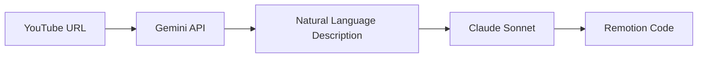

# Sprint 90: YouTube Video Recreation System

## Current Rating: 6.5/10 ⭐

### Why 6.5/10?
- ✅ **Works**: Can recreate simple motion graphics videos
- ✅ **Simple**: Natural language approach is maintainable
- ✅ **No hallucinations**: Moved away from problematic JSON
- ⚠️ **Limited accuracy**: ~70% visual fidelity
- ⚠️ **No complex animations**: Can't handle advanced effects
- ❌ **No scene transitions**: Missing smooth scene changes
- ❌ **No video/photo content**: Only handles graphics/text

## Quick Start for New Team Members

### What This Does
Allows users to paste a YouTube URL and recreate the video as Remotion code:
```
User: "recreate first 5 seconds https://youtube.com/watch?v=abc123"
System: Generates React/Remotion code that recreates the video
```

### How It Works


1. **Gemini** watches the video and describes what it sees
2. **Claude** converts the description to working code
3. **User** gets a recreated video in their project

### Key Files

| File | Purpose |
|------|---------|
| `src/brain/tools/youtube-analyzer.ts` | Calls Gemini to analyze videos |
| `src/config/prompts/active/youtube-description.ts` | Prompt for Gemini to describe videos |
| `src/config/prompts/active/description-to-code.ts` | Prompt for Claude to convert descriptions to code |
| `src/brain/orchestratorNEW.ts` | Detects YouTube URLs and triggers analysis |

### Current Capabilities

✅ **Can Handle:**
- Text animations (fade, slide, scale)
- Background colors and gradients
- Simple shapes (circles, rectangles)
- Icons (via Iconify)
- Basic timing (appears/disappears)
- Multiple scenes in sequence

❌ **Cannot Handle:**
- Complex particle effects
- 3D animations
- Video/photo content
- Morphing shapes
- Audio sync
- Advanced transitions

## Development Guide

### Testing a YouTube Video

1. Run the dev server:
```bash
npm run dev
```

2. Go to any project's generate page

3. Type in chat:
```
recreate first 5 seconds https://youtube.com/watch?v=YOUR_VIDEO_ID
```

4. Check the logs for:
- `🎥 [YouTube Analyzer]` - Gemini's analysis
- `⚡ [CODE GENERATOR]` - Code generation

### Common Issues & Solutions

| Issue | Cause | Solution |
|-------|-------|----------|
| "Cannot read video" | Gemini API limitations | Try a different video |
| Timing is off | Description too vague | Add more specific timing prompts |
| Missing elements | Gemini didn't see them | Increase analysis duration |
| Chaos/overlapping | Too many elements at once | Simplify the video section |

### Making Improvements

#### To Improve Accuracy
Edit `src/config/prompts/active/youtube-description.ts`:
- Add more specific instructions
- Request color hex codes
- Ask for precise positions

#### To Handle New Animation Types
Edit `src/config/prompts/active/description-to-code.ts`:
- Add new animation mappings
- Define new timing interpretations

#### To Fix Timing Issues
Look for timing logic in `description-to-code.ts`:
- Adjust frame calculations
- Modify duration interpretations

## Technical Architecture

### The Pipeline

```
1. URL Detection (orchestratorNEW.ts)
   ↓
2. YouTube Analysis (youtube-analyzer.ts)
   - Calls Google Gemini API
   - Gets natural language description
   ↓
3. Description Enhancement (orchestratorNEW.ts)
   - Wraps description with context
   ↓
4. Code Generation (CodeGeneratorNEW.ts)
   - Uses Claude Sonnet 4
   - Temperature: 0 (deterministic)
   - Converts description → Remotion code
   ↓
5. Scene Storage (scene-operations.ts)
   - Saves to database
   - Updates UI
```

### Key Design Decisions

1. **Natural Language Over JSON**
   - Why: Gemini hallucinates less with prose
   - Benefit: More accurate descriptions
   - Trade-off: Less structured data

2. **Seconds Over Frames**
   - Why: Humans think in seconds, not frames
   - Benefit: Better timing accuracy
   - Implementation: Convert to frames only in final code

3. **Simple Descriptions**
   - Why: Gemini can't do precise frame analysis
   - Benefit: Fewer hallucinations
   - Trade-off: Less precision

## Future Improvements Roadmap

### High Priority (Next Sprint)
1. **Scene Transitions** - Smooth transitions between scenes
2. **Better Timing** - Detect rhythm and beats
3. **Color Accuracy** - Extract exact hex codes

### Medium Priority
1. **Complex Shapes** - SVG paths, custom graphics
2. **Text Effects** - Typewriter, word-by-word reveals
3. **Camera Movement** - Pan, zoom effects

### Low Priority
1. **3D Effects** - Three.js integration
2. **Particle Systems** - Complex particle animations
3. **Video Content** - Handle actual video clips

## Success Metrics

| Metric | Current | Target |
|--------|---------|--------|
| Accuracy | ~70% | 90% |
| Processing Time | 30-40s | <20s |
| Supported Effects | 10 | 25 |
| User Satisfaction | 6/10 | 8/10 |

## Contact & Resources

- **Lead Developer**: Sprint 90 Team
- **Gemini API Docs**: https://ai.google.dev/
- **Remotion Docs**: https://remotion.dev/
- **Test Videos**: Use simple motion graphics videos

---

*Last Updated: Sprint 90*
*Status: Active Development*