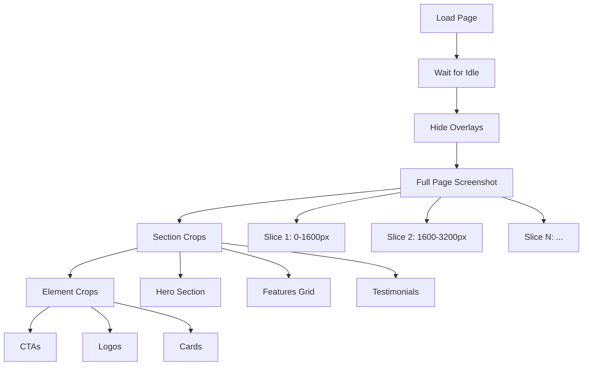
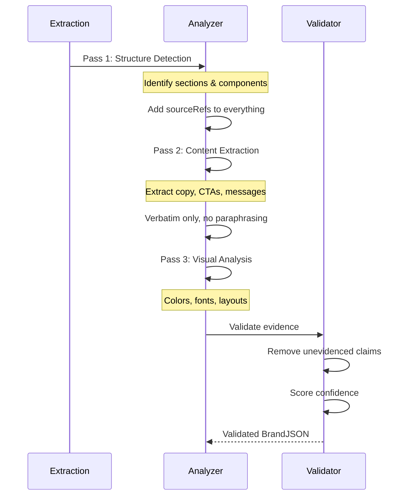
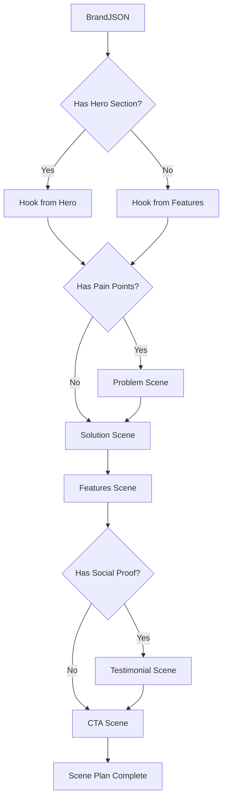
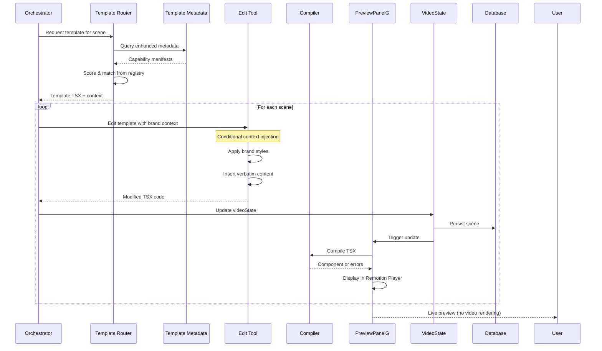

# URL to Video V2 - Detailed Pipeline Documentation

## Building on Sprint 99 Foundation

This pipeline enhances existing components from Sprint 99. We're not creating from scratch but improving fidelity through evidence-based extraction and metadata-driven template selection.

## Stage 1: Web Extraction 🌐

### Objective
Capture complete, high-fidelity representation of the homepage including HTML, screenshots, and computed styles.

### Implementation

```typescript
interface ExtractionConfig {
  viewport: { width: 1920, height: 1080 }
  deviceScaleFactor: 2  // 2x resolution
  userAgent: 'desktop'
  waitForIdle: 3000    // ms after network idle
  scrollStrategy: 'full-page'
  screenshotFormat: 'png'
}
```

### Screenshot Strategy



### Extraction Output

```typescript
interface ExtractionPayload {
  url: string
  timestamp: string
  
  // HTML Data
  html: {
    raw: string           // Original HTML
    cleaned: string       // Without scripts/styles
    dom: string          // Post-JS rendered DOM
  }
  
  // Screenshots
  screenshots: Array<{
    id: string           // e.g., "hero_001"
    type: 'full'|'section'|'element'
    path: string         // R2 path
    bbox?: BoundingBox   // Position in page
    sectionId?: string   // Which section
    elementType?: string // 'cta'|'logo'|'card'|etc
  }>
  
  // Computed Styles
  styles: {
    palette: Color[]     // Extracted colors
    fonts: Font[]        // Used typefaces
    elements: Array<{
      selector: string
      styles: CSSProperties
    }>
  }
  
  // Metadata
  metadata: {
    title?: string
    description?: string
    ogImage?: string
    favicon?: string
    language?: string
  }
}
```

### Key Extraction Rules

1. **Cookie/Modal Handling**
   - Hide via CSS injection: `display: none !important`
   - Never interact/click (legal compliance)
   - Record presence for context

2. **Lazy Loading**
   - Scroll to trigger loading
   - Wait for network idle
   - Capture after content settles

3. **Animation Freeze**
   - Set `prefers-reduced-motion: reduce`
   - Pause video elements
   - Stop carousel auto-play

---

## Stage 2: Brand & Visual Analysis → BrandJSON 🎨

### Objective
Transform raw extraction into structured, evidence-based brand representation with clear visual element classification (photos/illustrations vs UI components).

### Multi-Pass Analysis



### BrandJSON Schema

```typescript
interface BrandJSON {
  url: string
  extractionId: string
  
  // Global brand attributes
  brand: {
    name?: string
    tagline?: string
    voice: VoiceTone[]  // ['professional', 'minimal', 'bold']
    archetype?: BrandArchetype
  }
  
  // Design system
  design: {
    palette: {
      primary: Color
      secondary?: Color
      accent?: Color
      neutrals: Color[]
    }
    typography: {
      headings: FontSpec
      body: FontSpec
      ui: FontSpec
    }
    spacing: SpacingScale
    borderRadius: string
  }
  
  // Page sections (evidence-based)
  sections: Array<{
    id: string          // "hero", "features", etc
    type: SectionType
    order: number
    
    // Evidence tracking
    evidence: {
      screenshotIds: string[]
      domPath: string
      confidence: number  // 0-1
    }
    
    // Content
    content: {
      headline?: string
      subheadline?: string
      body?: string[]
      ctas?: CTA[]
    }
    
    // Visual Elements (classified)
    visualElements: {
      photos: Array<{
        id: string
        screenshotRef: string
        message: string  // One-line description
        purpose: 'hero'|'feature'|'testimonial'|'decoration'
      }>
      uiComponents: Array<{
        id: string
        type: 'dashboard'|'card'|'form'|'chart'|'interface'
        rebuildSpec: {  // Precise rebuild instructions
          layout: string
          styling: CSSProperties
          components: string[]
          interactions?: string[]
        }
      }>
    }
    
    // Visual attributes
    visual: {
      layout: 'single-col'|'two-col'|'grid'
      alignment: 'left'|'center'|'right'
      background?: Color|Gradient
      spacing: 'tight'|'normal'|'loose'
    }
  }>
  
  // Global UI components catalog
  components: Array<UIComponent>
}

interface UIComponent {
  id: string
  type: ComponentType  // 'hero'|'card'|'testimonial'|etc
  
  // Must have evidence
  evidence: {
    screenshotId: string
    bbox: BoundingBox
    domSelector?: string
  }
  
  // Actual content (verbatim)
  content: {
    text?: ComponentText
    images?: ComponentImage[]
    icons?: string[]
  }
  
  // Visual properties
  style: {
    colors: Record<string, Color>
    fonts: Record<string, FontSpec>
    dimensions?: Dimensions
  }
}
```

### Evidence Requirements

Every field must satisfy:
```typescript
interface EvidenceRequirement {
  sourceRef: string[]      // Screenshot IDs or DOM paths
  confidence: number        // 0-1 score
  extractMethod: 'visual'|'dom'|'computed'
}
```

**No Evidence = No Field** - If we can't point to where it came from, it doesn't exist.

---

## Stage 3: Hero's Journey Composition 🎬

### Objective
Transform BrandJSON into a compelling 15-30s narrative using proven story structure.

### Scene Planning Rules

```typescript
interface ScenePlanningRules {
  totalDuration: { min: 15000, max: 30000 }  // ms
  sceneDuration: { min: 2500, max: 6000 }
  sceneCount: { min: 5, max: 8 }
  
  // Story arc template
  structure: [
    'hook',           // 3-4s: Main value prop
    'problem?',       // 2-3s: Pain point (optional)
    'solution',       // 4-5s: Product reveal
    'features',       // 4-6s: Key capabilities
    'social-proof?',  // 3-4s: Testimonials/logos
    'cta'            // 2-3s: Clear next step
  ]
}
```

### Scene Plan Schema

```typescript
interface ScenePlan {
  id: string
  order: number
  
  // Story purpose
  narrative: {
    purpose: ScenePurpose
    keyMessage: string      // One clear point
    emotionalBeat: 'intrigue'|'tension'|'relief'|'excitement'|'trust'|'urgency'
  }
  
  // Source mapping (CRITICAL)
  sources: {
    sectionIds: string[]    // From BrandJSON
    componentIds: string[]  // Specific UI elements
    screenshotIds: string[] // Visual assets
  }
  
  // Content plan
  content: {
    onScreen: {
      headline?: string     // Verbatim from source
      subtext?: string[]
      bullets?: string[]
    }
    voiceover?: string      // Optional narration
    music?: MusicMood
  }
  
  // Visual plan
  visual: {
    templateCandidates: TemplateId[]  // Suitable templates
    layout: LayoutType
    motion: MotionStyle
    transitions: {
      in: TransitionType
      out: TransitionType
    }
  }
  
  // Technical specs
  specs: {
    duration: number        // ms
    aspectRatio: '16:9'|'9:16'|'1:1'
    resolution: '1080p'|'4k'
  }
}
```

### Composition Algorithm



---

## Stage 4: Template Selection & Routing 🎯

### Objective
Enhance existing template-selector.ts to use metadata-driven selection with UI template preference, and prepare optimal context for Edit tool with rebuild-ready descriptions.

### Enhanced Template Metadata

Enhancing existing `/src/templates/metadata.ts` (partially done in Sprint 99):

```typescript
// Current metadata structure (Sprint 99)
interface TemplateMetadata {
  id: string
  name: string
  keywords: string[]
  categories: string[]
  styles: string[]
  // ... existing fields
}

// V2 Enhancement: Complete technical requirements
interface EnhancedTemplateMetadata extends TemplateMetadata {
  // Technical requirements for Remotion compilation
  requirements: {
    imports: string[]  // Required window globals
    props?: string[]   // Required props
    minDuration: number
    maxDuration: number
  }
  
  // Content capabilities
  content: {
    texts: {
      headline?: { min: number, max: number }
      body?: { min: number, max: number }
    }
    images?: {
      count: { min: number, max: number }
      aspectRatio?: string
    }
  }
  
  // Scene matching hints
  sceneMatch: {
    emotionalBeats: EmotionalBeat[]
    purposes: ScenePurpose[]
    industries?: Industry[]
    visualComplexity: 1 | 2 | 3 | 4 | 5
  }
}
```

### Matching Algorithm (With UI Template Preference)

```typescript
function matchTemplate(
  scene: ScenePlan,
  templates: TemplateManifest[],
  brand: BrandJSON
): ScoredTemplate {
  
  // Step 1: Check for UI elements in scene
  const hasUIElements = scene.visualElements?.uiComponents?.length > 0
  
  // Step 2: Hard requirements filter
  const eligible = templates.filter(t => {
    // Basic requirements
    const meetsBasic = 
      t.requirements.texts.headline.max >= scene.content.onScreen.headline.length &&
      t.capabilities.duration.min <= scene.specs.duration &&
      t.capabilities.duration.max >= scene.specs.duration &&
      t.capabilities.aspectRatios.includes(scene.specs.aspectRatio)
    
    // UI template preference when UI refs exist
    if (hasUIElements && t.type === 'ui') {
      return meetsBasic // Prefer UI templates
    }
    
    return meetsBasic
  })
  
  // Step 3: Score by fit with UI bonus
  const scored = eligible.map(t => ({
    template: t,
    score: calculateScore(t, scene, brand, hasUIElements)
  }))
  
  // Step 4: Sort and select
  return scored.sort((a, b) => b.score - a.score)[0]
}

function calculateScore(
  template: TemplateManifest,
  scene: ScenePlan,
  brand: BrandJSON,
  hasUIElements: boolean
): number {
  let score = 0
  
  // UI Template Bonus (20% when UI elements present)
  if (hasUIElements && template.type === 'ui') {
    score += 20
  }
  
  // Purpose match (30%)
  if (template.scoring.preferredFor.includes(scene.narrative.purpose)) {
    score += 30
  }
  
  // Content fit (25%)
  const contentFit = calculateContentFit(template.requirements, scene.content)
  score += contentFit * 25
  
  // Visual match (15%)
  const visualMatch = calculateVisualMatch(template.capabilities, scene.visual)
  score += visualMatch * 15
  
  // Brand alignment (10%)
  if (template.scoring.industries?.includes(brand.brand.archetype)) {
    score += 10
  }
  
  return score
}
```

### Template Router Output

```typescript
interface TemplateRouterOutput {
  templateId: string  // From registry (UI templates preferred)
  templateType: 'ui' | 'text' | 'animation'
  templateCode: string  // TSX code from template
  sceneContext: {
    purpose: ScenePurpose
    keyMessage: string
    brandData: BrandJSON
    visualElements: {
      photos?: Photo[]  // With one-line messages
      uiComponents?: UIComponent[]  // With rebuild specs
    }
    screenshots: string[]  // URLs for Edit tool
  }
}
```

---

## Stage 5: Scene Generation via Edit Tool 🎨

### Objective
Use existing Edit tool to generate brand-aware TSX code for each scene that will be displayed in PreviewPanelG (not rendered as videos).

### Edit Tool Integration (Existing Sprint 99 Component)

```typescript
// Existing /src/tools/edit/edit.ts already supports:
interface EditToolInput {
  tsxCode: string  // Template code from router
  userPrompt: string  // Scene requirements
  
  // V2 Enhancement: Conditional context injection with rebuild specs
  webContext?: {
    originalUrl: string
    pageData: BrandJSON  // With evidence tracking
    visualElements?: {
      photos?: Array<{url: string, message: string}>
      uiComponents?: Array<{
        type: string
        rebuildSpec: {  // Precise instructions for UI recreation
          layout: string
          styling: CSSProperties
          components: string[]
        }
      }>
    }
  }
  imageUrls?: string[]  // Screenshot URLs from R2
  referenceScenes?: Array<{
    id: string
    name: string
    tsxCode: string  // For cross-scene consistency
  }>
}

// Edit tool outputs TSX for PreviewPanelG
interface EditToolOutput {
  success: boolean
  tsxCode?: string  // Goes directly to PreviewPanelG
  reasoning?: string
  error?: string
}
```

### Orchestration Flow



### Quality Gates for TSX Generation

```typescript
interface QualityGates {
  preCompilation: {
    checkContrast: (fg: Color, bg: Color) => boolean
    checkTextLength: (text: string, max: number) => boolean
    checkAssetResolution: (image: Image) => boolean
    checkFontAvailability: (font: FontSpec) => boolean
    validateTSXSyntax: (code: string) => boolean
  }
  
  postCompilation: {
    checkRemotionImports: (code: string) => boolean
    checkComponentProps: (component: Component) => boolean
    checkDuration: (scene: Scene) => boolean
    checkTransitions: (scenes: Scene[]) => boolean
  }
}
```

---

## Error Recovery & Fallbacks 🛡️

### Extraction Failures
```typescript
const extractionFallbacks = {
  screenshotFailed: () => useBackupScreenshotService(),
  domTimeout: () => retryWithLongerTimeout(),
  cookieWall: () => injectCookieHider(),
  lazyLoad: () => scrollAndWaitStrategy()
}
```

### Analysis Failures
```typescript
const analysisFallbacks = {
  noSectionsFound: () => useGenericSectionDivision(),
  lowConfidence: () => requestHumanReview(),
  missingEvidence: () => removeUnevidencedClaims()
}
```

### Template Matching Failures
```typescript
const matchingFallbacks = {
  noTemplateMatch: () => useGenericTemplate(),
  missingAssets: () => useColorBlocks(),
  fontUnavailable: () => mapToSystemFont()
}
```

---

## Performance Targets 🚀

| Stage | Target Time | Optimization Strategy |
|-------|------------|----------------------|
| Extraction | <15s | Parallel screenshots, CDN caching |
| Analysis | <10s | Streaming LLM, batch processing |
| Composition | <5s | Template precomputation |
| Matching | <2s | Indexed metadata manifests |
| Edit Tool | <10s | Parallel scene generation |
| Compilation | <5s | Cached Remotion builds |
| **Total** | **<50s** | End-to-end to PreviewPanelG |

---

## Monitoring & Observability 📊

```typescript
interface PipelineMetrics {
  // Extraction
  extractionDuration: number
  screenshotCount: number
  domSize: number
  
  // Analysis
  sectionsDetected: number
  componentsFound: number
  confidenceScore: number
  
  // Composition
  scenesGenerated: number
  totalDuration: number
  sourceUtilization: number  // % of brand data used
  
  // Matching
  templateMatchScore: number
  fallbacksUsed: string[]
  
  // Compilation & Display
  compilationDuration: number
  compilationErrors: string[]
  displayLatency: number
  qualityScore: number
}
```