# URL to Video V2 - Visual Flow Documentation

## Important Note
This pipeline enhances existing Sprint 99 components and outputs TSX scenes to PreviewPanelG for live preview, not rendered video files.

## Complete Pipeline Flow

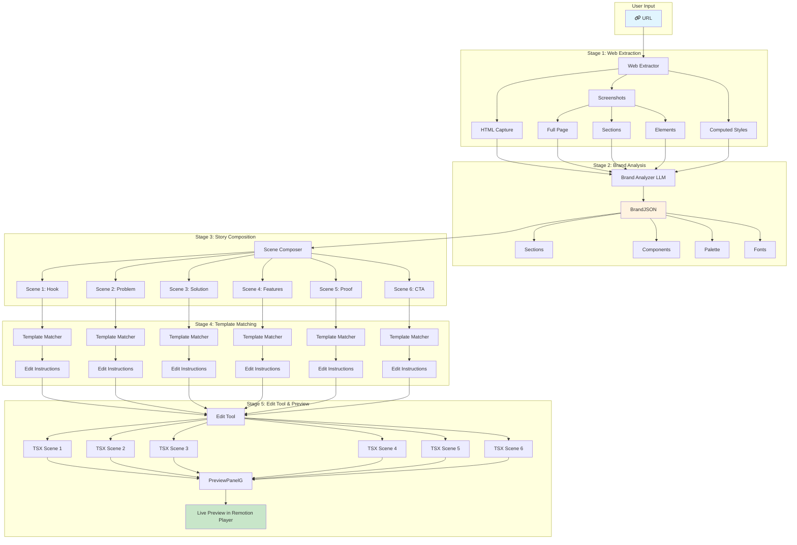

## Detailed Data Flow

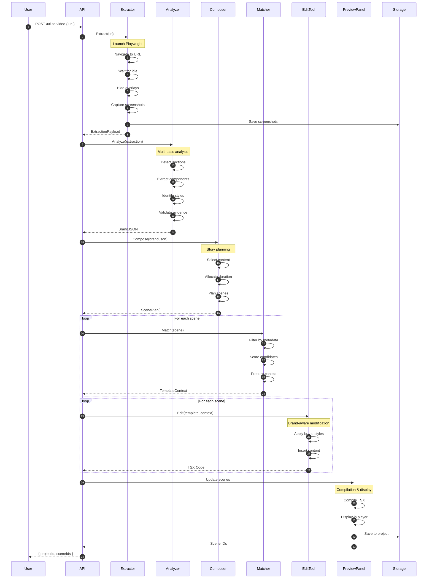

## Screenshot Strategy

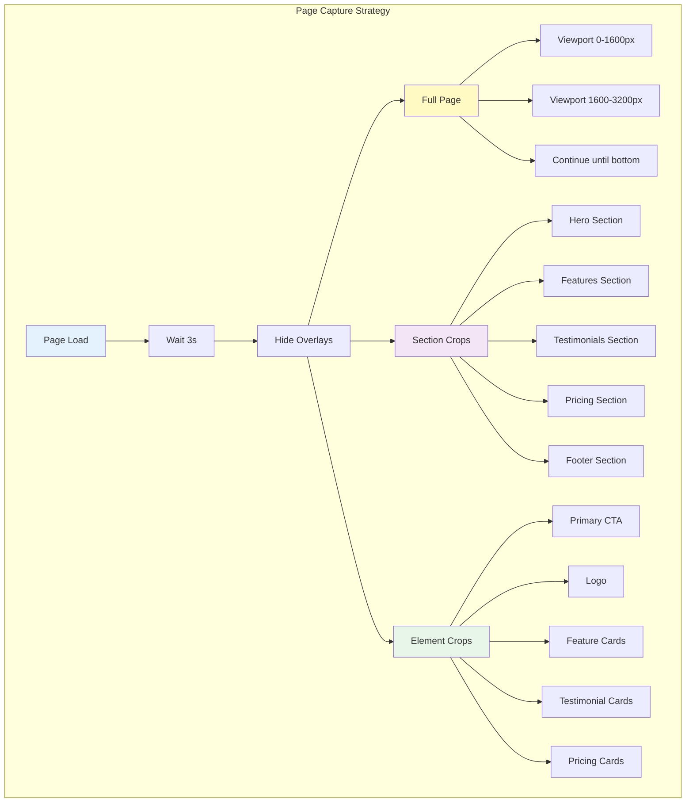

## BrandJSON Structure

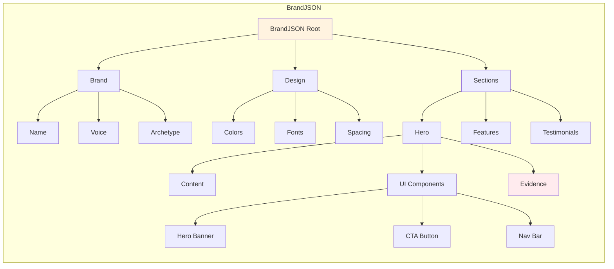

## Scene Planning Logic

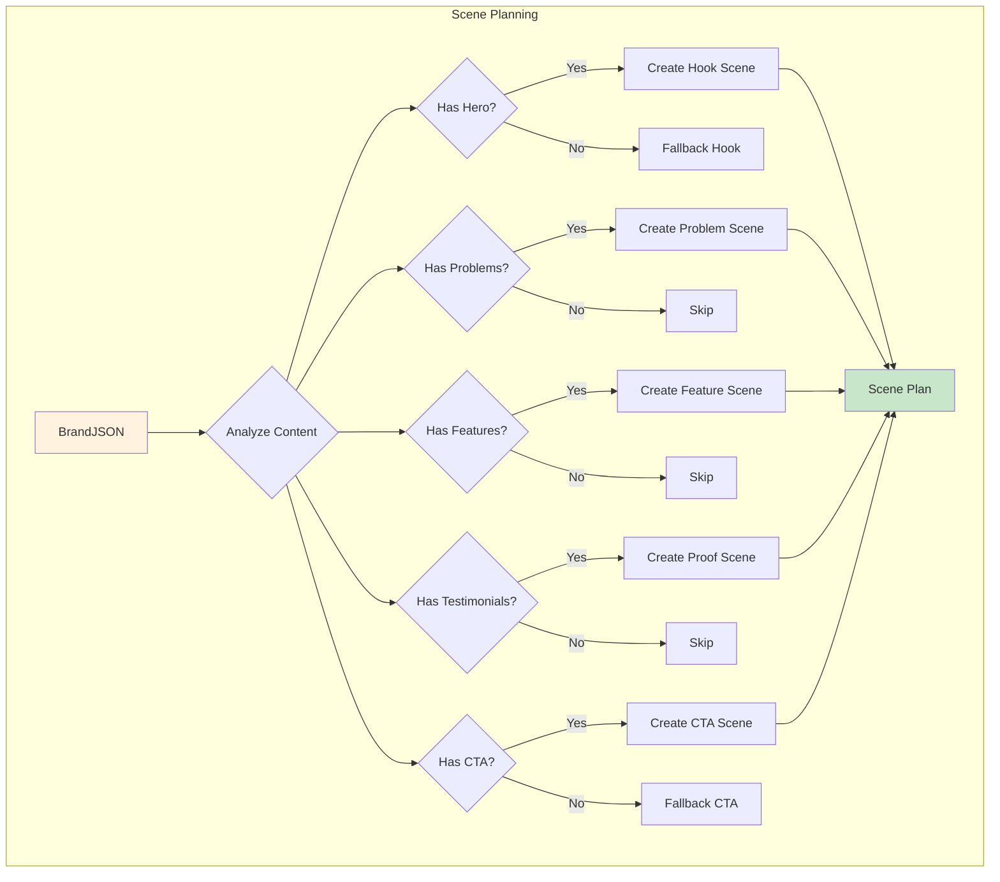

## Template Matching Process (Metadata-Driven)

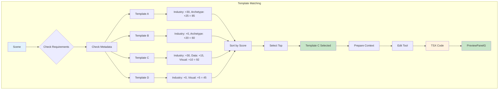

## Evidence Tracking

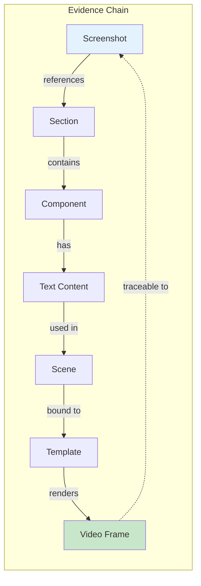

## Quality Gates

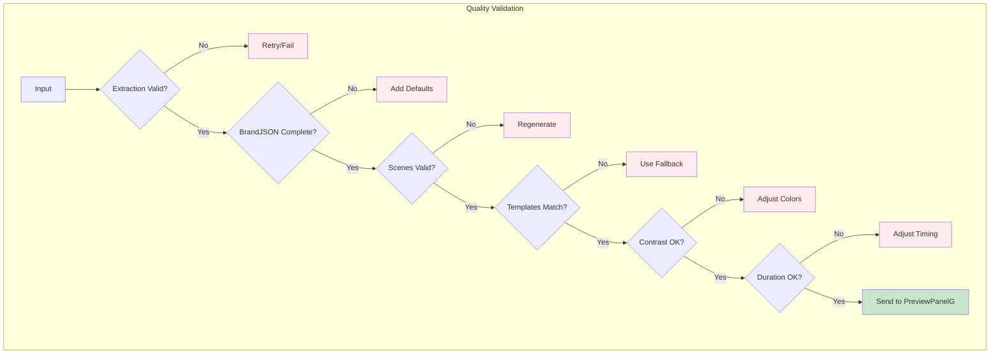

## Example: Fintech Homepage

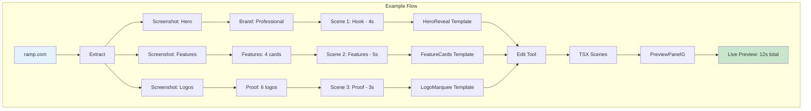

## Performance Optimization

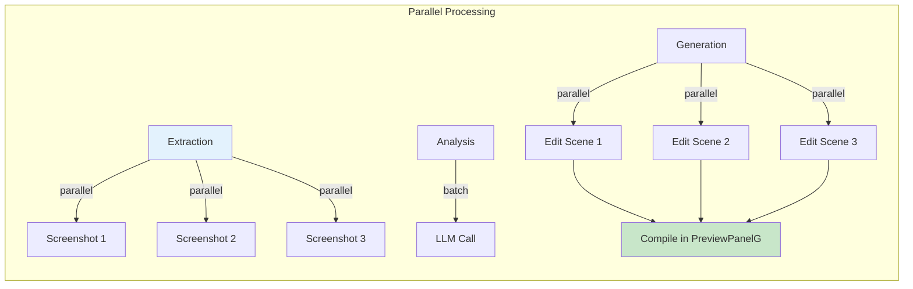

## Error Recovery Flow

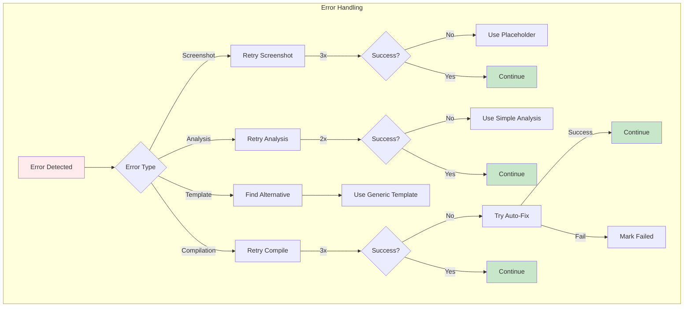