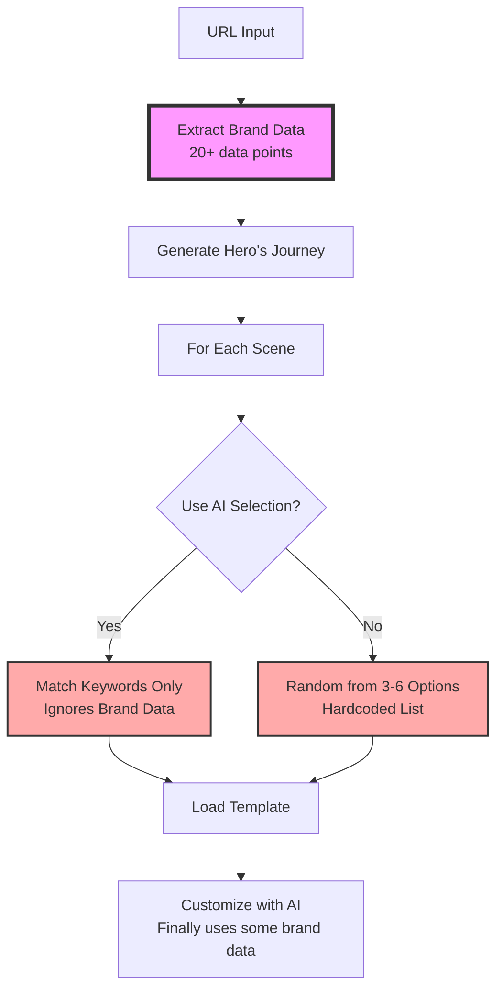

# Current Template Selection Status - Deep Analysis

## 🔴 Current State: Data Waste

### 1. Brand Data Extraction vs Usage

#### What We Extract (Enhanced):
```javascript
// From WebAnalysisAgentV4 - We extract ALL of this:
{
  brand: {
    identity: {
      name: "Ramp",
      archetype: "innovator",  // NOT USED in selection
      positioning: "Spend management platform"  // NOT USED
    },
    visual: {
      colors: {
        primary: "#FF6B6B",  // NOT USED in selection
        secondary: "#4ECDC4",  // NOT USED
        palette: [...]  // NOT USED
      },
      typography: {
        stack: ["Inter", "sans-serif"]  // NOT USED
      }
    },
    voice: {
      tone: "professional"  // NOT USED
    }
  },
  product: {
    targetAudience: ["CFOs", "Finance teams"],  // NOT USED
    features: [20+ features],  // NOT USED
    positioning: {
      category: "Financial Technology"  // NOT USED
    }
  },
  socialProof: {
    customerLogos: ["Shopify", "Airbnb"],  // NOT USED
    stats: ["25% cost reduction"]  // NOT USED
  }
}
```

#### What We Actually Use:
```javascript
// In template-selector.ts - Almost NOTHING:
async selectTemplateForBeat(scene, style, brandData) {
  // brandData is passed but barely used!
  
  if (this.useIntelligentSelection && brandData) {
    // Only uses scene narrative, not brand data
    const selectionPrompt = `${scene.narrative} ${scene.emotionalBeat} ${style} style`;
    // Brand data IGNORED in prompt!
  }
  
  // Falls back to random selection from hardcoded list
  const templateOptions = this.beatToTemplateMap[scene.emotionalBeat][style];
  const randomIndex = Math.floor(Math.random() * templateOptions.length);
}
```

### 2. Metadata Categories vs Usage

#### What Metadata Contains:
```javascript
// Rich categorization in metadata.ts:
{
  categories: ['text-animation', 'typography', 'transitions'],  // NOT USED in beat selection
  styles: ['modern', 'clean', 'professional', 'minimal'],  // Partially used in AI matching only
  useCases: ['headlines', 'taglines', 'features'],  // NOT USED
  animations: ['typewriter', 'fade', 'morph'],  // NOT USED
  colors: ['monochrome', 'dark', 'vibrant'],  // NOT USED
  complexity: 'simple' | 'medium' | 'complex',  // NOT USED
  industries: undefined,  // MISSING!
  brandArchetypes: undefined,  // MISSING!
  emotionalBeats: undefined,  // MISSING!
}
```

#### How It's Actually Used:
```javascript
// Only in AI fallback matching:
if (promptLower.includes(keyword)) score += 5;  // Basic keyword matching
// No consideration of brand alignment!
```

### 3. Selection Logic Flow



### 4. Wasted Opportunities

#### Brand Archetype → Template Style Mapping (NOT IMPLEMENTED):
```javascript
// This SHOULD exist but doesn't:
const archetypeToStyle = {
  'innovator': ['modern', 'cutting-edge', 'tech-forward'],
  'sophisticate': ['elegant', 'minimal', 'premium'],
  'protector': ['stable', 'trustworthy', 'secure'],
  'everyman': ['friendly', 'approachable', 'simple']
}
```

#### Industry → Template Preference (NOT IMPLEMENTED):
```javascript
// This SHOULD exist but doesn't:
const industryTemplates = {
  'fintech': ['GrowthGraph', 'TeslaStockGraph', 'FintechUI'],
  'saas': ['DualScreenApp', 'PromptUI', 'Coding'],
  'ecommerce': ['ProductShowcase', 'AppDownload', 'MobileApp']
}
```

#### Color Harmony Matching (NOT IMPLEMENTED):
```javascript
// This SHOULD exist but doesn't:
const matchTemplateToColors = (brandColors, templateMetadata) => {
  // Match brand primary/secondary to template color schemes
  // Prefer templates with compatible color palettes
}
```

### 5. Current Selection Statistics

Based on the hardcoded `beatToTemplateMap`:

| Emotional Beat | Style | Options | Using Brand? |
|---------------|-------|---------|--------------|
| Problem | Minimal | 3 templates | ❌ No |
| Problem | Dynamic | 3 templates | ❌ No |
| Problem | Bold | 3 templates | ❌ No |
| Discovery | Minimal | 3 templates | ❌ No |
| Discovery | Dynamic | 3 templates | ❌ No |
| Discovery | Bold | 3 templates | ❌ No |
| Transformation | All | 3-4 templates | ❌ No |
| Triumph | All | 3 templates | ❌ No |
| Invitation | All | 3 templates | ❌ No |

**Total unique templates in rotation: ~25 out of 45 available**

### 6. Customization Phase (Where Brand Data Finally Appears)

```javascript
// In template-customizer-ai.ts:
const customizationPrompt = buildCustomizationPrompt(
  templateCode,
  scene,
  brandData,  // FINALLY used here!
  previousSceneCode
);

// But only for:
// - Changing colors (sometimes)
// - Updating text content
// - Not for template selection itself
```

## 🔍 Key Problems

1. **Brand Blindness**: Template selection ignores 95% of extracted brand data
2. **Random Selection**: Most selections are random from 3-6 hardcoded options
3. **No Industry Awareness**: Fintech brands get same templates as fashion brands
4. **No Audience Targeting**: CFO-targeted content uses same templates as developer-targeted
5. **Color Mismatch**: Template colors don't consider brand palette until customization
6. **Missing Metadata**: No industry, archetype, or audience fields in metadata
7. **Static Mapping**: Hardcoded beat-to-template map instead of dynamic matching

## 📊 Data Utilization Score

| Data Type | Extracted | Used in Selection | Score |
|-----------|-----------|------------------|-------|
| Brand Colors | ✅ 10+ colors | ❌ Never | 0% |
| Brand Archetype | ✅ Yes | ❌ Never | 0% |
| Target Audience | ✅ 4-8 segments | ❌ Never | 0% |
| Industry | ✅ Inferred | ❌ Never | 0% |
| Features | ✅ 20+ items | ❌ Never | 0% |
| Voice Tone | ✅ Yes | ❌ Never | 0% |
| Social Proof | ✅ Yes | ❌ Never | 0% |
| CTAs | ✅ 3-6 items | ❌ Never | 0% |

**Overall Data Utilization: < 5%**

## 🎯 The Gap

We extract rich brand data but throw it away during template selection, only to partially use it during customization. This is like:
- Analyzing someone's fashion style in detail
- Randomly picking clothes from a closet
- Then trying to dye them to match afterwards

The selection should be intelligent from the start!