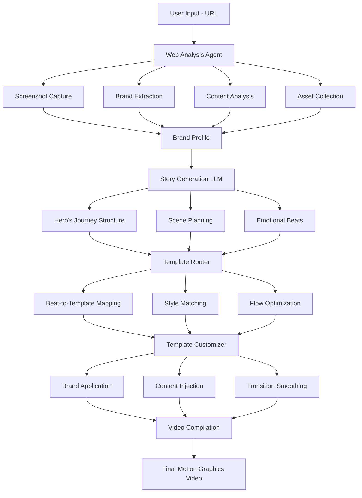

# 🚀 Sprint 99: URL-to-Motion Graphics Pipeline Master Plan

## Executive Summary
Transform any website URL into a stunning, brand-aligned motion graphics video using AI-powered analysis, hero's journey storytelling, and modular template customization.

## 🎯 Core Vision
**"Paste URL → Extract Brand → Generate Story → Create Video"**

Users simply paste their website URL, and Bazaar automatically:
1. Extracts complete brand identity (colors, fonts, voice, imagery)
2. Creates a compelling hero's journey narrative  
3. Selects and customizes templates to match the brand
4. Generates a cohesive motion graphics video

## 📊 Current State Analysis

### ✅ What Already Exists:
- **WebAnalysisEnhanced.ts**: Comprehensive brand extraction (colors, typography, buttons, shadows, copy voice, social proof)
- **HeroJourneyGenerator**: Narrative structure with emotional beats (problem → discovery → transformation → triumph → invitation)
- **Template System**: 50+ templates (LogoTemplate, ParticleExplosion, GrowthGraph, etc.)
- **Template Selector**: Maps emotional beats to appropriate templates
- **Template Customizer**: Applies brand styling to templates
- **Website Pipeline Router**: Orchestrates the entire flow

### 🔧 What Needs Enhancement:
1. Deeper brand profile storage and management
2. More sophisticated story generation with LLM fine-tuning
3. Modular template organization and metadata
4. Intelligent template routing based on brand personality
5. Quality assurance and testing framework

## 📋 Implementation Plan

### Phase 1: Enhanced Brand Extraction (Week 1-2)
1. **Upgrade WebAnalysisAgent**
   - Add screenshot capture at multiple viewports
   - Extract interactive elements (hover states, animations)
   - Capture brand voice and messaging hierarchy
   - Detect and save logo variations
   - Extract social proof and testimonials
   - Identify key metrics and data points

2. **Create Brand Profile Storage**
   ```sql
   -- New tables needed
   brand_profiles {
     id: uuid
     project_id: uuid
     website_url: string
     brand_data: jsonb -- Full extraction data
     screenshots: jsonb -- S3 URLs
     created_at: timestamp
     updated_at: timestamp
   }
   ```

### Phase 2: Advanced Story Generation (Week 2-3)
1. **Hero's Journey LLM Enhancement**
   - Fine-tune GPT-4 specifically for software demo narratives
   - Create story arc variations:
     - Problem-Solution Arc
     - Before-After Transformation
     - Feature Discovery Tour
     - Customer Success Story
     - Innovation Showcase
   - Dynamic scene duration based on content complexity
   - Emotional pacing optimization

2. **Story Templates Structure**
   ```typescript
   interface StoryArc {
     type: 'problem-solution' | 'transformation' | 'discovery' | 'success';
     beats: EmotionalBeat[];
     totalDuration: number;
     transitions: TransitionStyle[];
   }
   ```

### Phase 3: Modular Template System (Week 3-4)
1. **Template Categorization**
   ```
   templates/
   ├── intros/         (2-3s brand reveals)
   │   ├── logo-reveal/
   │   ├── text-intro/
   │   └── brand-splash/
   ├── problems/       (2-3s pain point animations)
   │   ├── dark-mood/
   │   ├── broken-system/
   │   └── frustration/
   ├── solutions/      (3-5s feature showcases)
   │   ├── app-demo/
   │   ├── feature-grid/
   │   └── workflow/
   ├── benefits/       (2-3s metric displays)
   │   ├── growth-chart/
   │   ├── counter/
   │   └── comparison/
   ├── social-proof/   (2-3s testimonials/logos)
   │   ├── testimonial-card/
   │   ├── logo-cloud/
   │   └── rating-display/
   ├── ctas/          (2-3s call-to-action)
   │   ├── button-pulse/
   │   ├── signup-form/
   │   └── qr-code/
   └── transitions/    (0.5s scene connectors)
       ├── wipe/
       ├── morph/
       └── particle/
   ```

2. **Template Metadata System**
   ```typescript
   interface TemplateMetadata {
     id: string;
     name: string;
     category: TemplateCategory;
     duration: {
       min: number;      // Minimum viable duration
       max: number;      // Maximum before it drags
       optimal: number;  // Sweet spot
     };
     customizable: {
       colors: ColorSlot[];      // ['primary', 'secondary', 'accent']
       text: TextSlot[];         // ['headline', 'subheadline', 'body']
       images: ImageSlot[];      // ['logo', 'hero', 'background']
       metrics: MetricSlot[];    // ['value1', 'label1']
     };
     style: TemplateStyle[];     // ['minimal', 'dynamic', 'bold']
     emotionalTone: Tone[];      // ['serious', 'playful', 'inspiring']
     compatibleWith: string[];   // Other template IDs for smooth flow
     brandPersonality: {
       corporate: number;  // 0-1 score
       playful: number;
       technical: number;
       elegant: number;
     };
   }
   ```

3. **Template Adaptation Engine**
   ```typescript
   class TemplateAdapter {
     adaptTemplate(template: Template, brand: BrandProfile): AdaptedTemplate {
       // Dynamic color replacement
       replaceColors(template, brand.colors);
       
       // Font family and weight mapping
       replaceFonts(template, brand.typography);
       
       // Logo placement and sizing
       injectLogo(template, brand.logo);
       
       // Text content injection
       populateText(template, brand.copy);
       
       // Image/icon substitution
       replaceImages(template, brand.imagery);
       
       // Animation speed adjustment
       adjustTiming(template, brand.motionStyle);
       
       return adaptedTemplate;
     }
   }
   ```

### Phase 4: Intelligent Template Router (Week 4-5)
1. **Selection Algorithm**
   ```typescript
   class IntelligentRouter {
     selectTemplates(story: StoryArc, brand: BrandProfile): Template[] {
       const selected = [];
       
       for (const beat of story.beats) {
         const candidates = this.getCandidatesForBeat(beat);
         const filtered = this.filterByBrandPersonality(candidates, brand);
         const sorted = this.sortByCompatibility(filtered, selected);
         const best = this.pickOptimal(sorted, beat.duration);
         
         selected.push(best);
       }
       
       return selected;
     }
   }
   ```

2. **Customization Pipeline**
   - Pre-processing: Extract customizable elements
   - Brand injection: Apply colors, fonts, logos
   - Content population: Insert text, metrics, images
   - Post-processing: Ensure timing and transitions
   - Quality check: Validate output

### Phase 5: Quality & Polish (Week 5-6)
1. **Template Quality Standards**
   - Professional motion design principles
   - Accessibility guidelines (contrast, readability)
   - Performance optimization (render time < 2s per scene)
   - Mobile-first responsive design
   - Brand consistency score > 90%

2. **Testing Framework**
   ```typescript
   interface QualityTest {
     brandAlignment: number;      // 0-100
     visualFlow: number;          // 0-100
     readability: number;         // 0-100
     emotionalImpact: number;     // 0-100
     renderPerformance: number;   // ms
   }
   ```

## 🏗️ Technical Architecture



## 🎨 Template Organization Strategy

### Core Template Properties
```typescript
interface Template {
  // Identification
  id: string;
  name: string;
  category: 'intro' | 'problem' | 'solution' | 'benefit' | 'social' | 'cta';
  
  // Timing
  duration: {
    min: number;      // Minimum frames
    max: number;      // Maximum frames
    optimal: number;  // Recommended frames
  };
  
  // Customization slots
  customizable: {
    colors: {
      primary: boolean;
      secondary: boolean;
      accent: boolean;
      background: boolean;
    };
    text: {
      headline: boolean;
      subheadline: boolean;
      body: boolean;
      cta: boolean;
    };
    images: {
      logo: boolean;
      hero: boolean;
      background: boolean;
      icons: boolean;
    };
    metrics: {
      values: boolean;
      labels: boolean;
      charts: boolean;
    };
  };
  
  // Style attributes
  style: ('minimal' | 'dynamic' | 'bold')[];
  emotionalTone: ('serious' | 'playful' | 'inspiring' | 'urgent')[];
  
  // Compatibility
  compatibleWith: string[];  // Template IDs that flow well after this
  incompatibleWith: string[]; // Templates to avoid in sequence
  
  // Performance
  renderComplexity: 'low' | 'medium' | 'high';
  fileSize: number; // KB
}
```

### Smart Template Selection Logic
```typescript
// Router selects templates based on multiple factors:
function selectOptimalTemplate(
  narrativeBeat: EmotionalBeat,
  brandPersonality: BrandPersonality,
  previousTemplate: Template | null,
  availableContent: Content,
  targetDuration: number
): Template {
  
  // 1. Get all templates for this narrative beat
  const candidates = getTemplatesForBeat(narrativeBeat);
  
  // 2. Filter by brand personality match
  const brandMatches = candidates.filter(t => 
    calculatePersonalityMatch(t, brandPersonality) > 0.7
  );
  
  // 3. Ensure visual flow from previous template
  const flowMatches = previousTemplate 
    ? brandMatches.filter(t => 
        previousTemplate.compatibleWith.includes(t.id)
      )
    : brandMatches;
  
  // 4. Check content requirements
  const contentMatches = flowMatches.filter(t =>
    hasRequiredContent(t, availableContent)
  );
  
  // 5. Match duration requirements
  const durationMatches = contentMatches.filter(t =>
    t.duration.min <= targetDuration && 
    t.duration.max >= targetDuration
  );
  
  // 6. Pick the best match
  return durationMatches.sort((a, b) => 
    calculateOverallScore(b) - calculateOverallScore(a)
  )[0];
}
```

## 📈 Success Metrics

### Performance KPIs
- **Speed**: URL to video in < 60 seconds
- **Quality**: 90% user satisfaction with brand alignment
- **Variety**: No two videos look identical (uniqueness score > 80%)
- **Conversion**: 50% of generated videos get exported
- **Retention**: Users generate 3+ videos per session

### Technical Metrics
- **Brand Extraction Accuracy**: 95% color/font match
- **Story Coherence Score**: 85% narrative flow rating
- **Template Selection Success**: 90% appropriate matches
- **Render Performance**: < 2 seconds per scene
- **Error Rate**: < 1% generation failures

## 🚦 Immediate Next Steps

### Week 1 Sprint Goals
1. ✅ Create `/memory-bank/sprints/sprint99_url_to_video/` folder
2. Design enhanced brand profile database schema
3. Implement multi-viewport screenshot capture
4. Build template metadata registry
5. Create hero's journey LLM prompt engineering doc
6. Test pipeline with 5 real websites:
   - Stripe.com (fintech)
   - Notion.so (productivity)
   - Spotify.com (entertainment)
   - Airbnb.com (marketplace)
   - OpenAI.com (AI/tech)

## 🎯 MVP Focus

### Core Template Set (15 templates to perfect first)
Each category has 3 style variations (minimal, dynamic, bold):

1. **Logo Reveal** (intro)
   - Minimal: Fade in with subtle pulse
   - Dynamic: Scale with rotation
   - Bold: Particle explosion reveal

2. **Problem Statement** (tension)
   - Minimal: Dark text on gradient
   - Dynamic: Glitch text effect
   - Bold: Breaking/shattering animation

3. **Feature Showcase** (solution)
   - Minimal: Clean app mockup
   - Dynamic: Floating UI elements
   - Bold: 3D device rotation

4. **Growth Metrics** (triumph)
   - Minimal: Simple counter
   - Dynamic: Animated chart
   - Bold: Explosive growth visualization

5. **CTA Button** (invitation)
   - Minimal: Subtle hover state
   - Dynamic: Pulsing glow
   - Bold: Particle attraction

## 🔬 Technical Innovations

### 1. Brand DNA Extraction
```typescript
interface BrandDNA {
  // Visual Identity
  colors: {
    primary: Color;
    secondary: Color;
    accents: Color[];
    gradients: Gradient[];
    darkMode?: ColorPalette;
  };
  
  // Typography System
  typography: {
    headingFont: Font;
    bodyFont: Font;
    codeFont?: Font;
    scale: TypographicScale;
  };
  
  // Motion Personality
  motion: {
    speed: 'slow' | 'moderate' | 'fast';
    easing: EasingFunction[];
    complexity: 'simple' | 'moderate' | 'complex';
  };
  
  // Content Voice
  voice: {
    tone: 'casual' | 'professional' | 'technical';
    emotions: string[];
    keywords: string[];
  };
  
  // Visual Style
  style: {
    corners: 'sharp' | 'rounded' | 'pill';
    shadows: 'none' | 'subtle' | 'dramatic';
    spacing: 'tight' | 'comfortable' | 'spacious';
    imagery: 'photography' | 'illustration' | '3d' | 'abstract';
  };
}
```

### 2. Story Arc Engine
```typescript
class StoryArcEngine {
  generateArc(brand: BrandDNA, product: ProductData): StoryArc {
    // Analyze product type and audience
    const productType = this.classifyProduct(product);
    const audience = this.identifyAudience(product);
    
    // Select appropriate story structure
    const structure = this.selectStructure(productType, audience);
    
    // Generate narrative beats
    const beats = this.generateBeats(structure, brand, product);
    
    // Optimize pacing
    const pacedBeats = this.optimizePacing(beats);
    
    // Add transitions
    const finalArc = this.addTransitions(pacedBeats);
    
    return finalArc;
  }
}
```

### 3. Template Intelligence
```typescript
class TemplateIntelligence {
  // Learn from user feedback
  async improveSelection(feedback: UserFeedback) {
    await this.updateWeights(feedback);
    await this.retrainModel(feedback);
  }
  
  // A/B test template combinations
  async runExperiment(variants: Template[][]) {
    const results = await this.trackPerformance(variants);
    return this.analyzeResults(results);
  }
  
  // Predict template success
  predictSuccess(template: Template, context: Context): number {
    return this.model.predict({ template, context });
  }
}
```

## 🚀 Launch Strategy

### Beta Testing (Week 6)
- 10 partner companies
- 50 test websites
- Feedback collection
- Performance monitoring
- Bug fixes and optimizations

### Public Launch (Week 8)
- Marketing campaign: "Your Website, Your Movie"
- Tutorial videos
- Template showcase
- Customer success stories
- Pricing tiers

## 📚 Documentation Needed
1. Template Creation Guide
2. Brand Extraction API Docs
3. Story Generation Prompt Library
4. Performance Optimization Guide
5. Troubleshooting Manual

## 🎬 End Goal
Any user can paste their website URL and receive a professional, brand-aligned motion graphics video that tells their story compellingly in 20-60 seconds, ready for social media, presentations, or website hero sections.

---

*This is a living document. Update as we progress through Sprint 99.*