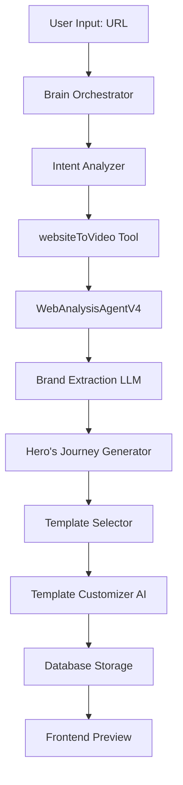

# 🏗️ Technical Architecture: URL-to-Video Pipeline

## System Components



---

## 🧠 Core Services

### 1. Brain Orchestrator
**Location**: `/src/brain/orchestratorNEW.ts`
**Purpose**: Central coordinator for all generation requests
**Model**: GPT-5-mini (via optimal-pack)

### 2. WebAnalysisAgentV4
**Location**: `/src/tools/webAnalysis/WebAnalysisAgentV4.ts`
**Purpose**: Extract comprehensive brand data from websites
**Technology**: Playwright + Claude Sonnet 4

### 3. Hero's Journey Generator
**Current**: `/src/tools/narrative/herosJourney.ts` (hardcoded)
**Improved**: `/src/tools/narrative/herosJourneyLLM.ts` (AI-powered)
**Model**: Claude Sonnet 4 (for code generation)

### 4. Template System
**Templates**: `/src/templates/` (50+ Remotion components)
**Selector**: `/src/server/services/website/template-selector.ts`
**Matcher**: `/src/services/ai/templateMatching.service.ts`

### 5. Customization AI
**Location**: `/src/server/services/website/template-customizer-ai.ts`
**Purpose**: Apply brand data to templates
**Model**: Claude Sonnet 4 (via Edit tool)

---

## 📊 Data Flow

### Input Data Structure
```typescript
interface WebsiteToVideoInput {
  websiteUrl: string;
  projectId: string;
  style?: 'minimal' | 'dynamic' | 'bold';
  streamingCallback?: (update: any) => void;
}
```

### Extracted Brand Data (V4)
```typescript
interface ExtractedBrandDataV4 {
  brand: {
    identity: { name, tagline, mission, values, archetype };
    visual: { colors, typography, shadows, spacing };
    voice: { tone, personality };
  };
  product: {
    problem: string;
    value_prop: { headline, subhead };
    features: Array<{ title, desc }>;
    benefits: string[];
  };
  content: {
    headlines: string[];
    ctas: Array<{ label, style }>;
  };
  screenshots: Array<{ url, type }>;
  metadata: { url, timestamp };
}
```

### Narrative Scene Structure
```typescript
interface HeroJourneyScene {
  title: string;              // "The Old World"
  duration: number;           // 90 (frames)
  narrative: string;          // Story text
  emotionalBeat: EmotionalBeat; // 'problem' | 'discovery' | etc
  visualElements: string[];   // Visual descriptions
  brandElements: {
    colors: string[];
    typography: string;
    motion: string;
  };
}
```

### Final Scene Output
```typescript
interface SceneEntity {
  id: string;
  projectId: string;
  name: string;
  tsxCode: string;      // Remotion React code
  duration: number;     // Frames
  order: number;        // 0-4 for 5 scenes
}
```

---

## 🤖 AI Models Configuration

### Current Configuration (optimal-pack)
```typescript
{
  brain: { 
    provider: 'openai', 
    model: 'gpt-5-mini', 
    temperature: 0.4 
  },
  codeGenerator: { 
    provider: 'anthropic', 
    model: 'claude-sonnet-4-20250514', 
    temperature: 0.3,
    maxTokens: 16000 
  },
  editScene: { 
    provider: 'anthropic', 
    model: 'claude-sonnet-4-20250514', 
    temperature: 0.3,
    maxTokens: 16000 
  }
}
```

### Model Selection
- **Brain (GPT-5-mini)**: Fast intent detection and tool selection
- **Code Generation (Claude Sonnet 4)**: Superior at generating Remotion code
- **Edit (Claude Sonnet 4)**: Excellent at code modification with context

---

## 🔄 Processing Pipeline

### Stage 1: Analysis (3-5 seconds)
1. Browser automation launches
2. Navigate to URL
3. Capture screenshots
4. Extract page content
5. Send to LLM for brand extraction

### Stage 2: Narrative Generation (1-2 seconds)
1. Select narrative structure based on brand
2. Generate 5-act story arc
3. Assign emotional beats
4. Define visual elements

### Stage 3: Template Selection (<1 second)
1. Match templates to emotional beats
2. Score templates using AI
3. Random selection from top matches
4. Prevent duplicates

### Stage 4: Customization (10-15 seconds)
1. For each scene (5 total):
   - Load template code
   - Send to AI with brand data
   - Receive customized code
   - Save to database
   - Stream update to frontend

### Total Time: ~20-25 seconds

---

## 🎯 Optimization Opportunities

### 1. Parallel Processing
```typescript
// Current: Sequential
for (const scene of scenes) {
  await customizeTemplate(scene);
}

// Optimized: Parallel with streaming
await Promise.all(scenes.map(async (scene, i) => {
  const result = await customizeTemplate(scene);
  await onSceneComplete(result, i);
}));
```

### 2. Template Pre-compilation
- Cache compiled templates
- Reduce parsing overhead
- Store in Redis/memory

### 3. Brand Data Caching
- Cache extraction for same URL
- 15-minute TTL
- Reduces redundant analysis

### 4. Smart Queueing
- Priority queue for generation
- Background processing
- WebSocket updates

---

## 🔌 Integration Points

### Frontend Integration
- **ChatPanelG**: User input and messaging
- **PreviewPanelG**: Real-time video preview
- **TimelinePanel**: Scene management

### Backend Services
- **Database**: PostgreSQL via Drizzle ORM
- **Storage**: Cloudflare R2 for media
- **Rendering**: Remotion for video compilation

### External APIs
- **OpenAI**: GPT models for orchestration
- **Anthropic**: Claude for code generation
- **Playwright**: Browser automation
- **Unsplash**: Stock imagery (optional)

---

## 🚨 Error Handling

### Fallback Chain
1. **LLM Failure** → Use hardcoded generator
2. **Template Missing** → Use default template
3. **Customization Error** → Return base template
4. **Database Error** → Retry with exponential backoff

### Monitoring Points
- Brand extraction success rate
- Template selection distribution
- Customization completion time
- Error frequencies by stage

---

## 📈 Performance Metrics

### Current Performance
- **Total Time**: 20-25 seconds
- **Success Rate**: ~95%
- **Template Variety**: Low (deterministic)
- **Narrative Variety**: None (hardcoded)

### Target Performance (with fixes)
- **Total Time**: 18-22 seconds (parallel processing)
- **Success Rate**: >97%
- **Template Variety**: High (80%+ unique)
- **Narrative Variety**: 7 different structures

---

## 🔐 Security Considerations

### Input Validation
- URL sanitization
- XSS prevention in extracted content
- Rate limiting per user

### Data Privacy
- Screenshots stored temporarily
- Brand data anonymized in logs
- User content isolated by project

### API Security
- API keys in environment variables
- Request signing for R2
- CORS policies enforced

---

## 📝 Configuration Files

### Key Files
- `/src/config/models.config.ts` - AI model configuration
- `/src/config/prompts.config.ts` - System prompts
- `/src/env.js` - Environment validation
- `/drizzle.config.ts` - Database configuration

### Environment Variables
```env
MODEL_PACK=optimal-pack
OPENAI_API_KEY=sk-...
ANTHROPIC_API_KEY=sk-ant-...
DATABASE_URL=postgresql://...
CLOUDFLARE_R2_BUCKET_NAME=...
```

---

## 🔮 Future Architecture

### Microservices Approach
- Separate brand extraction service
- Independent template service
- Dedicated rendering service

### Event-Driven Architecture
- Message queue for generation tasks
- Event bus for status updates
- Webhook notifications

### ML Enhancements
- Fine-tuned models for brand extraction
- Custom template recommendation model
- User preference learning

---

**Last Updated**: January 2025
**Sprint**: 99 - URL to Video Pipeline