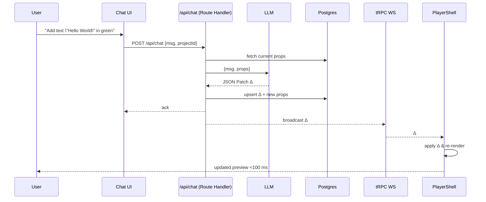

Technologies used
Development setup
Technical constraints
Dependencies

## 1 What we are building

**Bazaar‑Vid** is a web app where a user can _describe_ a product demo video in natural language and see it appear instantly:

```
┌──────────────┬─────────────────────────────┐
│  Chat panel  │  Live Remotion preview      │
│  (left)      │  (right, auto‑updates)      │
└──────────────┴─────────────────────────────┘
```

Flow in one sentence:
> User types → backend sends current `inputProps` + message to LLM → LLM returns **JSON Patch** → backend validates & persists → front‑end applies patch → **@remotion/player** re‑renders → user sees change under 100 ms.

When the user clicks **Render**, we call **Remotion Lambda** to create an MP4, then store the asset in Cloudflare R2.

---

## 2 Chosen stack (2025‑04‑26)

| Layer | Choice | Notes |
|-------|--------|-------|
| Framework | Next.js 15 App Router | One repo for pages + API Route Handlers. |
| Styling | Tailwind + **21stst.dev** token preset | Use semantic classes. |
| Auth | **Auth.js v5** (Drizzle adapter) | One `await auth()` per request. |
| DB | **Postgres (Neon)** | All tables live here. |
| ORM | **Drizzle ORM** + `drizzle-kit` | Compile‑time types, tiny runtime. |
| API | **tRPC v11** | HTTP + WebSocket links. |
| Realtime | tRPC WS for JSON patches | No Supabase Realtime. |
| Video preview | **@remotion/player** | Lives in `/components/client/PlayerShell.tsx`. |
| Video render | **Remotion Lambda** | Triggered in Route Handler. |
| Storage | Cloudflare R2 | Images + final MP4s. |
| LLM | GPT‑4o (OpenAI) | Fallback Claude 3. |

---

## 3 Critical data shapes (keep in sync with Zod & Drizzle)

```ts
// src/types/input-props.ts
export interface Scene {
  id: string;
  type: "text" | "image" | "custom";
  start: number;          // frame
  duration: number;       // frames
  data: Record<string, unknown>; // scene‑specific props
  componentId?: string;   // for type === "custom"
}

export interface InputProps {
  meta: { duration: number; title: string };
  scenes: Scene[];
}

export type JsonPatch = import("../lib/patch").JsonPatch;
```

DB table snippets
```ts
export const projects = pgTable("projects", { … props: jsonb("props").$type<InputProps>() });
export const patches  = pgTable("patches",  { patch: jsonb("patch").$type<JsonPatch>() });
```

---

## 4 Runtime sequence diagram



---

## 5 Offline custom component pipeline (phase 3)

1. User uploads image or spec.
2. `/api/generate-component` calls GPT‑Vision → spec → GPT‑4 w/ Remotion system prompt → returns *stand‑alone* TSX.
3. `esbuild` transpiles → uploads `dist/comp-<hash>.js` to R2.
4. Row added to `components` table `{ id, srcUrl, propsSchema }`.
5. CI redeploys Remotion site bundle with new component registered.
6. Live editing references `componentId` in JSON; Player lazy‑imports via:
   ```ts
   const mod = await import(/* webpackIgnore: true */ srcUrl);
   ```

---

## 6 Non‑negotiable rules (cursor must obey)

1. **Never** execute LLM‑generated code at runtime.
2. Player and any hook that touches `window` must be inside a file starting with `"use client"`.
3. All LLM JSON passes through Zod schema & auto‑repair loop.
4. Each PR **must** update this doc if architecture changes.
5. `pnpm test && pnpm lint && pnpm type-check && pnpm drizzle-kit diff` must pass.

---

## 7 Folder map with responsibilities

```
/app
  api/chat/route.ts         // tRPC router wraps chat mutation
  api/render/route.ts       // Lambda trigger
/auth.ts                    // Auth.js v5 setup
/db/schema.ts               // Drizzle tables (+ auth tables seed)
/db/index.ts                // createDrizzle client
/components/
  client/PlayerShell.tsx    // Remotion Player island
  DynamicVideo.tsx          // Composition switching over scene types
/lib/
  llm.ts                    // OpenAI helpers + retry
  patch.ts                  // fast-json-patch helpers
  remotion.ts               // Lambda helper wrappers
/t3/trpc.ts                 // tRPC init
```

---

## 8 Styling via 21stst.dev

* Install: `pnpm add -D @21stst/tailwind-config`.
* Tailwind config extend:
  ```js
  presets: [require("@21stst/tailwind-config")],
  ```
* Use semantic tokens (`bg-surface`, `text-primary`).

---

## 9 Phase roadmap

| Phase | Deliverables |
|------|--------------|
| **1** | Base scaffold (done), Drizzle tables, Auth.js wired, Player showing static video. |
| **2** | /api/chat with GPT‑4 → full props replacement; patch broadcasts. |
| **3** | Switch to JSON Patch + WebSocket diff; add LLM auto‑repair. |
| **4** | Integrate Remotion Lambda render + R2 storage. |
| **5** | Offline custom‑component pipeline + dynamic import. |

---

*Last updated 2025‑04‑26 – keeper: ChatGPT o3*

